Original Post: 2015-11-28

### Foreward
I have wanted to do a blog post about adding keyboard support to an arcade game for a while now. Historically my work has been focused more on Linux arcade games, but I'm getting more and more into Windows territory nowadays.

Adding emulated IO support for this game in particular was pretty straightforward which is why I opted to do it now - the game itself isn't stripped, original IO support is modular, and it runs on a modern OS. As a result, we can focus more on strategy and implementation design rather than having to do a bunch of compatibility patching beforehand.

In practice, this is the same approach I would take for more difficult games.

### Background

There are a vast assortment of PC-based arcade games - some are well-known, others are super obscure. Although patching security checks or emulating security hardware are common tasks in getting these to run on a modern system, what good is that if you can't actually play it?

With that, let's dig up a strange obscurity and give it keyboard support!

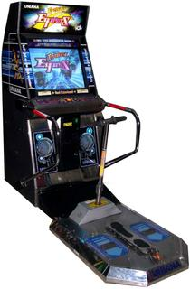

OK - now we're in strange territory...

This game came out in 2001 as a sort of ripoff of Crazy Taxi - the player racer around town avoiding obstacles collecting powerups while stopping at pickup and dropoff points around town. Given that this is a scooter and not a taxi, packages such as flowers, toys, and important documents (whatever those are) are carted around while the player tries to make $15,000 to go on vacation.

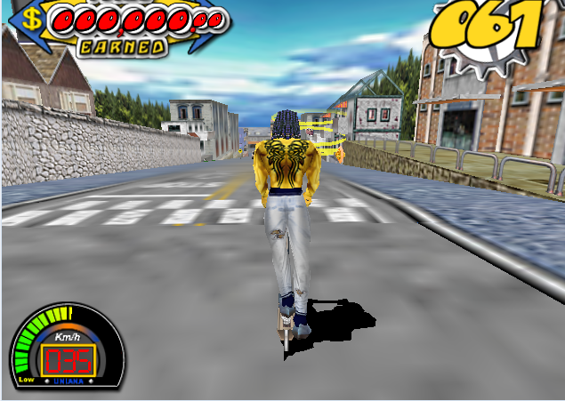

### First Time run
The game itself runs fine without any security-related modifications (even on Windows 10). Of course, the input doesn't work other than a hardcoded "crash the game" key (ESC or F12).

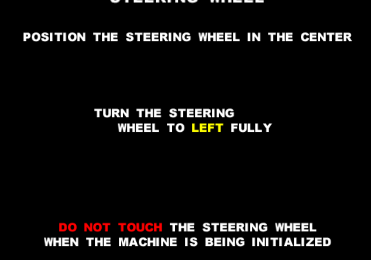

It starts with a simple calibration screen that errors, but doesn't stop the game from proceeding - eventually, we'll get this working perfectly as well...

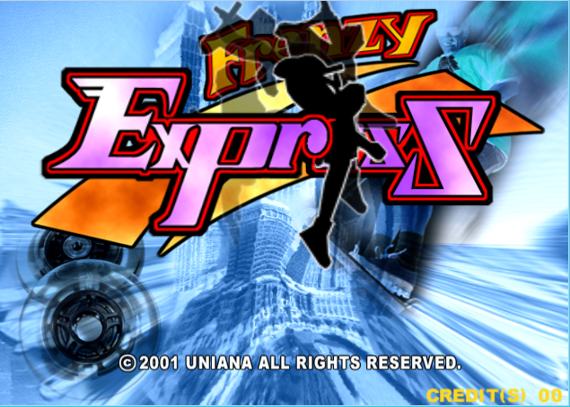

We then hit the attract mode loop and everything seems to be working fine - albeit lacking input.

OK - let's dig into this!

### The Files

The HDD contains two partitions

The first partition contains your standard Win9X stuff:

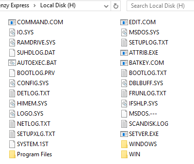

The second partition contains the game root under a directory marked "FRENZY".

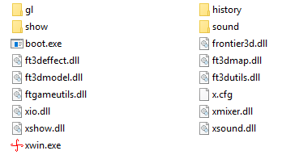

The "FRENZY" directory contains various subdirectories:

- gl contains textures.
- show contains MP3 files for music.
- history contains replay data and attract info.
- sound contains all the sfx, speech, etc.

The rest of the files are either dlls for various components of the game (sound,video,IO), the game executable itself (xwin.exe), or an x.cfg file which is probably game data. Also, boot.exe is used to establish an environment on boot but that's not important for us at the moment.

Next Step!

### IDA

Before we dive into game executable (xwin.exe), there's a library called xio.dll that might be interesting...

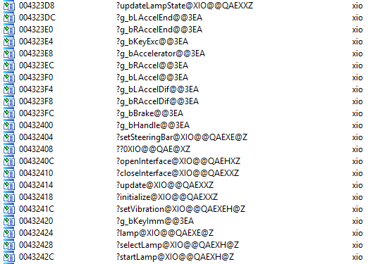

Judging from the import table, it appears that this dll is responsible for the IO object and might be the focal-point of our IO modifications!

It also appears to not be stripped (could we be any luckier???)

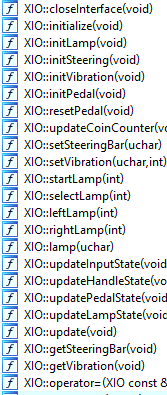

A number of functions are simply void returned calls to do something to the internal state of XIO and/or talk to the hardware (we'll jump into this in a sec).

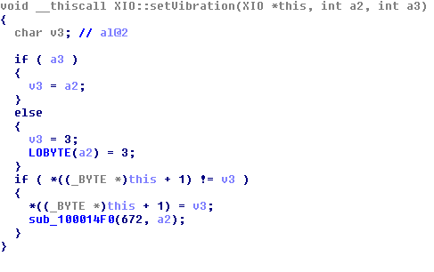

This looks like it's checking some value and if it's 0, it sets the value back to the default (3). After all of this, it calls that sub at the bottom with a 6xx number and the value we're passing...

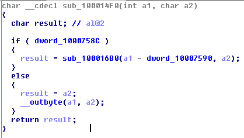

This looks like some kind of write function - we have the 9x direct hardware access \__outbyte here on a conditional... it looks like if the dword at the top is set, it will run another function; if not, it will push the value to hardware directly. At this point, we can assume that the dword at the top is a flag if the OS supports direct hardware access (any Windows before NT).

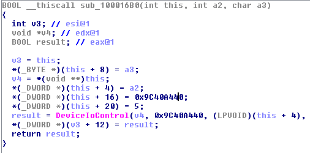

A quick look at the upper sub confirms - this route uses DeviceIoControl to make the hardware call indirectly (think ioctl for Windows). Just to be sure, let's xref that dword in the previous function to see where it's set.

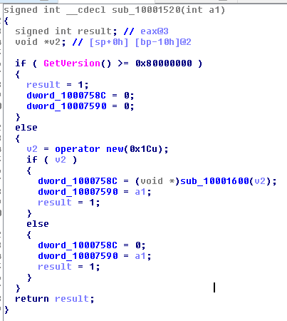

Makes sense - the GetVersion() line where it checks >=0x80000000 is an old trick to determine if a Windows version is NT or later - they don't support direct IO access due to a number of issues unless it's from a driver...

OK - so we have the general idea of how it writes - following DeviceIoControl again we find the read function:

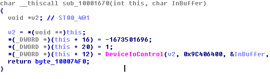

Given that we have the general idea- we can now determine that the IO setup of this game works in a pretty straightforward fashion

 (game<-->xio.dll<-->hardware).

For clarity, we may want to build a struct in IDA to list the properties that we see (using the logic that a function like setSteeringBar will use members that control steering, etc...)

We get something like this:

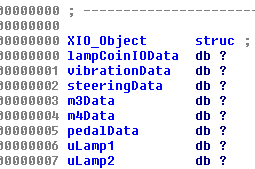

And when we run hex-rays, things begin to look a lot more readable:

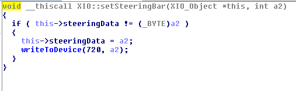

From this point, we should start first by trying to get the operator menu or inserting a coin - any of the basic non-movement inputs... just to get a feel for what we'll be doing the rest of the time.

### Coin and Operator Menu

The game makes several calls to xio::update() - several due to the fact that it's hammering this to update all button and lamp states:

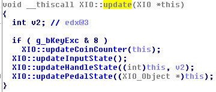

Right off-the-cuff, it's apparent that g_bKeyExec & 8 (or the 4th bit of that value) is a conditional to update the coin counter - looks like we found our coin button.

Looking deeper into the update input state, we can see that various bits are set to control buttons:

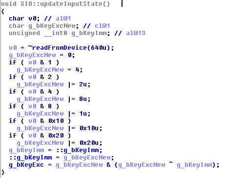

Looks like this byte controls buttons (more than likely the operator menu, coin drop, start, and arrow keys on the machine).

To test this theory, let's use CheatEngine to mess with the values and see what we can have happen. First, however, let's force this thing to Windowed mode so we can more easily change values and debug on a single screen.

### Windowed Mode

First of all, the game calls ChangeDisplaySettingsA to force 640x480:
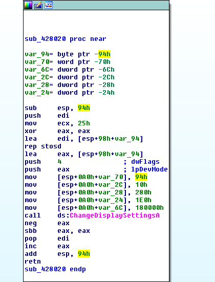

We can easily nop out this function with no real issues to prevent the global resolution change.

The real work comes from CreateWindowExA:

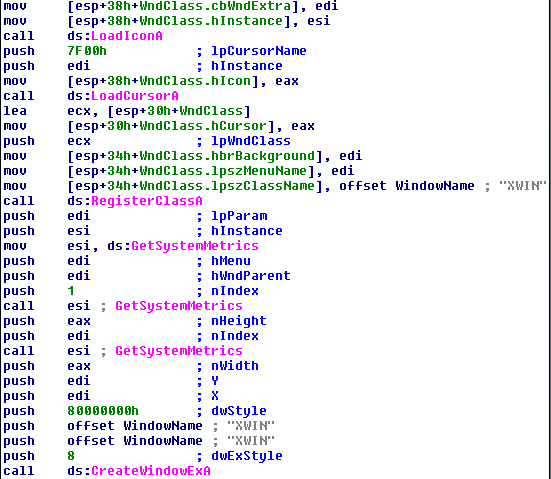

This is where it pulls the current resolution and sets the window to that size. Unfortunately for us, the game will render a big black window with the game sitting in the lower corner - not exactly what we want... let's force this to statically render the window at 640x480!

The trick is we need some bytes to play with - 'push eax' for height and width are only one byte and we need about 8 or so to do what we want. Although we could shiv a codecave into this and trampoline back or something else, let's see if we can do this inline...

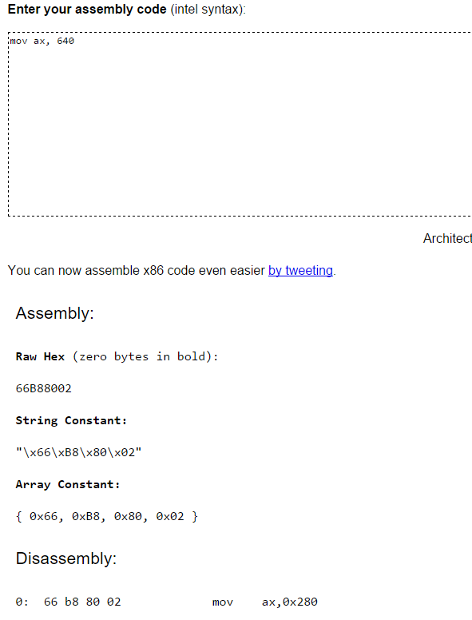

However, we don't need GetSystemMetrics for width or its parameter index - so we have about 5 extra bytes... still not enough.

Provided registers are not reused, we can use the GetSystemMetrics call above the other set values (the one for height) and keep it in the proper buffer with a bit of rewriting and move everything up the few extra bytes we'll have - provided the stack stays in good shape, we should be fine doing this.

The Result:

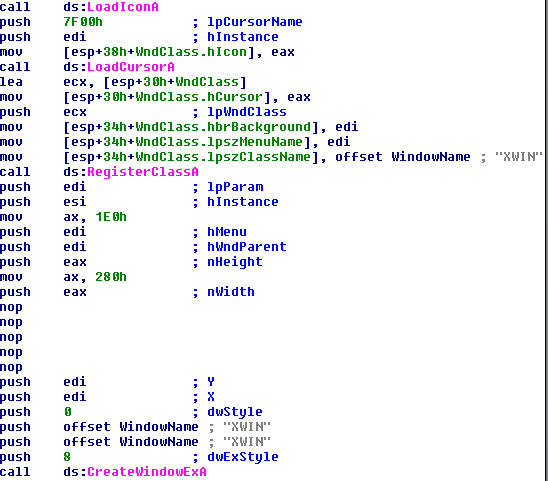

There we go - it should be in windowed mode now!

### CheatEngine Dance!

I love this thing! Hats-off to whoever makes it. It's more than a trainer development tool - it can scan for codecaves, nop out variables being set, it's scriptable, it can scan memory, slow down execution, the list goes on.

The first thing we'll want to do is find out where in the game the g_bKeyExec variable is stored.

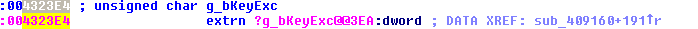

From this point, we can fire up CheatEngine and add it as a variable to watch.

While adding an address manually, we tick the pointer checkbox, set the value to byte, and put the address in below:

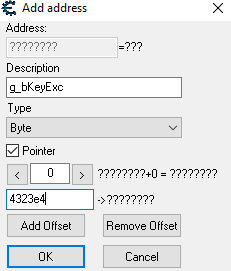

We load up the game and attach it to CheatEngine and we see that that value is just sitting there which makes sense initially:

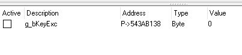

Now, we could try to modify the value, but remember that this is an IO set value - it's going to be firing like every X milliseconds so it will quickly get overwritten - we need to first shut the IO library up so we can set it ourselves.

If we right click on the value, we can select 'Find out what writes to this address'.

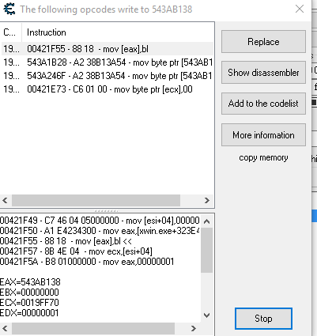

The top one looks like it writes a lot - we can select 'Add to Codelist' to keep track of it and give it a fun name. In addition, if we right click on the line in the code list, we can select 'Replace with Code that Does Nothing' and it will NOP this value being set for us - it can be restored later on as well.

 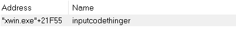

Now, if we set the value to 8, a coin should be dropped.

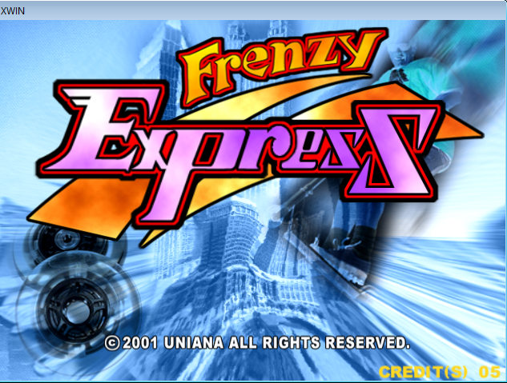

Success!!!

If we wanted to get even more fancy with testing, we could hook up some rudimentary input support via CheatEngine's LUA scripts, add keyboard handling to to set the bits, and so on, but at this point it makes sense to write our real implementation.

### Writing the Replacement IO Library

Ok, now that we roughly know how the input works, we can construct a dll based on a similar XIO object and replace the calls to hardware with some winapi keyboard logic. However, doing this would be (and was) an unnecessary task.

## ** IMPORTANT LESSON **

One of the biggest challenges faced by reversers, exploit developers, anyone really - scope. We could implement our emulator at the DeviceIoControl level and reimplement the IO protocol and it could potentially be super accurate, but maybe not worth the extra effort. In reality, we could probably get away with just telling the game which values we want within sane limits which is why fuzzing is a valuable step.

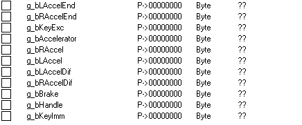

The original code implementation (https://github.com/batteryshark/feXIOEmulator) contained a proper map of the device calls, but without a proper protocol reimplementation, steering was rather buggy and didn't work properly.

In reality, the game only needs a few exports:

- Various globals such as brake velocity, button state, acceleration, etc.
- Open and close the interface (even if stubbed)

The current I/O library simplifies things quite a bit.

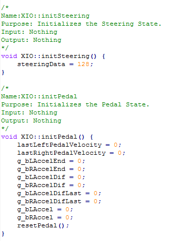

Because this is C++, it's also important to keep our data types consistent due to name mangling.

If we were to, say, give lampState an unsigned char value in XIO::selectLamp:
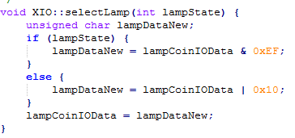

The game wouldn't link with our library because the method would be:
"?selectLamp@XIO@@QAEXE@Z" instead of "?selectLamp@XIO@@QAEXH@Z"

### Keyboard Input

All this time and no mention of what we're here for... wat!

That's because the keyboard part itself is relatively simple unless we want to include xinput or multiple input types.

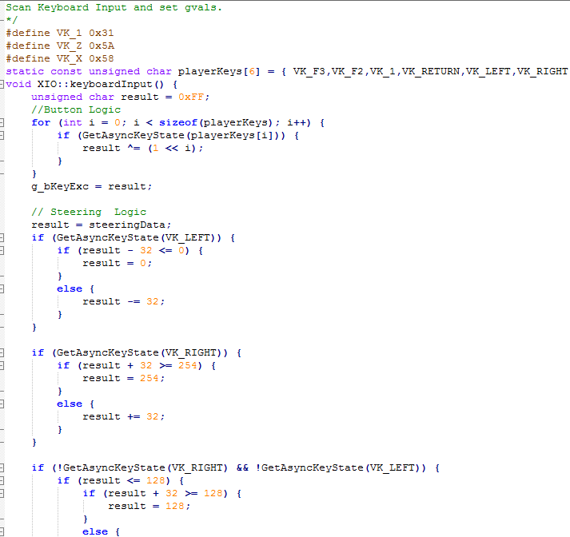

For this game, I used GetAsyncKeyState - made a couple of defines, and set the bits needed to be set for each member function to do its thing. Remember, the original hardware could only send 1 byte back at a time and only once per poll which means that most values are pretty small (0-255).

This is where the real fun begins - testing and tweaking the emulated input to make it feel not terrible - in reality, the analog handlebar controls would be better emulated by an analog controller, but that's an exercise for the reader.

### Conclusion

Input emulation can be a fun challenge when one has never seen the original hardware or very little is known about how a peripheral works, but the steps generally follow a similar workflow. Cheers!
