# Compatibility Patching for Classic PC Games
#### *A Cross-Platform Approach*
Original Post: 2014-06-19

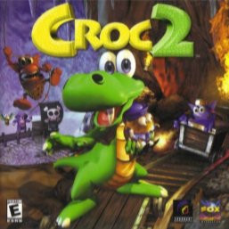

### Intro
Quite a bit of work these days goes into compatibility patching for legacy applications. In the area of reverse-engineering games, few things are more fun than being able to hack up a game that previously didn't work right and make it do just that. 

Many games in the past were built with designs and dependencies that either no longer apply or exist on a modern PC (e.g. optical media, region-specific character encoding, etc.). Today, we're going to dive into hacking up an old game to make it run on a modern machine, complete with working CD Audio (CDDA) without mounting bin/cues or any of that extra installed software nonsense - let's modernize the shit out of this game :)

### Analysis

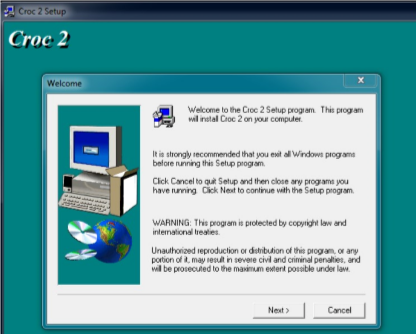

We have what looks like an old-school installer after mounting the iso. Installing the game gives us the following files on disk:

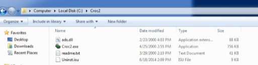

Okay, nothing real interesting here - it just puts a copy of the game's executable, some library, a readme, and an uninstaller file. Running it without the disc mounted will likely not be that productive :)


Yup - time to throw it into IDA.

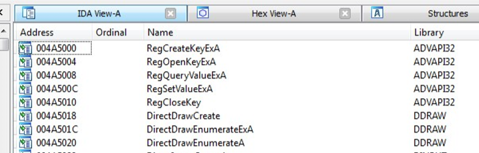

We're looking for a few things in here:

- We want to know if it used the registry to write anything useful (it doesn't).
- We want to look for its identification of which drive is the CD Drive (for disc checks).
	- More complicated checks/protection will get fancy with this, but early stuff pre commercialized protection wasn't as bad.
- We want to know what types of APIs it used.
	- Early 9x and some NT based 3D games near the turn of the century relied on DDRAW which screws up on modern Windows installs, something to keep in mind.

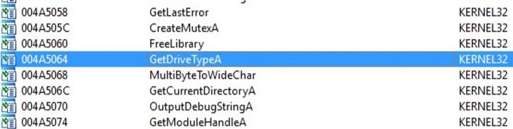

The GetDriveType API call was traditionally used to determine which drive letter belonged to the optical drive.

Generally, a reference to GetDriveType will have a block rather similar to this:

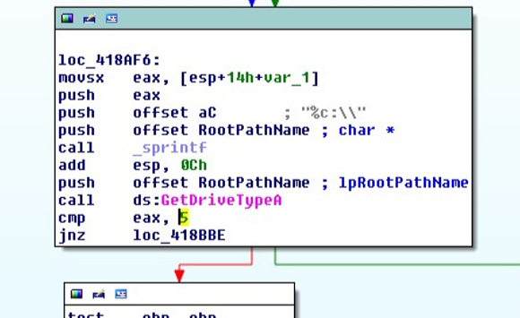

Essentially, it will cycle through your drive letters, look for a return value of 5 from GetDriveTypeA which equates to REMOVABLE/CDROM. Once it determines that a drive is removable, it will perform some additional checks. In this case, the check it does is rather trivial:

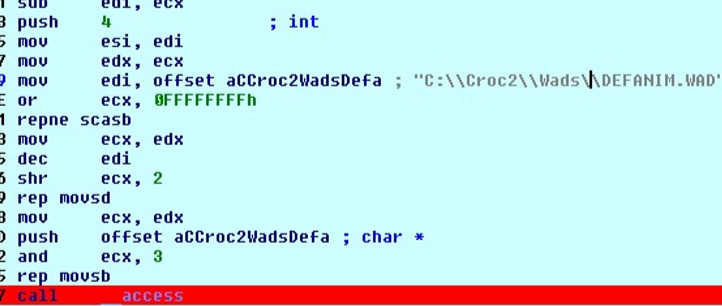

To summarize, it will determine if the current drive letter contains a Croc2/Wads/DEFANIM.WAD path that it can access. If it sees that file, it assumes that the game assets are on this drive.

As a result, copying the files to a target path, modifying the base string that the disc check uses to find assets to a relative path, and re-running the game, it will happily load everything without a disc check complaint. As a bonus, the audio appears to derive from files instead of CDDA which saves us a bit of effort there.

It even runs in Wine :)

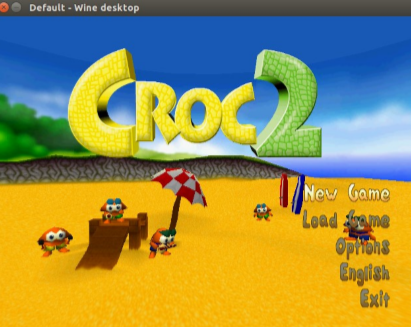

### Just Kidding! That one wasn't any fun at all - too easy. Let's do something a bit more screwed up :)

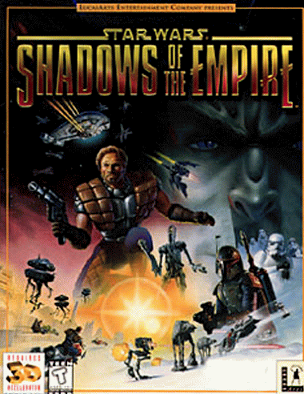

Here we go, this one should be fun!

It has CDDA, was a nightmare to even get working when it was released, and many people have had problems since. A lot of people have played the N64 version of this game, but what's interesting is that the N64 version is actually a butchered port of the PC version which contained real cutscenes, voice acted audio sequences for ingame text, and a vastly improved musical score. Also, the resolution could be adjusted so it even LOOKS better.


The disc contents looks like this: 

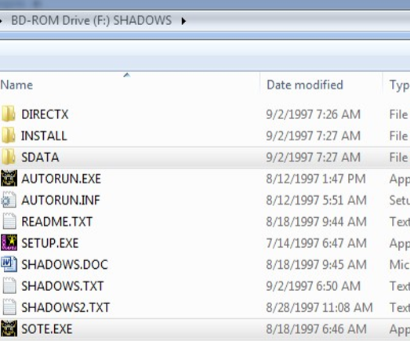

Right off-the-bat, attempting to run the setup program gives us this fancy message:

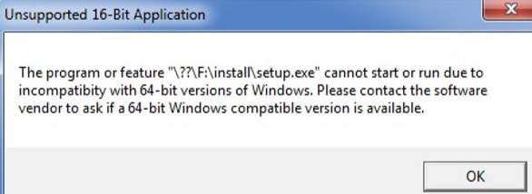

Ok, so their installer program used a 16bit Windows application environment that no longer runs on a 64bit Windows installation.

Putting that aside for a sec, we can use isobuster or ultraiso to dump the cdda tracks to mp3:

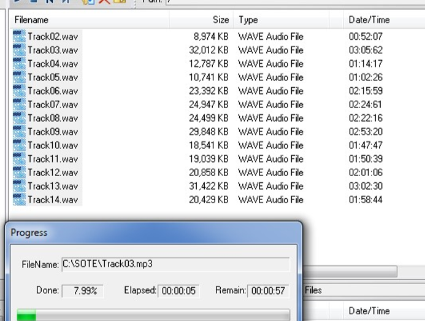

As an unrelated side-note, it looks like the launcher was recycled from Jedi Knight as it still contains the text resources:

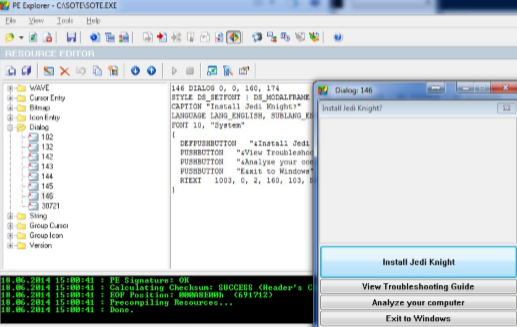

Apart from that, the REAL game executable is SHADOWS.exe in the SDATA directory - we only need the SDATA directory, actually. The rest is all setup crap we don't care about. Running SHADOWS gives us:

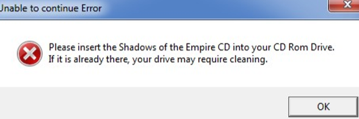

Yup - figured. Let's check this one for GetDriveType:

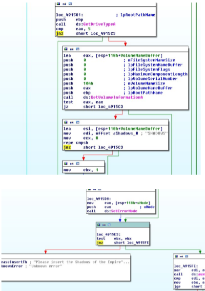

Ok, so this one checks for the CDROM drive (type removable) as before, and then calls GetVolumeInformation to check if the name of the volume is "SHADOWS" and sets that as the root drive. In this case, the easiest way to adjust this would be to just set the root to a relative directory and change the jump after the volume check to an unconditional.

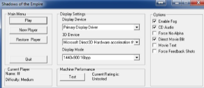

After running again, we are then greeted with the config window, but pressing play crashes... oh, the registry!

```
 [HKEY_LOCAL_MACHINE\SOFTWARE\LucasArts Entertainment Company\Shadows of the Empire] 
 "Install Path"=".\\" 
 "SData Path"=".\\" 
 "Video Path"=".\\" 
 "Source Dir"=".\\" 
 "Fog"="TRUE" 
 "Force Alpha"="FALSE" 
 "Display Device"="Primary Display Driver" 
 "3D Device"="Microsoft Direct3D Hardware acceleration through Direct3D HAL" 
 "Width"="1024" 
 "Height"="768" 
 "Game Pad"="FALSE" 
 "Direct Movie"="TRUE" 
 "CD Audio"="TRUE" 
 "Cutscene Text"="FALSE" 
 "Executable"=".\\Shadows.exe" 
 "Numb Hand"="FALSE" 
```

We need to set the paths properly. This can either be achieved by importing this key into the registry or using other patching/registry emulation methods to give the game the proper paths.

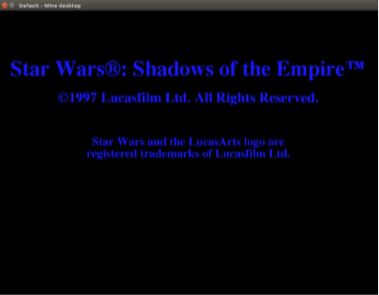

Aaaaand works! Ok, now onto getting CDDA Working.

Most CDDA games of this era used winmm.dll to communicate with the CDROM drive. This was achieved through Media Control Interface (MCI) command strings. As a result, wrapping these strings is a relatively trivial solution - we build a replacement winmm.dll that interprets the MCI commands to a virtual CDROM object we make in memory when loading our code and interpret the MCI_PLAY command as a call to load and play our audio tracks externally.

Now, I could write an MCI interpretation library, but I'm pretty lazy so I'll grab hifi's ogg-winmm [https://github.com/hifi/ogg-winmm], however, we are going to make one minor tweak to his code:

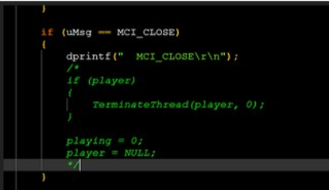

SOTE calls an MCI_CLOSE right after play. If we let close kill the audio thread, the game will deadliock. Besides, it will stop playing the track when it finished and will reinit itself when a new track plays - no biggie.

After recompilation, we will name this library winm0.dll as to not interfere with the system-level winmm.dll (more important for WINE as it hates overriding and referencing original functionality). We create a MUSIC folder in our game directory and place all the audio tracks in this path.

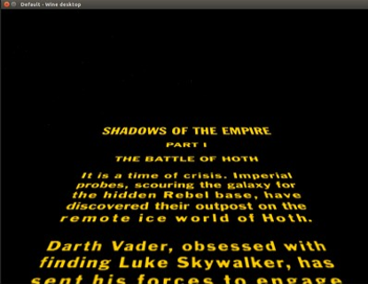

OGG File CDDA Works now (even in WINE!)

Until next time :)


