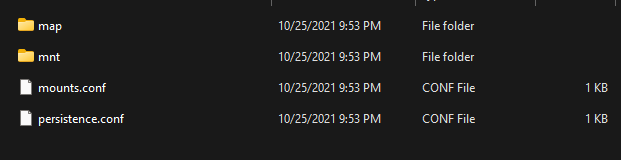

A homebrew experiment to bring the console experience to PC gaming - one hack at a time.

## Foreword

This is something I've been working on since roughly 2014, has gone through many **MANY** iterations, and is finally something worth sharing. It's taken a lot of reverse-engineering, further background in Windows/Linux internals, cross-platform code compliance, and a lot of sacrificed sleep. At this point, this will probably be the most ambitious thing I ever do before I let life cannibalize the rest of my free time, but it was absolutely worth it.

## Background

For years, I've wanted to bring the convenience of modern console gaming to my PC game collection without many of the compromises that locked-down consoles bring. I would patch games and include dependencies, make them run from discs, or keep pre-installed files with dependencies so I could just play whenever I wanted. As consoles got more advanced, the allure of modern features such as frontends, containerization, and state management were hard to ignore, but incredibly difficult to replicate on Windows.

Instead of ranting for 70ish pages of how everything is put together, I'm going to attempt to break this up into different technologies as, by themselves, the components that make this up may be useful in their own right to someone or some project down the road. First of all, let's establish some context.

## Analysis of a Console OS

Depending on where you want to start this, game consoles roughly started to have "rich" OSes for only about the last decade or so, previous iterations offered little more than some settings for the BIOS, networking, etc:


However, these were some of the first that laid the groundwork - OSes with hard disk storage, multiple partitions, updateable Operating Systems, and interchangeable components. These offered updates for games, DLC, and basically everything that console gaming is now.


Over the last decade, most consoles have been publicly jailbroken. While homebrew and pirating games are valuable for the majority of those that decide to tinker with exploits, it's also interesting to dig into the internals of these Operating Systems and see just how similar their designs are.

From purely a super high-level design standpoint, what you'll find in a modern Console OS doesn't vary a whole lot from console to console and actually shares quite a lot with modern mobile devices:

- Some type of isolated Operating Environment that acts as a substrate.
- Software installed as a containerized (read: sandboxed) app with some type of isolation layer (normally kernel level) with granular ACL.
- Apps generally have a copy of their own dependencies with exceptions given to global APIs that may be offered from a specific OS revision or greater.
- Some type of way to manage versions and add files to an app's read-only memory.
- Some form of user profile-specific state for apps.
- Separate writeable area for an app to store and cache files.
- Some way to reset an app.
- Applications are generally not able to be modded unless it's from an approved mod source.

Of course, looking at your average PC gaming environment, things are a bit different:

- Apps are generally installed directly (e.g. direct download, GoG) or from some managed storefront (e.g. Steam, Epic, Origin, etc.)
- Installations affect the OSes dependencies (e.g. DirectX, PhysX, etc.)
- Writes to game files are not isolated and preservation varies by provider (e.g. Steam cloud sync, etc.)
- Locally run apps must be fully downloaded to play.
- Users may not have their own files, settings, or saves.
- (In Most Cases) Updates are destructive to original files.
- Games allow for user-based modding of arbitrary files.

## The Plan

So, what would we need to keep things like user-based modding, but add the convenience of managed apps, layered storage, universal cloud saving, and a pretty package to put it all in?

- A way to layer application files into a virtualized filesystem.
- A sandboxed environment for our applications to run.
- Support for multiple entry-points and subprocesses to share the same app "context".
- An app format to explain how an app should be constructed and executed.
- Some type of loader/launcher that understands our format.
- (Ideally) A way to cloud stream files which would enable streaming app rom files and universal cloud saving.
- (Ideally) Some pretty frontend package to make it look not terrible.

# Implementing a Layered Filesystem

Software management generally includes some method of managing files and their respective paths. Several approaches to this exist, and solutions greatly depend upon if software is expected to be updated as a whole (traditional), updated with modules (plugin-based), updated incrementally (e.g. diffs, volumes), or a mix of all types.

Some solutions go far enough to include custom filesystem layouts within the software for maximum control.

Because we are implementing a system that should work with all (most) software, we have a few constraints:

- We need something that allows for incremental changes.
- We need something that can operate per-process.
- It has to be something that is somewhat portable to make code management easier.
- It has to be performant.
- It has to be customizable and (somewhat) dynamic.
- It has to allow for arbitrary changes.

## Initial Design Considerations

While we could create a virtualized filesystem layout and cache it in our application memory, this comes with a few constraints:

- It's far more brittle (real-time changes are more difficult).
- We have to track changes within the process itself (complicated and a lot of additional logic).
- Difficult to share a virtualized layout across processes.
- Difficult to manage it across platforms.

Console OSes have a few solutions based on their designs of these systems, they:

- Generally have a read-only package format that are "mounted".
- Have some type of description as to how and which packages are mounted.
- Understand some additional customized mount point.

Although we won't borrow the kernel-driven approach, modern Operating systems have some of these components, they:

- Have mountable images that allow us to mount packages as read-only.
- Allow us to create arbitrary mount-points.
- Give us some rudimentary path translation.

So - merging these ideas, we may get something like this:


## Enter Smoothie

For this, I created a compositing library to take arbitrary images and paths backed by a configuration, and create a layered filesystem of paths and various changes.

Smoothie takes a configuration file (called a map), mounts images of various formats (iso, zip, vhd, vhdx), and can make arbitrary changes (such as deleting files in a layer) and replacing others by way of leveraging the host Operating Systems symbolic linking. A map may look something like this:

```
# Comments - Semicolon-Delimited commands
MAP;example.zip;C:\\
MAP;exiso.iso;D:\\
MAP;windows.vhdx;C:\\Windows
LINK;somefile_example.txt;C:\\app\\somefile.txt

```

The working root is then divided into multiple parts:

- The "map" root containing any drive roots (Windows only) or our root target (everyone else).
- The "mount" root containing all of our referenced mountpoints.
- A configuration file to keep track of everything mounted.
- A specified read-write layer (if appropriate).

While a lot of the compositing logic is cross-platform, image mounting and manipulation is not. As a result, several approaches are necessary for cross-platform support. On Windows, we have VirtDisk.dll that allows us to programmatically mount and manage ISO, VHD, etc.. On Linux, we have libguestFS.

The workflow, however, is essentially the same:

- Read the config, mount all images.
- Iterate all paths from the image and create/alter any symlinks and respective parent directory paths.
- Optionally composite a read/write layer on top of that.
- Let the process do its thing until done. If write compositing is enabled, make a copy of any modified files and replace the symlink with a real file.

When done, the process follows a fairly predictable flow:

- Read the config included in the working dir to determine what was mounted and unmount.
- Erase any symlinks from our "map" root.
- Copy any real files from our "map" root into the persistence (RW) layer paths.
- Any additional cleanup.

There are working examples written in C++ and .NET 5.0 (C#) for smoothie:

[https://github.com/batteryshark/libsmoothie](https://github.com/batteryshark/libsmoothie)

[https://github.com/batteryshark/Smoothie.NET](https://github.com/batteryshark/Smoothie.NET)

A working example map might be something like this for a Windows app:

Then, our working root would look like this:


And the map root for C:

Finally, the mount directory showing everything that was mounted:

## Additional Considerations

Now, we can't just tell a process that /path/to/root/thing is /root/thing, right? Further, we can't just expect a process to like the fact that we're mounting packages as read-only and stick to writing within our composite filesystem... we need some kind of redirection to happen from within the process. Let's get to that next!

# Making a Custom Operating Environment

Now that we have a (somewhat) reasonable way to create a set of files, we have several other considerations before a process can use it effectively:

- We have to control filesystem access at the process level and redirect anything necessary - including reporting when something should be read/write when it isn't.
- We have to monitor and control dependency management and library loading.
- We have to anonymize or give control of our operating layer to not use the OS specific usernames to ensure that instances store files in a universally compliant manner.
- We have to have some exceptions for our own benefit, such as bypassing shader caching.
- We have to include some emulation of calls that control things like drives on the machine, optical disc referencing (for old CD checks), operating system version reporting, etc..
- We have to deal with configuration control such as registry functionality on Windows.
- We have to deal with legacies, that is, processes that create child processes and ensure that they also understand our operating environment.
- We have to offer these things in a way that isn't global, can exist in multiple processes at once, and is (somewhat) configurable.

## Enter Paradox

Paradox, or pdx for short, is a collection of libraries that hook syscalls for various operating systems to establish a programmable context for a process and any of its subprocesses, it's the heart of our isolation layer and controls a lot of what makes all of this work.

It starts with a bootstrap layer that establishes what components to load with what options, and then loads libraries that do everything from filesystem redirection, registry emulation, and environment emulation. Network emulation is a planned addition.

The gory details of each plugin require their own section and writeup. As a result, I'd say to read the various [readme.md](http://readme.md/) files in each component here if you want more information about a particular feature:

[https://github.com/batteryshark/pdx](https://github.com/batteryshark/pdx)

Paradox currently supports Windows and Linux with OSX planned. In reality, sandboxing at the process level is a common practice for apps such as web browsers ([https://chromium.googlesource.com/chromium/src.git/+/57.0.2987.21/sandbox/win/tools/finder/finder_kernel.cc](https://chromium.googlesource.com/chromium/src.git/+/57.0.2987.21/sandbox/win/tools/finder/finder_kernel.cc)) and other non-OS software components that require this kind of isolation without a driver.

## Additional Considerations

- This approach will not universally work with aggressive DRM that leverages drivers or other rootkit-like operations, but will handle most cases.
- Careful consideration must always be exercised when crutching on syscalls as they are the first to be hooked by OS components, the first to change, and more difficult to maintain than higher level functions.
- Given that these plugins are configurable and different applications need different options, we'll need a format to store these configurations along with the necessary application data, up next!

# Putting Together an ‘app’ Format

Now that we have a composite filesystem library and shims that allow us to establish our own operating context, we need something to tie everything into an easily deployable package. This concept has suffered the most iterations over the years, but we need a few things:

- Some minimal metadata to identify the app.
- Our 'content' including read-only files and our smoothie map.
- A list of any executable entry-points we want to expose to whatever loads the app.
- A list of any plugins or configuration options that need to be enabled to make it all work.

## Enter .vxapp

Simplicity is key here, and .vxapp takes pages from various app formats including Mac's .app, and various console package formats.

A typical app layout may look like the following:

```
App Name.vxapp /
    content /
        some_image.vhdx
        smoothie.map
        plugin_options.ini
     vxapp.config
     vxapp.info (e.g. name, rating, etc.)
     metadata( icon? )

```

When an app is loaded, we look at the vxapp.config JSON format which uses entries like the following:

```
[
    {
        "args": "base\\\\Wolf3d.exe -conf base\\\\wolf3d.conf -fullscreen -exit",
        "cwd": "",
        "envar": [],
        "executable": "C:\\\\app\\\\base\\\\dosbox.exe",
        "map": "smoothie.map",
        "name": "Play Game",
        "preload": [
            "pdxproc.dlldynamic",
            "pdxfs.dlldynamic"
        ]
    }
]

```

Each "entrypoint" has a few fields:

- A (virtual) path to the target executable.
- An (optional) set of args.
- An (optional) alternate working directory to start the app from.
- A specified map as an app may choose to list many different maps to run different versions of the app.
- A name for a loader to reference.
- Any environment variables that need to be set.
- Any preloaded pdx plugins we need to use.

One lesson learned over the many iterations is to keep metadata generic, we aren't trying to recreate steam or another online curating service, we want something generic that can be reused. As a result, nothing in [vxapp.info](http://vxapp.info/) is ever used by a loader.

Now that we have a format, we have to build a loader to tie all this together!

# Creating an App Controller

Ok, we have an app format and some supporting code, but that doesn't do us much good if we can't get it into the process and give some additional control, we need:

- Something that can launch the app itself and configure any environment variables needed.
- Something that can inject our plugins into the process to kick things off.
- Something that can monitor the app and understand that several processes might require the environment and context to exist unless we want to simply prompt when the app is done.
- Something that can cleanup a hanged app.
- Perhaps something that can suspend/resume an app (if we're following the console spirit).
- Some way to programmatically create a unique instance of our smoothie composite and any app specific paths.
- Some way to clean everything up on close.

## Enter vxtools

For this, several tools are needed:

### vxlauncher ([https://github.com/batteryshark/vxlauncher](https://github.com/batteryshark/vxlauncher)):

This launcher allows us to call a ".vxapp" and uses smoothie to create the composite layer, read the desired entrypoint, and execute the ep with an architecture-dependent bootstrap to bind all of our modifications to the process. In addition, it allows us to have a "watchdog" that will watch for all processes and child processes of our original target to quit before cleaning everything up. For ease-of-use, we create an arbitrary ID for every app by hashing the name and creating some 9 character printable ascii code (e.g. ABC-12F-GZ9). This will serve as our working directory for the app. In addition, we could combine the app name with a particular username to create a user-specific root as well.

### vxbootstrap ([https://github.com/batteryshark/VXBootStrap](https://github.com/batteryshark/VXBootStrap)):

For Windows, one of the more reliable ways to inject a set of arbitrary libraries would be Queued User APC injection. There are several methods of injection that can be used which would be a topic for another writeup (or the thousands of others on the Internet), but this is what has been the most reliable that I have tested. Essentially, we build some shellcode that looks like this:

```
__declspec(noinline) static void __stdcall load_library_worker(load_library_t *s){
	HMODULE module_handle; unsigned int ret = 0;
	for(int i = 0; i < s->num_libs_to_load; i++){
		s->ldr_load_dll(NULL, 0, &s->filepath[i], &module_handle);
	}
	return;
}

```

We then allocate some pages to store unicode library paths, and use a resolved LdrLoadDll address within our process to load our libraries.

Why not LoadLibraryA? We create the process in a suspended state, at this point, nothing is loaded other than ntdll and perhaps the wow64 stuff for 32bit apps. Instead of force loading kernel32, we use the ntdll library's equivalent to map a library into memory to assure that we can map our changes early in the process for the best compatibility with potential changes. This will also allow us to inject libraries that do not include references to stdlib if necessary.

In addition, we create an optional callout over a named pipe to our watchdog to register the new process ID to determine when the application has exited. All child processes will also follow a similar entrypoint as the bootstrap can also support existing processes via pid to perform the same injections and operations.

Due to the fact that we have a running process that interprets commands, it would also be useful to create a generic utility that can send commands to that channel to control the app's state, suspend/resume, clean up, or anything else. For this, a simple app called "vxctrl" exists.

In addition, I have put everything together and ported it to .NET 5.0 as [VXTools.NET](http://vxtools.net/): [https://github.com/batteryshark/VXTools.NET](https://github.com/batteryshark/VXTools.NET)

## Next Steps

Now we have a launcher, supporting code, an app format, and a way to control apps, but running them from a command line or context menu is kind of crappy, let's see what else we can leverage to make this a bit more friendly!

# Slapping on a Frontend and Wrapping it Up

At this point, we can work on bringing the "console feel" to everything, but honestly, making a frontend requires a lot of overhead, you need:

- Some type of library manager.
- Graphics Libraries.
- Controller Support.
- Metadata management.

You essentially need the makings of a game engine to do this decently, and that's just the basics. Modern frontends include scrapers, icon/image management, and a ton of other features. Fortunately, we don't need to build this ourselves.

## Enter Playnite

Playnite ([https://playnite.link/](https://playnite.link/)) is an open-source frontend hosted on github by one JosefNemec: [https://github.com/JosefNemec/Playnite/](https://github.com/JosefNemec/Playnite/) that will do pretty much everything we want:

- Scrapers for Metadata and Media
- Rich assortment of plugins and themes
- Controller Support
- "Big Picture" mode for TV selection and a more "console-like" experience.

Most importantly of all, it has a fairly robust API to create your own plugins, which will allow Playnite to (somewhat) understand the vxapp format and run our launcher, and with that:

## Enter VXApp4Playnite

The VXApp4Playnite (v4p) plugin ([https://github.com/batteryshark/VXApp4Playnite](https://github.com/batteryshark/VXApp4Playnite)) can be configured to read "repositories" of vxapp files from any given path and list them in the frontned.

Features:

- Multiple repositories with realtime updates can be specified.
- Controls to copy apps to a cached directory for faster loading.
- Controls to Suspend/Resume an app.
- Controls to clear cache and copy apps.
- Self updating to pull the latest copy of paradox libraries and supporting VXTools.
- Background splashes for loading apps.
- Controls to pull/push metadata updates (e.g. icons, ratings, etc.)

Main Screen:

Settings:

Game-Specific Context Menu:

Fullscreen mode now resembles something more like what we'd see on a console:


That's all well-and-good, but what about cloud saves? What about remote apps?

## Going CloudSide

Although we could implement something to handle all of this for us, something simple like Google Drive File Stream will work well for this.

For those not familiar, Google Drive has a driver that can mount your GDrive and Shared Drives as native filesystem paths and operate read/writes as normal. In this case, we simply put our vxapp folders onto GDrive and we have an online repository that we can stream the app files from as we need them.

This allows us to read from the various images as needed without having to download the entire app. In this case, the "Install" option to copy the app locally is useful for offline play.

Also, because smoothie uses a read/write persistence layer, we can point our persistence root to Google Drive and support cloud saving for all of our apps!

## Looking Forward

At this point, remaining work is mostly:

- Improving paradox to support network emulation
- Additional format support for smoothie (maybe xvc, squashfs)
- Better Linux Support
- Mac Support
- Additional Frontend support

But that's for another day,

Cheers!