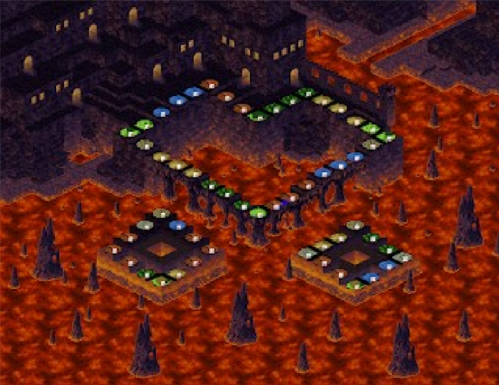

#### *Reverse Engineering Console Game Assets*
Original Post: 2013-11-12


### Background

This game series is like MTG meets monopoly. I discovered it back in the Dreamcast days (even though a PS2 port existed that was in English). I always wanted to make the time and port it to something more open, but screwing with the game assets will do for now!

#### Breaking a custom Huffman Stream Format

Apart from the standard ADX archives, the textures and models seem to be in a different format and are jammed into a 100-ish MB file. 

The first interesting bit is at the top:


Right off, this looks like some kind of archive or virtualized filesystem. A bit of sanity checking on values such as 0x128 and 0x2A1E4B4 could be an offset and size which add up to the third value: 0x2A1E5DC. 

Writing a quick iterative script might be something like this:
```python
def carve_file(dat_file,out_path,offset,size):
	chk = dat_file[offset:offset+size]
	with open(out_path,'wb') as g:
		g.write(chk)
```

Yields about 37 smaller files; not very many. However, some of the larger files (>60KB) have the same structure at the top, so it's clear that this format can be nested.

Recursing through them, you end up with something that looks like this:


In this case, most of the files start off with 0x8008, but not all of them. After digging through the game binary to try and make sense of this, it's rather apparent that this is some form of LHA-based compression and stored via Huffman encoding. This format is relatively common amongst console games as it could get decent compression, could be inlined with assembly, is fast, has a lot of the benefits of something like zlib but without needing expensive dependencies in memory.

This instance appears to be operating on a 64k sliding window and LH5. For an extraction program, however, this would need a header to tell it that. For a lot of console games that use this kind of compression, they implicitly understand the levels and generally don't use headers.

Fun fact, Windows 7 in Japan actually COMES with LHA support built-in. A typical header looks like this:


We can already see a few things - the first byte is a header size, a 1 byte crc, a tag for the compression used (e.g. -lh5-), compressed size, decompressed size, file metadata  (including the filename) and finally, the data itself.

Now, we could simply remake a header and try to slap it onto our data, but we also don't know where the compressed stream starts (1 byte off could completely screw up the decompression). It's important to note that this compression method doesn't have any built in error handling and will happily decompress garbage - it doesn't understand if the output is correct or not.

In this case, it might be worth making a brute force unpacker.

Thankfully, there is a C-extension python module called lhafile that we can hack up and turn into a brute forcer [http://trac.neotitans.net/wiki/lhafile] which consists of a wrapper that figures out the compression type and details, then passes that data to a c library that does the actual heavy lifting.

Modifying the _RealGetcontent function, we'll populate the structure of what our header SHOULD populate (if it had one).

```python
def _RealGetContent(self):
	info = LhaInfo()
	info.directory = ""
	info.filename = "newfile"
	info.compress_size = 0
	info.file_size = 0
	info.CRC = 0
	info.header_offset = 0
	info.file_offset = 0
	info.external_attr = None
	info.internal_attr = None
	info.reserved = 0
	info.comment = 0
	info.compress_type = '-lh7-'
	info.date_time = 0
	return info
```

Other smaller changes include wiping out the CRC16 not matching 0 and the uncompressed size considering we won't know what it should be uncompressed.

Now comes the tricky part, we can decompress the chunk, but we have no idea what byte it starts on, therefore, we need to actually do the decompression multiple times while checking to ensure it didn't break. 

Thankfully, LHA has the ability to fault out if the bit pattern isn't right (which basically means we started on the wrong byte and it can't figure out how to decode the next byte in the sequence). We'll alter the original logic from raising an exception at this point to simply continuing to the next start byte in the sequence.

Basically, our workflow is like this: 

1. Read compressed data starting at n. 
2. Try to decompress.
3. If success, write out to file and go again from n+1 / if not, go to the next iteration anyway.

The last step also involves us resetting the file pointer for the data stream back to the beginning byte, but those are just details. 

In the end, we want:
- To specify the number of successful decompressions we want. 
- To specify how many times we're going to retry the file from the next offset.

Adding some arguments to the runtime and calling with sys.argv[i] will work nicely with that.

```python
info.copmress_type = sys.argv[3]
if info.compress_type in Lhafile.SUPPORTED_COMPRESS_TYPE:
	self.fp.seek(info.file_offset)
	fin = cStringIO.StringIO(self.fp.read(info.compress_size))
	fin_back = fin
	fout = cStringIO.StringIO()
	status = 0
	status_limit = int(sys.argv[2])
	while status < status_limit:
		try:
			session = lzhlib.LZHDecodeSession(fin, fout, info)
			while session.do_next() == False:
				pass
			outsize = session.output_pos
			if(outsize == 0):
				info.file_offset +=1
				self.fp.seek(info.file_offset)
				fin = cStringIO.StringIO(self.fp.read(info.compress_size - info.file_offset))

				if(info.file_offset > os.path.getsize(sys.argv[1])):
					print("FFFFFF")
					exit(-1)
				continue
			crc = session.crc16
		except Exception, e:
			info.file_offset +=1
			continue
		if(status < status_limit):
			info.file_offseet +=1
			self.fp.seek(info.file_offset)
			fin = cStringIO.StringIO(self.fp.read(info.compress_size - info.file_offset))
			with open(sys.argv[1]+".dec"+str(status),"wb") as g:
				fout.seek(0)
				g.write(fout.read())
			fout = cStringIO.StringIO()
			status+=1
			continue
		status +=1
```

Basically, we keep trying until we hit the maximum number of attempts we give it to decompress the stream. We only keep files that are more than 0 bytes (meaning they actually decoded). I was surprised, there are only two or three that actually get decoded properly.

In the end, one of the smaller files I was working on contained this:


We have Text!!! The format surrounding it is odd, however. Maybe it didn't unpack properly? Maybe it's compressed further? 

#### The Legend Continues

Ok, so we have some uncompresessed chunks, what now? Comparing the DS version (which uses the same format), we can see that the plaintext is in some kind of file structure. The figure on the left is a memory dump from the DS and from the right is from the Dreamcast emulator Demul at runtime.


A better way to view the memory, however, is with savestates. 

Another interesting bit appears to be a model format! It uses a header of "MODL" for both DS and DC versions - more than likely some custom format.


There's also this header which keeps showing up... maybe card graphics?


It's more difficult to tell with textures for consoles as they were traditionally compressed/encoded and either split up via palette, swizzled, or were straight up chunks of rgb/a data to be fed into the PowerVR gpu. Realistically, why use an image format and have to convert the usable image to a texture to be sent to the gpu when you can just write it to the gpu as-is.

Carving these chunks out, we can use something like Gimp to load these blobs as raw data.


A little messy, but it looks like some pattern is here - we can stick with powers of 2 for resolution as that's generally what you'll see for textures.


Ah, there we go! The color is a bit screwed up which points to either an incorrect palette, we started on the wrong pixel color data, or something else, but we have the general feel for the pixel pattern.

Testing more, we see that there are some differing formats, but this one looks true to the game:


After looking at the ASM again, it appears that there are multiple formats.

The first format is a type that starts with the offset,size values, but there isn't any indication as to how many files there are (most likely in the executable or some implicit stop value).

The second format is our compression data - prefixed with 0x08. There are actually TWO execution paths here - dependent upon the second value (if it's 0x0C or 0x08).

0x0C appears to be our 64K sliding window (lh7) whereas anything else (e.g. 0x08) appears to be an 8K sliding window (lh5).

The next two bytes are the uncompressed size, but our compiler does something odd - it takes the first byte, left shifts by 8, then ORs the second byte onto it - it's endian swapping a 16 bit size and reading as big endian on a small endian system.

The third and final type of file (so far) is rather odd - basically, it's a collection of composited files split up into chunks. These files are generally given away by not starting with 0x08+size, but rather a strange int that varies (probably a checksum) and continues with 0x00 0x08 UncompressedSize.


Generally, these files are in 8k chunks. Extracting individual pieces gets you something like this:


It looks like all the ingame background/maps are in 64x64 pixel chunks, this is going to be a pita.

### The Map Format

So, somewhere, there has to be a number that determines how many chunks a map can contain, both X and Y. For now, we can make an assumption that maps will be a rectangle or square (i.e. no weird missing chunks).

We can try to stitch these pretty quickly given that with the following workflow:

1. We parse every file in the map chunk.
2. For each we:
	- read the pixel data
	- paste it onto a WIP framebuffer in memory
	- specify an arbitrary width and wrap columns when necessary.

Something like this perhaps:

```python
import os,sys
from PIL import image
TEX_W = 64
TEX_H = 64
row_size = int(sys.argv[1])
cur_row = 0
cur_col = 0
file_count = 0

for dirpath, dnames, fnames in os.walk("."):
	for f in sorted(fnames):
		if "file_" in f:
			file_count+=1
col_size = file_count / row_size
background = Image.new('RGBA',(TEX_W*row_size,TEX_H*col_size),(255,255,255,255))
bg_w,bg_h = background.size

for dirpath, dnames, fnames in os.walk("."):
	for f in sorted(fnames):
		if "file_" in f:
			if(cur_col > int(sys.argv[1])):
				cur_row +=1
				cur_col = 0
			img = Image.open(os.path.join(durpath,f),'r')
			img_w,img_h = img.size
			offset = (cur_col * TEX_W, cur_row * TEX_H)
			background.paste(img.offset)
			cur_col +=1
	background.save('../MAP_%s.png' % sys.argv[2])
```

Basically, this program takes two arguments - what I "think" the width of the map is in tiles, and a number so I can quickly name the output something unique.

What next? Well, here we have attempt #1, width of 20, doesn't look right:


We'll try a little more (23). This one, we can tell it's getting close due to the board almost lining up - looking toward the top for alignment makes sense as things get rather chaotic toward the bottom due to being mis-aligned for the entire image:


Seems like 24 is the magic number for this one!


For the sake of scale - this is about the zoom level used ingame:


Our method is a bit hacky though, let's clean it up and do it properly:

So the map file has two 16 bit values at the front (rows and columns). Previous decompression issues prevented this from being apparent at first (more on that later).

Now that we know the format a bit better, we can blit the tiles, convert the color data to ARGB8888 from ARGB1555 (16->32bit color), and stick it onto the blank image.

```python
#Culdcept Map Dumper by atr0x
#Dreamcast Maps need a channel swap from ABGR to ARGB
import os,sys,struct
from PIL import Image

#Don't let this scare you - it's just reading RGB numbers from 16 bit to 32 bit.
def ARGB1555toARGB8888(in_pixel):
	a = (in_pixel & 0x8000) & 0xFFFF
	r = (in_pixel & 0x7C00) & 0xFFFF
	g = (in_pixel & 0x03E0) & 0xFFFF
	b = (in_pixel & 0x1F) & 0xFFFF
	rgb = ((r << 9) | (g << 6) | (b << 3)) & 0xFFFFFFFF
	return ((a*0x1FE00) | rgb | ((rgb >> 5) & 0x070707)) & 0xFFFFFFFF

#This will never change - like a bad pizza place.
BLOCK_SZ = 64

f=open(sys.argv[1],'rb')
#Theres a 1 padding column that the game uses - I don't need it.
w_blocks = struct.unpack("<H",f.read(2))[0] - 1
h_blocks = struct.unpack("<H",f.read(2))[0]
#Yes - I load it all into memory.
fdata = f.read()

#Get the start point for each map chunk - we have to add the 1 back :)
file_offsets = []
for i in range(0,(w_blocks+1)*h_blocks):
	file_offsets.append(struct.unpack("<I",fdata[(i*4):(i*4)+4])[0])
	
#The end doesn't have an offset - sooo...
file_offsets.append(len(fdata))

#Let's make a new image to hold our final map.
outmap = Image.new('RGBA', (BLOCK_SZ*w_blocks,h_blocks*BLOCK_SZ), (255, 255, 255, 255))

#The big loop - extract, convert, composite
cur_row = 0
cur_col = 0
for i in range(0,len(file_offsets)-1):

	#I write the data to a temp file and use a C uncompressor for LHA.
	itmp = open("in.tmp","wb")
	itmp.write(fdata[file_offsets[i]:file_offsets[i+1]])
	itmp.close()
	os.system("delha 1>nul")
	#Read the uncompressed file into the program.
	otmp = open("out.tmp","rb")
	img16_data = otmp.read()
	otmp.close()
	
	#Now we convert the ARGB1555 pixels to ARGB8888
	img32_data = ""
	for i in range(0,len(img16_data),2):
		img32_data += struct.pack("<I",ARGB1555toARGB8888(struct.unpack("<H",img16_data[i:i+2])[0]))
	im32 = Image.frombuffer("RGBA",(BLOCK_SZ,BLOCK_SZ),img32_data,'raw',"RGBA",0,1)
	#Basically, if we hit the width, go to the next row.
	if(cur_col > w_blocks):
		cur_row+=1
		cur_col = 0
	#Paste the current chunk in the appropriate spot.	
	outmap.paste(im32,(cur_col*BLOCK_SZ,cur_row*BLOCK_SZ))
	cur_col+=1
	
#Write our image out to disk.
outmap.save('%s.png' % os.path.splitext(sys.argv[1])[0])
```

As a bonus - it's interesting to note that the Playstation 2 version of this game contained extra maps not seen prior (they're marked with notes and look like test maps that were never active in the game:





### The Card Format

The card format encompasses a number of different items with varying compression, encoding, and other formats. The first part is an lh5 compressed chunk.


After the 0x08 header follows a 20bit size in little endian. As a result, the third byte is >> 0x0F to get the least significant 4bits: 

```
e.g. \x88\x68\x05 would equate to 0x26888
```

An extracted version of this card header looks like the following:


The Playstation 2 verision, however, includes an additional format (such as the one for Carbunfly) which can be identified by a starting header of 0x09 (more on that later).


Needless to say, it looks like the 09 card block format is a bit different or is subject to additional modifications or, who knows. We can see 'Ca' in 0x34, it's possibly a coincidence, but that would be where 'Carbunfly' starts...

Making the assumption that this has to be decrypted in memory and simple to be done rather quickly, I started looking online for values for Carbunfly because it appears that the shot values are still in place - you can see the header size looks like its a 16 bit value.


The first bytes we see are:
4C 00 DC FF 00 00 00 00 3C 00

We know the values follow the same format, and based on the stats we have should be:
4C 00 28 00 28 00 28 00 64 00

Referring back to the 'corrupted' data, lets say that our ST value (40/0x0028) is accurate and correlates to where the value 0xFFDC is. 

0x28-FFDC = 0x4C

Seeing the same starting 2 bytes, then some modified values, then trailing 00s and repeated values, one possibility is that this is some kind of chain/run-length cipher or encoding.

Let's test that theory:

Given: offset0 is 0x004C
0x004C - 0xFFDC = 0x0028
0x0028 - 0x0000 = 0x0028
0x0028 - 0x0000 = 0x0028
0x0028 - 0x003C = 0x0064

Yup!

Performing this over the stream nets us the following:


Much better!

#### Card Format
As a breakdown, the structure of the cards are as follows:
[Header]
[Strings]
[Sprite File - if Creature Card]
[Animation Data - if Creature Card]
[Card Graphic]

##### Header
This area has a number of card-related metadata such as:
- Size of the pre-text header in bytes.
- ST (the card's attack rating)
- HP 
- MHP (Max HP)
- G (Cost to use card)
- Type (Neutral, Earth, Air, Fire, Water, Spell, Weapon, Armor, etc.)
- Land Restriction (can't use with X types)
- Artist ID that drew the card.
- Item restriction (can't use with armor, spell, scroll, etc.)
- Other values (will come back to these, most are extra cost to use, etc.)
- Card ID in the set
- Offset to card graphic
- Offset to sprite
- Offset to animation data

##### Strings
- Title of Card (always at offset 0x34)
- Description Page 1 (normally with repeated title header)
- Description Page 2
- Description Page 3

The devs used special non-printable hex digits to mean in-game icons like elements and weapons to be displayed instead of text. This makes Python throw a shitfit; I replace them with special characters to denote at a later time.
```
\x87\x41 = (Fire)
\x87\x42 = (Water)
\x87\x43 = (Earth)
\x87\x44 = (Air)
```
Side Note: Dreamcast strings are all shift-JIS, keep that in mind while decoding.

##### Sprite File

Basic LH5 compressed sprite. However, the two consoles vary greatly.

The Dreamcast uses an 8 bit texture that has been twiddled (all the pixels have been resorted by row so they load faster into the GPU). They also have no color data embedded, an external palette is used and yet to be found (more on this in part 2). Basically, they're a real mess to extract (lots of math to flip stuff around, etc.)

The Playstation 2 version is 8 bit as well, but is indexed and uses a CLUT (also note that the PS2 readjusts the width of the sprite)

A Color Lookup Table is a palette of all the colors in an image. Instead of storing color values, each pixel need only store a 1 byte index of the color it requires at that spot (meaning you can put up to 256 8 bit colors, or 128 16 bit colors, or 64 32 bit colors (meaning ARGB).

To reconstruct this image is fairly easy then, we:
- Read all the 16 bit colors in the palette, convert them to 32 bit RGB values.
- Go through each pixel, find which number out of 256 it points to
- Draw a pixel at [x,y] on a new image with that color.
- If you don't have enough colors to fill the palette, it will repeat colors until the palette memory is 1024 bytes in size.

#### Animation Format
A number of values specify each frame's upper-right coordinate. The first two bytes are definitely size of data, however.

#### Card Graphic
This, unlike the sprite, isn't compressed. It's actually 256x320 ARGB1555 in the Playstation2 version (as basically everything is) and RGB565 with BGR channel swap in the Dreamcast version; so swap those channels or you'll get blue when you want red!

### Tool
For fun, I wrote a WIP tool that puts everything together:
- Metadata is exported to a JSON file.
- Sprites convert to a PNG
- Animations convert to a bin file because idk.
- Card Graphics convert to a png.

```python
'''
Culdcept Card Dumper by atr0x
'''

import os,sys,struct,json,StringIO,string
from PIL import Image
import traceback


class Card(object):
	def __init__(self,infile):
		self.hdr_sz = 0
		self.st = 0
		self.hp = 0
		self.mhp = 0
		self.g = 0
		self.unk_0x09 = 0
		self.rarity = ""
		self.unk_0x0B = 0
		self.unk_0x0C = 0
		self.unk_0x0D = 0
		self.type = ""
		self.land_restriction = ""
		self.item_restriction = ""
		self.unk_0x12 = 0
		self.unk_0x14 = 0
		self.unk_0x16 = 0
		self.id = 0
		self.unk_0x1A = 0
		self.unk_0x1C = 0
		self.card_offset = 0
		self.spr_offset = 0
		self.unkfile_offset = 0
		self.unk_0x24 = 0
		self.unk_0x26 = 0
		self.unk_0x28 = 0
		self.unk_0x2A = 0
		self.unk_0x2C = 0
		self.unk_0x2E = 0
		self.unk_0x30 = 0
		self.unk_0x32 = 0
		self.name = ""
		self.desc1 = ""
		self.desc2 = ""
		self.desc3 = ""
		self.sprite_compressed = ""
		self.sprite = ""
		self.unknown_file = ""
		self.card_gfx = ""
		self.read_file(infile)
	rarity_table = {0x00:"N",0x01:"S",0x02:"R",0x83:"E",0x03:"E"}
	type_table = {0x11:"Fire",0x12:"Water",0x13:"Earth",0x14:"Air",0x10:"Neutral",0x18:"Spell_Buff",0x28:"Spell_Curse",0x38:"Spell_Attack",0x48:"Spell_Curse2",0x90:"Weapon",0xA0:"Armor",0xB0:"Tool",0xC0:"Scroll"}
	item_limit_table = {0x00:"None",0x01:"Weapons",0x2:"Armor",0x3:"Weapons, Armor",0x8:"Scrolls",0x9:"Weapons, Scrolls",0xA:"Armor, Scrolls",0xB:"Weapons, Armor,Scrolls",0x0E:"Armor, Tools, Scrolls",0x0F:"Weapons, Armor, Tools, Scrolls"}
	land_limit_table = {0x00:"None",0x2:"Fire",0x4:"Water",0x06:"Fire, Water",0x8:"Earth",0x0A:"Fire, Earth",0x10:"Air",0x12:"Fire, Air",0x13:"Fire, Air",0x14:"Water, Air",0x1B:"Neutral, Fire, Earth, Air"}
	artist_table = {0x00:"Yuri Hanayama",0x02:"Naoyuki Katoh",0x03:"Ayano Koshiro",0x04:"Yuji Kaida",0x06:"Satoshi Nakai",0x07:"Ayano Koshiro"}
	
	def msg_log(self,msg):
		manifile = open(".\\card.txt","a+")
		manifile.write(msg+"\n")
		manifile.close()
	
	
	def dump_cardinfo(self,str_data):
		str_data = str_data.replace("\n","").strip()
		str_data = str_data.replace('"',"`")
		str_data = str_data.replace(b'\x83\xC0',"a ")
		str_data = str_data.replace(b'\x83\xBF',"b ")
		strings = str_data.split(b'\x00')
		card_metadata = {"name":strings[0]}
		ref_strings = []
			
		for i in range(0,len(strings)):
			strings[i] = strings[i].replace(strings[0],"")
			#Fix because they cant spell 
			strings[i] = strings[i].replace("Judgement","")
			#strings[i] = filter(lambda x: x in string.printable, strings[i])
			strings[i] = strings[i].replace(b'\x87\x41'," (Fire) ")
			strings[i] = strings[i].replace(b'\x87\x42'," (Water) ")
			strings[i] = strings[i].replace(b'\x87\x43'," (Earth) ")
			strings[i] = strings[i].replace(b'\x87\x44'," (Air) ")

			if(card_metadata['name'] != strings[i] and strings[i] != "" and strings[i] != b'\x00' and strings[i] != "\n"):
				ref_strings.append(strings[i])
		strings = ref_strings
		
		card_metadata["page_1"] = strings[len(strings) - 3]
		card_metadata["page_2"] = strings[len(strings) - 2]
		card_metadata["page_3"] = strings[len(strings) - 1]
		'''	
		for i in range(1,len(strings)):
			
			strings[i] = strings[i].replace(b"\x01\x1E\x01\x64","")
			strings[i] = strings[i].replace(b'\x87\x41'," (Fire) ")
			strings[i] = strings[i].replace(b'\x87\x42'," (Water) ")
			strings[i] = strings[i].replace(b'\x87\x43'," (Earth) ")
			strings[i] = strings[i].replace(b'\x87\x44'," (Air) ")
			strings[i] = strings[i].replace('@',"")
			strings[i] = strings[i].replace(b'\x04\x0C\x0D\x40','')
			strings[i] = strings[i].replace(b'\x80\x05','')
			strings[i] = strings[i].replace(b'\x09','')
			strings[i] = strings[i].replace(b'\x01','')
			#Just in case something snuck by...
			strings[i] = filter(lambda x: x in string.printable, strings[i])
			
			if(strings[0] == strings[i] and page_ctr == 1):
				page_ctr +=1
				continue
			if(strings[0] != strings[i] and strings[i] != "" and strings[i] != b'\x00' and strings[i] != "\n"):
				card_metadata["page_%d" % page_ctr] = strings[i]
				page_ctr+=1
		'''
		return card_metadata

	def uncompress_file(self,compdata):
		if(compdata[0] != b'\x08'):
			print("ERROR - Not an LH5 Compressed File!")
			exit(1)
		
		tfp = open("in.tmp","wb")
		tfp.write(compdata)
		tfp.close()
		result = os.system("delha 1>nul")

		if(result == 1):
			print("ERROR IN Extraction!")
			exit(1)
		os.remove("in.tmp")
		tfp = open("out.tmp","rb")
		outdata = tfp.read()
		tfp.close()
		os.remove("out.tmp")
		
		return outdata

	def ARGB1555toARGB8888(self,in_pixel):
		a = (in_pixel & 0x8000) & 0xFFFF
		r = (in_pixel & 0x7C00) & 0xFFFF
		g = (in_pixel & 0x03E0) & 0xFFFF
		b = (in_pixel & 0x1F) & 0xFFFF
		rgb = ((r << 9) | (g << 6) | (b << 3)) & 0xFFFFFFFF
		return ((a*0x1FE00) | rgb | ((rgb >> 5) & 0x070707)) & 0xFFFFFFFF	
	
	def pvr2png(self,curpath,indata,width,height,pvr_type,outname):

		if(pvr_type is "ARGB1555"):
			colortype = "RGBA"
		def channelSwap(pixeldata,bpp):
			channelcount = 0
			while(channelcount < len(pixeldata)):
				tmpixB = pixeldata[channelcount]
				pixeldata[channelcount] = pixeldata[channelcount+2]
				pixeldata[channelcount+2] = tmpixB
				channelcount+=int(bpp / 8)
			return pixeldata

		def ARGB1555toARGB8888(in_pixel):
			a = (in_pixel & 0x8000) & 0xFFFF
			r = (in_pixel & 0x7C00) & 0xFFFF
			g = (in_pixel & 0x03E0) & 0xFFFF
			b = (in_pixel & 0x1F) & 0xFFFF
			rgb = ((r << 9) | (g << 6) | (b << 3)) & 0xFFFFFFFF
			return ((a*0x1FE00) | rgb | ((rgb >> 5) & 0x070707)) & 0xFFFFFFFF
			
		
		outdata = bytearray()

		for i in range(0,len(indata),2):
			outdata += struct.pack("<I",ARGB1555toARGB8888(struct.unpack("<H",indata[i:i+2])[0]))

		#Padding for larger resolutions because PIL is a fuckhead.
		outdata += bytearray(200048)
		#Because ARGB -> ABGR
		
		#STUPID FUCKING DREAMCAST FORMAT BEING ABGR!!!!
		#outdata = channelSwap(outdata,32)
			
		im = Image.frombuffer(colortype,(width,height),outdata,'raw',colortype,0,1)
		im.save("tmp.png","PNG")
		f = open("tmp.png","rb")
		outpng = f.read()
		f.close()
		os.remove("tmp.png")
		return outpng

	def dump_cardgfx(self,card_data):
		outpng = self.pvr2png(".\\",card_data,256,320,"ARGB1555","card.png")
		return outpng
	
	def dump_sprite(self):
		pal16 = self.sprite[0:32]
	
		while (len(pal16) < 512):
			pal16 += pal16
	
		#Convert Palette from 16bit to 32 bit
		pal32 = []
		for i in range(0,len(pal16),2):
			pal32.append(self.ARGB1555toARGB8888(struct.unpack("<H",pal16[i:i+2])[0]))

		#Create 32 bit pixel data by using our clut against the pixels
		outpixels = ""
		for pixel in self.sprite:
			outpixels += struct.pack("<I",pal32[struct.unpack("B",pixel)[0]])
	

		#Make new image
		im = Image.frombuffer("RGBA",(int(64),int(128)),outpixels,'raw',"RGBA",0,1)
		im.save("tmp.png","PNG")
		f = open("tmp.png","rb")
		outpng = f.read()
		f.close()
		os.remove("tmp.png")
		return outpng

	def read_file(self,infile):
		#Check Flag
		f = open(infile,"rb")
		dec_byte = f.read(1)
		f.close()
		
		os.system("unlha d %s %s 1>nul" % (infile,infile))
		
		if(dec_byte == b'\x09'):
			os.system("c:\\python27\\python.exe card_dcrypt.py %s" % infile)
		f = open(infile,"rb")
		data = f.read()
		f.close()
		
		self.hdr_sz = struct.unpack("B",data[0x00])[0]
		self.st = struct.unpack(">H",data[1:3])[0]
		self.hp = struct.unpack(">H",data[3:5])[0]
		self.mhp = struct.unpack(">H",data[5:7])[0]
		self.g = struct.unpack(">H",data[7:9])[0]
		self.unk_0x09 = struct.unpack("B",data[0x09])[0]
		try:
			self.rarity = self.rarity_table[struct.unpack("B",data[0x0A])[0]]
			self.unk_0x0B = struct.unpack("B",data[0x0B])[0]
			self.unk_0x0C = struct.unpack("B",data[0x0C])[0]
			self.unk_0x0D = struct.unpack("B",data[0x0D])[0]
			self.type = self.type_table[struct.unpack("B",data[0x0E])[0]]
			self.land_restriction = self.land_limit_table[struct.unpack("B",data[0x0F])[0]]
			self.item_restriction = self.item_limit_table[struct.unpack("B",data[0x10])[0]]
		except KeyError:
			exc_type, exc_value, exc_traceback = sys.exc_info()
			self.msg_log("%s" % sys.argv[1])
			lines = traceback.format_exception(exc_type, exc_value, exc_traceback)
			self.msg_log("%s" % ''.join('!! ' + line for line in lines))
			#os.rename(sys.argv[1],".\\v\\"+sys.argv[1])
			exit(1)
		self.unk_0x12 = struct.unpack("<H",data[0x12:0x14])[0]
		self.unk_0x14 = struct.unpack("<H",data[0x14:0x16])[0]
		self.unk_0x16 = struct.unpack("<H",data[0x16:0x18])[0]
		self.id = struct.unpack("<H",data[0x18:0x1A])[0]
		self.unk_0x1A = struct.unpack("<H",data[0x1A:0x1C])[0]
		self.unk_0x1C = struct.unpack("<H",data[0x1C:0x1E])[0]
		self.card_offset = struct.unpack("<H",data[0x1E:0x20])[0]
		self.spr_offset =  struct.unpack("<H",data[0x20:0x22])[0]
		self.unkfile_offset = struct.unpack("<H",data[0x22:0x24])[0]
		self.unk_0x24 =  struct.unpack("<H",data[0x24:0x26])[0]
		self.unk_0x26 =  struct.unpack("<H",data[0x26:0x28])[0]
		self.unk_0x28 =  struct.unpack("<H",data[0x28:0x2A])[0]
		self.unk_0x2A =  struct.unpack("<H",data[0x2A:0x2C])[0]
		self.unk_0x2C =  struct.unpack("<H",data[0x2C:0x2E])[0]
		self.unk_0x2E =  struct.unpack("<H",data[0x2E:0x30])[0]
		self.unk_0x30 =  struct.unpack("<H",data[0x30:0x32])[0]
		self.unk_0x32 =  struct.unpack("<H",data[0x32:0x34])[0]
		if(self.spr_offset == 0):
			card_metadata = self.dump_cardinfo(data[0x34:self.card_offset])
		else:
			card_metadata = self.dump_cardinfo(data[0x34:self.spr_offset])
		self.name = card_metadata["name"]
		self.desc1 = card_metadata["page_1"]
		self.desc2 = card_metadata["page_2"]
		self.desc3 = card_metadata["page_3"]
		if(self.spr_offset != 0):
			self.sprite_compressed = data[self.spr_offset:self.unkfile_offset]
			self.sprite = self.uncompress_file(self.sprite_compressed)
			self.unknown_file = data[self.unkfile_offset:self.card_offset]
			self.sprite = self.dump_sprite()
		self.card_gfx = data[self.card_offset:]
	
	def gen_json(self):
	
		json_data = '[{"card_id":%d,"data":{' % self.id+\
			'"id":%d,' % self.id + \
			'"st":%d,' % self.st + \
			'"hp":%d,' % self.hp + \
			'"mhp":%d,' % self.mhp + \
			'"g":%d,' % self.g + \
			'"name":"%s",' % bytes(self.name)+ \
			'"desc1":"%s",' % self.desc1+ \
			'"desc2":"%s",' % self.desc2 + \
			'"desc3":"%s",' % self.desc3 + \
			'"rarity":"%s",' % self.rarity + \
			'"type":"%s",' % self.type +  \
			'"land_restriction":"%s",' % self.land_restriction + \
			'"item_restriction":"%s",' % self.item_restriction  +  \
			'"unk_0x09":%d,' %self.unk_0x09  + \
			'"unk_0x0B":%d,' % self.unk_0x0B + \
			'"unk_0x0C":%d,' % self.unk_0x0C + \
			'"unk_0x0D":%d,' % self.unk_0x0D + \
			'"unk_0x12":%d,' % self.unk_0x12 + \
			'"unk_0x14":%d,' % self.unk_0x14 + \
			'"unk_0x16":%d,' % self.unk_0x16 + \
			'"unk_0x1A":%d,' % self.unk_0x1A + \
			'"unk_0x1C":%d,' % self.unk_0x1C + \
			'"unk_0x24":%d,' % self.unk_0x24 + \
			'"unk_0x26":%d,' % self.unk_0x26 + \
			'"unk_0x28":%d,' % self.unk_0x28 + \
			'"unk_0x2A":%d,' % self.unk_0x2A + \
			'"unk_0x2C":%d,' % self.unk_0x2C + \
			'"unk_0x2E":%d,' % self.unk_0x2E + \
			'"unk_0x30":%d,' % self.unk_0x30 + \
			'"unk_0x32":%d}}]' % self.unk_0x32
		

		return json_data
	
	def dump_card(self):
		#Dump Metadata to JSON
		out = open("%d.json" % self.id,"wb")
		out.write(self.gen_json())
		out.close()		
		if(self.spr_offset != 0):
			#Dump Sprite (if available)
			out = open("%d_spr.png" % self.id,"wb")
			out.write(self.sprite)
			out.close()
			#Dump Sprite_Unk File (if available)
			out = open("%d.bin" % self.id,"wb")
			out.write(self.unknown_file)
			out.close()
		#Dump Card Graphic
		out = open("%d_card.png" % self.id,"wb")
		out.write(self.dump_cardgfx(self.card_gfx))
		out.close()
	
if(__name__ == "__main__"):
	card = Card(sys.argv[1])
	card.dump_card()
	#os.remove(sys.argv[1])
```


