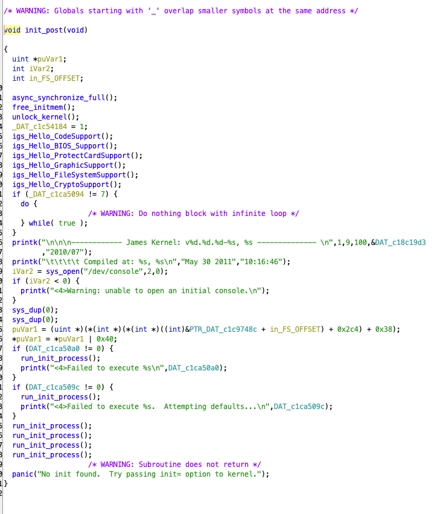
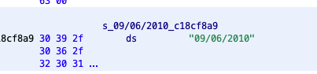

# GO TO SHELL
## Reverse Engineering Kernel Modifications with QEMU/gdb.
January 29, 2023

## Background

This writeup sort of came out of nowhere while working on the outline for another writeup (coming shortly).

I was asked to look at a few dumps from various eras of a company's release portfolio - known to mostly rely heavily on FPGAs and other custom hardware to deter copying and protect runtime assets. 

What started as a casual dive into a couple of runtimes quickly evolved into more interesting modifications and required more and more analysis and modification to get anywhere useful.

### <span style="color:red">** Disclaimer Time **</span>
This isn't meant to be some masterclass to deal with everything someone can do in order to make a nightmare kernel from Linux and make a reverser's life hell - there are plenty of other devious things (kernel jumping via kexec, removing mostly everything, custom kernel modules, etc.) that a developer can do to make this super painful.

Rather - this serves as a starting point with some general guidance on analyzing a customized environment, from bootup until user-space and beyond to get someone new to systems reversing in the right headspace to make progress.

Are you ready to jump? Let's-a-go!!!

## A Simple Example

### Testing from an Image 

The first thing we'll do is look at a general HDD image - use your weapon of choice here (xways forensics/winhex,ftk,whatever).

If you want to follow along, the archive with the image used is [here](https://archive.org/download/arcade-games/ice games/ice games/Harpoon Lagoon.zip).

Assuming your HDD image has the ability to boot, you'll have a few things:

* A way for your startup to go from power on to running some code (a bootloader).

* Some... THING for the bootloader to actually run (a kernel).

* Something that happens afterward - some OS or runtime or something related.


### The Drive Layout
For our example, we have 4 partitions:


The first partition contains a handul of files:


Looking at the files in a hex editor, one has various boot strings that looks like a compressed kernel [Fish4P]. It's also important to note that this looks like a Linux kernel. If this is the case, we can make some assumptions:

- The linux kernel is going to be loaded at a specific place in real mode memory (0x7C00)
- The linux kernel needs some kind of rootfs to load which provides access to a console, maybe a runtime to start things up (e.g. /sbin/init), and some kind of basic OS to get us to a runtime.


The other partitions have some data which looks like game assets and then a partition that looks like this:


### The RootFS
Looking for strings in this example, it's apparent that this blob represents something akin to a rootfs. Let's assume that we don't have the luxury of prior knowledge or are able to simply figure out the format offline (this will come in handy in the next example).

How do we get to a place where we can be in an environment that understands this format and work with it transparently?

### Runtime analysis of the Image

We can run the hdd image [v .001] with the following command:

```
qemu-system-i386 -s -drive format=raw,file=CF_GIG_M001US-WA.img 
```


Running the image, nothing happens which makes sense - the game itself would start given the right hardware and, maybe there are some hardware checks that make the game hang otherwise. 

At this point, some would give up, but not you and I - no siree! We're going to go deeper and figure out what's up, let's dive in!

### Extracting the Kernel

Linux kernels are generally held in a compressed image with some additional info that a bootloader uses to start them called a bzImage. There are various types of compression and naming and a bunch of  specifics but realistically, we care about getting the kernel out - so let's see what we can do in this case.

Running binwalk on the Fish4P-OS, we can see:


It looks like there is a compressed blob at a specific offset. Different kernels might use xz, lzma, gzip, or some bootloaders might even encrypt or otherwise encode the image themselves, it varies greatly. However, assuming whoever made this used a standard mechanism to pack their bzImage and it's gzip (given the era), we can look for 1f 8b 08 00, or the magic for gzip. 


As a result, we can use a hex editor and select from these 4 bytes until the end of the file, and use something like gunzip or 7zip to extract the kernel image.

However, knowing that this kernel is a 2.6 or newer kernel (based on strings visible in the bzImage), we have an even better option:

### vmlinux-to-elf

This [python package](https://github.com/marin-m/vmlinux-to-elf) can extract various compressed file formats of bzimage. It also can read a symbol table from the kernel if it was left compiled into the kernel and that will give us function names - including any customized function names. 

In our case, the kernel we have seems to work perfectly! 


Okay... so we have the kernel extracted... now what?

### Booting the Kernel

We can boot the compressed kernel (Fish4P) directly via QEMU 
```
qemu-system-i386 -s -drive format=raw,file=CF_GIG_M001US-WA.img -kernel "Fish4P-OS" -append "debug console=/dev/ttyso"
```

This will give us the same result as before, but now we have more control over the kernel itself because we can make modifications!

### Repacking the Kernel

In this case, because the kernel is compressed with gzip, and because we know the gzip header is unique in the bzImage, we can write a script to compress our modified kernel and pack it back into the bzImage. I wrote this quick [Python script](https://github.com/batteryshark/kernel_reversing_tools/blob/main/bzimage_repack.py) to do so.


This will give us the same qemu result for now, but let's dive into the kernel and see what's up.

### Static Analysis of the Kernel

When looking at a Linux kernel with the aim of reversing customizations, we have a few goals:

* See if we can identify what was changed from the vanilla kernel.
* Bypass any checks or roadblocks that prevent us from fully starting the kernel - as in, being able to run usermode code.
* Get from `kernel_start` through `init_post`. 

Think of `init_post` as your main function - after `kernel_start`, there's some initial setup, then `init_post` does additional mounting, sets up your console, and then kicks off whatever init usermode code needs to happen. 

This is our endgame - we need to get here in order to have a working system to progress.

### Throwing it into a Tool

Throwing the kernel (which is an ELF) into IDA, Ghidra, or another disassembler, we can pretty quickly find init_post:



We can also see several function calls, followed by a check, followed by what looks like an infinite loop right at the top!

Clearly, there are some checks happening to ensure that this is running on original hardware.


We can also see the support for our custom 'rofs' filesystem - based on CramFS 


It looks like it uses a password and AES (or a variation) to search for various files. As a sidenote - this is essentially CramFS using a variation of [Rijndael fst](https://opensource.apple.com/source/BerkeleyDB/BerkeleyDB-15/db/crypto/rijndael/rijndael-alg-fst.c.auto.html) with a slight modification - the input key shifts initial values in various places like so:

`tk[0] = tk[0] >> 2`
`tk[1] = tk[1] >> 1`
`tk[3] = tk[3] << 1`

Now, while we could use this kernel offline and write an extractor, that is not the purpose of this exercise, so we'll leave it be for now.

### Digging through the kernel

After tracing back from `init_post` to `kernel_start` we find a particular function of interest that's jammed into the side of `mount_root`.

It's also worth noting that the boot flag variable that controls the infinite loop in `init_post` can be referenced to see where it's set and this will speed up finding the right functions considerably.


`BIOS_kernel_level_check` is not in any of our kernel examples, and is likely custom as it does not exist in the [real code](https://elixir.bootlin.com/linux/2.4.31/source/init/do_mounts.c#L760)

Digging into the function itself reveals some interesting points:

* The root filesystem will not be mounted unless it returns properly.
* The function itself performs a string check.
* The string itself is a date.
* A proper return OR's a C1CA5094 [our boot flag from init_post] variable - adding to its value.


Looking at the function itself, it appears to be calling `BIOS_check_code`.


This code looks at real memory address 0x40000000 + an offset which is where your BIOS stores id information.


In this case, the offset is compared against a string value - it also returns zero if everything works out.



In this case, we can modify the function to just return 0 each time via the following bytes:


We can repack the kernel as `_patched` and ready the testing with the following:

```
qemu-system-i386 -S -s -drive format=raw,file=CF_GIG_M001US-WA.img -kernel 'Fish4P-OS_patched'
```

Note: This time, we added `-S` to our flags. This will hold qemu in waiting until we connect with a debugger in the next section.

### Kicking the Tires

Now that we have a modification that should work, it's time to test. After repacking the kernel and running the command in the last example, it's time to hook up a debugger such as gdb,ida, etc. to qemu and start stepping through the kernel.

We can put breakpoints at the various addresses for `init_post`, `kernel_start`, etc., and watch the kernel make its way to user mode.

While it looks like we've passed every check! And the OS should start...


 ...we still have a problem... we can't actually see the shell. Also, we aren't launching shell directly - we're launching the game startup!


So, what do we do now?

### Modifying the Startup

Linux kernels use kernel strings to tell the kernel how to start. This often involves telling it the first user-mode program to run (most of the time `init`), and what console userspace will start with `console=`. In our case, these are statically compiled into the kernel - although they can also be passed from the bootloader as well:


Because these are hardcoded, and while we could find the function `parse_cmdline_early` in the kernel and modify it so the bootloader strings are used instead of the hardcoded address, we can lazily just change the strings in the kernel image and repack it:


Now when we start up the kernel:


We have shell!!! ... but it kinda sucks... like we can't do anything such as mounting a filesystem or parse devices or disks... what's up?

### OS Runtime Setup

So... Linux has a few more steps to do once the kernel hits user-mode before it's not mostly useless.

Looking at /dev, we see we're missing device files for hardware and no real environment:


This is going to greatly depend on what's available or what was supposed to be run first, but in this case, we're looking at something similar to vanilla RedHat. As a result, running /etc/rc.d/rc.sysinit will start everything up:


The key here involves mounting procfs, sys, dev. A super baseline version of what an init script should do will be something like:

```
PATH=/bin:/sbin:/usr/bin:/usr/sbin
export PATH
mount -n -o remount,rw /
mount -n -t ramfs dev /dev
mount -n -t ramfs tmp /tmp
mount -n -t proc proc /proc
mount -n -t usbdevfs usbdevfs /proc/bus/usb
```

Great! So now we can boot with another hdd image, copy everything off that we want, and we're done!

## Bonus Simple Example

### Booting as before

So a similar OS I ran into from the same company with the same methods booted like this:


This means the default qemu cpu emulation doesn't support modern processor instructions. We have a couple of options:

* Use `-cpu phenom` to support AMD instructions from that era OR
* Use `-cpu max` to support all the instructions your modern CPU can emulate/support.

Moving ahead, we run into another issue:


In this case, we see the mount volume is /dev/sda - qemu defaults to 'ide' for its disk parameter. As a result, we need a system that supports SATA controllers that the Linux kernel in question might support. In this case, I used:

`-M q35`

After this, it properly booted the same way!


## A Not-So-Simple Example

Now that we have the foundation for how this works, let's get into something with more ...everything! More checks, more pitfalls, and more work to get to where we need to be!

### Drive Analysis

The drive itself looks fairly similar to the last.


Again we have a kernel file:


And again a custom rootfs:


But in this case, it looks like the game assets are also protected in what looks like yet ANOTHER custom filesystem:


Also, extracting the kernel and loading it up leads us to discover it's a 2.4 kernel.


### Working with an Old AF 2.4 Kernel


Linux 2.4 kernels had a `system.map` file included with some kernels if you're lucky... otherwise we likely don't have a proper way to map functions. In addition, we don't even have a great way to make an ELF out of this to process by a disassembler properly or know the base entry address without running it. There may be a way to determine those based on vmlinux structures, but I have yet to find one.

Opening the kernel in a disassembler, it's pretty apparent the default base address of 0 is wrong:


We can also tell because strings that should definitely be mapped into functions aren't referenced:


However, running the kernel in a debugger OR knowing that kernels are generally loaded at highmem ( >= 0xC0000000) + an offset (generally 0x100000) - we can try offsets until we get something workable:


We'll know we're in the right spot when functions start properly referencing, and some of our known strings are being xref'd too:


### Analysis Setup 

At this point, we'll start looking for that init string to lead us to `init_post`:


We'll also find kernel_start so we can set some breakpoints and begin the long journey to our shell.


We'll also set the debug flag and console kernel string in the kernel as well so it will be easier to see what's happening. We'll search for root:


And make the following modifications:


After that, we'll repack the image:

```
python3 bzimage_repack.py sub-OS-e64_kernel sub-OS-e64 sub-OS-e64_debug
Compressing VMLinux...
Replacing Original VMLinuz...
Writing out Modified bzImage
```

And test it:

```
qemu-system-i386 -m 512 -S -s -kernel "sub-OS-e64_debug" -append "debug console=/dev/ttyS0" -drive format=raw,file=sub.img,index=2 
```

Aaaaand we get a kernel panic:


It also appears to not be taking any of our manually entered kernel strings via append.

### Seconds from Disaster

So - because the kernel is panicking, we need to figure out why. We'll effectively have to start from the `start_kernel` function and debug our way to `init_post` as it's clearly getting stuck along the way.

Because we know where `parse_cmdline_early` is, and we can suspect it's at least getting there, we might be able to stick a breakpoint there and see if it makes it.

We can use the [real code](https://elixir.bootlin.com/linux/2.4.31/source/arch/i386/kernel/setup.c#L780) to help us find some identifying marker such as:


### Parse Cmdline Modifications

Right away, it's apparent that not all is well in `parse_cmdline_early` land. It looks like some logic has been added here and several functions exists where there should be none:


In addition, a byte is being OR'd with 1 underneath copying a replacement kernel string. XREF'ing that byte address with other areas of the code leads to additional flags:


#### extra-func-1
Digging into the first, we can see it's expecting that the boot string has `BOOT_IMAGE=sub` specified... but our static string doesn't even have that, so what's up!?


Also, it appears to be OR'ing an 0x20 value to specific variable...

#### extra-func-2
The next function does some shifting and OR's that value with 0x80...


Digging into that function further, we start seeing some XOR operations that look awfully familiar...


And Referencing one of those arrays confirms it - we're looking at mixcolums... this is AES... but in the cmdline parser... wtf?!


#### extra-func-3
The next function appears to look at a string, find `\xAA\x55\xAA` and then split the string at that point.


#### extra-func-4
And the last function parses 'Y' or 'N' values from keys separated by '='.


So - what's happening here?

#### The 'Harder' Way
<span style="color:red">Warning: Unnecessary Encryption Nerdiness</span>

Essentially, they have modified the AES algorithm to XOR against another mixcolumn value. In addition, the key schedule generation changes which table values are XOR'ed against. The have encrypted the actual kernel boot strings in the lilo boot file located near the bzImage and decrypt and validate the kernel strings. They fill the segment of encrypted boot string with garbage and look for a hardcoded start offset. The code then finds the end of the bootstrings by looking for AA55AA.

The AES they use is a derivative of [Rijndael fst](https://opensource.apple.com/source/BerkeleyDB/BerkeleyDB-15/db/crypto/rijndael/rijndael-alg-fst.c.auto.html) and slightly differs in mix and inverse mixcolumn tables.

Realistically, we could modify the above example aes code to create a decryptor, decrypt the kernel strings, and leave these checks alone, but that sounds like more work than it's worth and it only deals with 1 of 8 protections... Let's just short out the functions!

#### A Better Alternative

Realistically, three of these flags (the kernel string check, the decryption, and the BOOT_IMAGE check can be skipped. NOP'ing the bytes from the start of these functions until the 'qmemcpy'.

As the passed-in kernel strings are a parameter to this function, changing the 'source' pointer in the qmemcpy function to ours will negate all of the modifiction to strings and use the ones we give. Additionally, we can change the boot_flag |=1 instruction below that to 0xFF because we'll want that for later.


### The Other Flags

From the xref, it is apparent that there are several other flags including:

* Another check against our kernel strings flag (flag 0x40):


* A check against mounting the game and root partitions (flag 0x20):


If this function fails, however, the startup jumps to the start of the kernel and removes the functions that enumerate available memory which caused our kernel panic before!

* A check against an arbitrary int value that appears to be a broken hash check (flag 0x08).

 
 

* Running a process called /mnt/GECA - a userspace application [from the kernel](https://developer.ibm.com/articles/l-user-space-apps/) (flag 0x10):

 


* A check in `mount_root` - this one checks against a BIOS string `i852-W83627HF` and reset-panics the kernel as well if our BIOS does not contain this serial (flag 0x02).
 
 
 


At the end of all this, right before /dev/console is connected, the kernel checks our flag to ensure every bit has been flipped and enters an infinite loop if not:

 

### The Last Mile
 
 So at this point, we can pretty much patch all of our checks out by skipping them or otherwise. However, it seems to hang on running bash / connecting to our console, or hitting a panic - wtf?

 

At this point, we can suspect that the developers did something funny with their rootfs. That's why it's useful to make your own!

### Making our Own Stub RootFS

We're going to take a few files from a rootfs around the same time to ensure libc compatibility, but bash, tar, and gzip are useful if we're going to dump a copy of the files for ourselves. You may also want mount and some other goodies such as busybox if you're really paranoid about their environment.

 

It is also useful to pack an 'init' or at least a shell script with the init minimal implementation we had above to mount devfs,procfs, etc.

We can make our Stub RootFS by creating a blank disk image - I'll make it 8GB to dump all the files with plenty of space to spare:

```
dd if=/dev/zero of=./facade.img bs=1G count=8 && sync
sudo losetup loop1 facade.img
sudo -H gparted /dev/loop1
sudo mkdir facade
sudo mount -t ext3 -o rw /dev/loop1p1 ./facade
cd facade
```

We'll also make two device nodes - one for `null` and one for `console` as that will at least ensure the kernel has something useful to connect to:

```
mkdir dev
cd dev
sudo mknod -m 600 ./console c 5 1
sudo mknod -m 666 ./null c 1 3
cd ..
```

We'll then add all of our binaries and ensure they have execute privs the lazy way:

```
sudo mkdir bin
cd bin
sudo cp ../../bash .
sudo cp ../../tar .
sudo cp ../../gzip .
sudo chmod -R 777 .
cd ..
sudo mkdir ./sbin/
sudo cp ../init ./sbin/
sudo chmod +x ./sbin/init
```

We'll then make a text file with our minimal init script from before:

```
PATH=/bin:/sbin:/usr/bin:/usr/sbin
export PATH
mount -n -o remount,rw /
mount -n -t ramfs dev /dev
mount -n -t ramfs tmp /tmp
mount -n -t proc proc /proc
mount -n -t usbdevfs usbdevfs /proc/bus/usb
```

And add that to our rootfs. We can unmount at this point as well:

```
sudo mkdir -p ./etc/rc.d/
sudo nano ./etc/rc.d/rc.sysinit

sync
cd ..
sudo umount ./facade
sudo losetup -d /dev/loop1
```

If we want to remount, it's pretty easy:

```
sudo losetup -o 1048576 /dev/loop1 facade.img
sudo mount -t ext3 /dev/loop1 ./facade
sync
sudo umount ./facade
sudo losetup -d /dev/loop1
```

To save space, we can also convert this raw img file to qcow2 which will work well with qemu:

```
qemu-img convert -f raw -O qcow2 facade.img facade.qcow2
```

Now, if we take one of our sys_mount calls (such as the one that goes to the blank partition), we can
force the kernel to mount our new EXT3 partition. In addition, we'll make two other changes, we'll:

* Modify the kernel to point at our /dev/console wherever we mount it to (in this case /Sub/game_data/dev/console).
* Modify our `init=` in the kernel strings to point at our version of bash just in case they modified it (/Sub/game_data/bin/bash).

We'll now start it up like so:

```qemu-system-i386 -m 512 -s -kernel "sub-OS-e64_patched" -append "debug ro root=/dev/hdc2 console=ttyS0 init=/Sub/game_data/bin/bash" -drive format=raw,file=sub.img,index=2 -drive file=facade.qcow2,index=3```

 

Now that we have shell access, we can see that their /dev/console was a symlink to /dev/ttyS2 which didn't exist and was causing the panic. However, they included a `console.bak` which was a normal device file.

 

 

At this point, we're basically free to mount whatever we want. 

If we want to make a live copy of the rootfs for further startup analysis, we can use our tar+gzip `tar --exclude='mnt/Target' --exclude='dev' --exclude='sys' --exclude='proc' -czvf /mnt/Target/rootfs.tar /`

We can also use this as an opportunity to dump the custom partition data included as well.

It's worth noting that this is where we'll need to analyze startup scripts and any custom binaries to figure out what's next for our target. 

Welcome to userland!


## Final Thoughts

Reversing kernel modifications to better understand embedded systems will always be more of a challenge due to the kernel having the ability to fundamentally change how your Operating System works. Even seemingly innocuous things like extracting a compressed buffer, checking the time, or allocating memory might be filled with custom logic and functionality that vastly differs. You'll be operating in a strange new world that may not adhere to the rules you know.

However, the ability to analyze images based on well-known and well-documented software in the confines of a virtual environment (with a debugger to boot) will always make it a matter of time and patience like anything else.

I hope this was an interesting trip into looking at modified kernels and hope it inspires folks interested in the domain to come up with terrifying hell kernels for people to try and reverse someday.

Cheers!