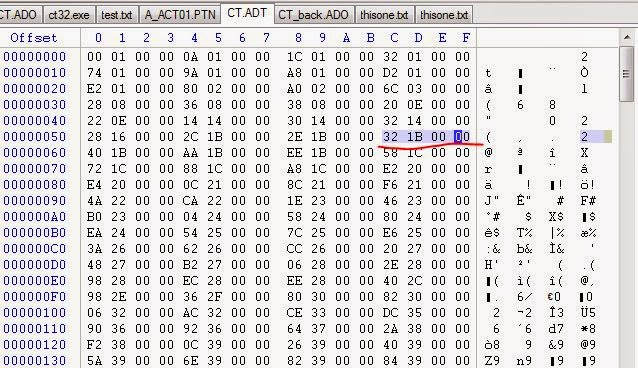

##### *Script Interpreter Analysis for the 21st century*
Original Post: 2014-08-07


```
This one... this one should be fun!

Let's take a great Japanese survival-horror game,
figure out how it works, make it English,
and do some other stuff to it.
```

___
### Background
___
For those not familiar with Clock Tower, it was a game originally developed for the Super Famicom by Human Entertainment. It's one of those point-and-click adventure games and a precursor to what would become the survival horror genre.:


 The plot itself is pretty straightforward - four orphans end up at this mansion after the orphanage closes and they start disappearing; you take over the role of Jennifer in the group and have to find a way out, hopefully find your friends, and figure out what's going on within the mansion.

Side Note: The mansion is pretty seriously haunted - things happen in the house for no apparent reason, instant deathtraps (a staple of adventure games) are plentiful, and Jennifer is forced to progress by solving various puzzles in addition to the fact that there's a psychopath with a pair of scissors that randomly chases the girls and can't be hurt or killed (no doubt an inspiration for Nemesis from Resident Evil 3):


The game is filled with visceral situations that involve split-second decision-making to survive. In most cases, running and hiding is the only option, but saving what sanity Jennifer has left is also important as she can trip over her own feet and die of a heart attack if things get too intense (a la Illbleed).

Anyway, this game was released in 1994 for the SNES, re-released with more content on the PSX in 1997, released on the Wonderswan (but seriously, who cares about the Wonderswan), and finally released on the PC (and then later re-released on the PC in 1999 as a value edition).

Yes - there's an English translation of the SNES rom by Aeon Genesis (I think it was him, anyway), but the SNES version is kinda shitty compared to the PC version which has better audio, an FMV intro, and other enhancements.

Probably the only version with a bit more content is the PSX version, but we'll get into that later.

___
### The Landscape
___

Essentially, we have a game root that looks like this:


- We have a BG directory containing what looks to be the room backgrounds in a carved up format along with an accompanying .MAP file for each one which I can only assume maps the various slices to the screen:


- We have a DATA directory containing various PTN and PYX files... not sure what these are at the moment - probably mapping the level screens to logic or something.

- We have a FACE directory containing bitmaps of the faces when characters speak:


- We have an item directory containing all of the items that Jennifer can use:


- We have a PATTERN directory with ABM files - perhaps sprite animations?
- We have an 'SCE' directory with two files: CT.ADO and CT.ADT.
  - The ADO and ADT file together are the script for the actions that happen in the game using a custom bytecode which will be where most of the changes to make will happen.

- We have a SNDDATA directory with MIDI and WAV files for BGM and SFX
- We have a VISUAL directory with all the HQ renders shown, menu options, and additional graphical assets in BMP format - this is also where the intro video is held.

- Finally, we have a DATA.BIN file which... I have no idea what it does at the moment in addition to the ct32.exe which is our game executable.


___
### NO-CD Time!
___
First, let's focus on getting the game running without the CD.

Running the game without the CD present will give us this:


Running it in a debugger shows that it can't find where the game data is.

Looking in IDA, we see RegQueryValueEx used to pull a registry value that determines what drive contains the game data:


Normally, we could patch this or hook this or any manner of methods to read a root path, HOWEVER, looking a little deeper by xref of this function leads to more interesting logic:


It appears that our diligence has paid off! The game checks for a "NOREG" argument on startup to load the game data from our current working directory and skip the registry read to determine the appropriate disc drive. We could simply always execute ct32.exe with this argument, OR, we could patch the argument check (as shown above) with 0xEB to always assume NOREG was passed.

Now, if we run the game:


___
### On the Hunt for Ingame Text!
___

Stepping back from a logical standpoint, should we expect all the text to be in the executable?

Well, it's possible - many games do it. There are even some strings in the binaries (like the NOCD error we found) that are static, but I have a feeling that they're going to be elsewhere (maybe in the DATA files?) - let's check the game executable first:


Although partially something that comes with experience, there appear to be SHIFT-JIS characters here - 3 bytes (including a control byte at the beginning normally in the 0x80 range).

We then copy these strings out  to a new file and open in notepad++ - pasting it into Google Translate:


Hrmmm... looks like some error messages with some game engine stuff, but no dialogue or anything.

Time to look in the DATA files!!!

- The PTN and PYX files don't really have anything text-related:
  - 

- The CT.ADT file looks to have 4 byte offsets (they count up from 0x100 all the way to the end of the file, 4 bytes at a time).
  -  

The CT.ADO file, however...


Now we're getting somewhere!

Not only are there ASCII strings that look like file paths, but also SHIFT-JIS text strings.

There appears to be data mixed in as well, however. The data repeats certain bytes that have a fixed size based on the starting bytes with a somewhat discernable format. This is definitely some kind of custom bytecode logic for the game itself.

I have a feeling that modifying this might break the game if offsets and other components are not updated to support more characters; this is a pretty common problem with English localizations; our words and phrases take up a lot more space, haha.

Let's see if we can figure out this bytecode format!

___
### The Bytecode Format
___

We've already looked a bit into how ADT works, let's take a look at what ADO looks like:


Essentially, we have a magic (ADC Object File) across the top, then a bunch of 0xFFs to get the offset up to 256, then it looks like data begins. Let's try to apply some engineering logic to this:

- Ton of strings
- A binary format with no apparent lookup besides potentially that ADT file

There has to be some kind of control code in here mixed in with the data to let the game know what it's looking at as it's being parsed... everything needs to have some kind of structure...

Looking at the strings with .BMP, we notice that some follow a similar pattern:

`\x39\xFF + \x00\x00 (sometimes \x00\x01) + string_loaded_from_FACE + padding?`

Every time a BMP is loaded from FACE (which contain the character face bitmaps), it appears to start with this 0xFF39 value. As a result, we can assume that this is an operation to load a face bitmap into memory.

Let's check the executable to see if we can verify our theory:


Nice! Not only do we have this value, but we have other values as well - let's check a few Shift-JIS strings to see if we can find a pattern:


Awesome! All strings start with 0xFF33, have two 16-bit values (0x0F00), and then a Shift-JIS string.

Note: One thing you'll notice about SHIFT-JIS is that it is NOT null terminated; it can't be.

Certain programs can operate on a mix of both single and multi-byte character values, but older ones had a more difficult time with this. As a result, you'll notice that all linebreaks (0x0a) have an 0x00 after them. In fact, ANY ASCII character in this has an 0x00 after it (and numbers or english letters). This is a way that the text rendering can support multibyte interpretation with ASCII characters (0-127) and not accidentally fuck up and read a data byte as a control byte and vice-versa.

As a result, we can assume that some logic in the game must parse the string until it finds the end somehow (probably by looking for a new opcode (normally 0x28FF).

Now, we can look at the switch statement in the executable that we found earlier (with all the cases) to mark down every opcode the game supports (to better understand the format).

We do this by noting the values (0xFF20, 0xFF87) and looking at them in the ADO file, determining if they have the same number of data bytes before the next opcode, attempt to figure out if they're 2 byte values, strings, and so on.


While doing this, it was discovered that the executable had some additional interesting text:


Awesome! This is starting to make more sense now. These appear to be the tags for the script operations - the game probably supports/supported reading a script from a text source as to not compile the binary every time for some menial change. The list seems to map nicely to the initial values we discovered as well:


From this point, we can run the game with a debugger; breaking at the various switch statements to see operations of various opcodes - one that might be interesting to us is JMP.

In fact, the first JMP (0xFF22) has a 2 byte value of 0x17 after it.

If you watch this in the game, and set the ADO_offset as a watched variable in IDA, you'll see the game jump from this value to 0x1B32 - How did it know to do that? It's not a multiple... maybe :



AHA!

0x17 * 4 is 0x5C - the ADT is a jump table for various scenes... you'll notice that the CALL function (0xFF23) works in a similar way, but the engine caches its offset and returns after execution (like the x86 CALL opcode).

The first few ADT offsets all point to 0xFF00 which seems to be a common jump point in the script. The jumps actually skip over them though (they add +2 to the offset after jumping) which works a lot like a RETN opcode.

You'll notice, however, that the ADT file has various values at the end that are far beyond the size of the ADO file... what gives?! We'll get to that, but it will take a bit better understanding of engine logic to determine how these jumps work (specifically, watching the jumps).


Dumping the memory, one thing you'll notice is that the ADC object file in memory (CT.ADO) has a value of 0x8000 int16 written in every 0x8000 or 32kb. Besides that, the ADO is unchanged. You can also see in the executable that it a function parses the values and skips 2 bytes ahead if it sees this value (akin to a NOP).


The game appears to read this data in 32k chunks and references offsets in 16bit addresses - important to remember. However, the ADT file uses 32bit addresses... there must be some kind of address mapping or otherwise implicit conversion going on. Looking at the executable, we see a bunch of offset logic that the decompiler wasn't a huge fan of:


Running this in a debugger and simplifying it, the logic itself is pretty simple:


`Note: high_val /= 2 could also be replaced with high_val>>=1 `

Ok, so far, we can generate ADT files (generating is the opposite; multiplying the most significant depending how many intervals of 0x8000 we've been over), we also have a general breakdown of the opcodes, and we know where the strings are. Before we dive into disassembly; let's keep our eye on the prize and go for broke (translation first).

___
### Translation Tooling
___

We know what format the strings are in and how to read them out of the ADO file... of course, injecting them back in will involve modifying the ADT offsets as string sizes are going to be different.

First, let's focus on ripping the ADO strings out into a text file - something easily editable and that can be read back into another program to mess with them. Even still, let's make a format where we can easily inject the strings into a new ADO file and let it take care of updating offsets and sizes automatically.

What do we need?

Well, the offset where the string starts is important, so is the size of the original string in bytes, then the string itself... sort of like

`0xE92 25 blahblahblah`

Enter cttd.py:

[ClockTower Text Dumper](assets/20140807/code/cttd.py)

I rename CT.ADO to CT_J.ADO when I generate a new test candidate.

This program reads in the ADO file, finds 0xFF33, skips 6 bytes ahead (to skip the opcode and 2-2byte values), and writes the starting offset of the string, the length of the string, and the string itself in a tab delimited format ending with a newline to a text file - simple!

You'll notice that I replace any 0x0a value (newline) with [NEWLINE] - this is because I want the whole string to be processed on one line and be able to specify newlines where I want them without having to modify the format of the text file.

For fun, let's do something kinda silly - we're gonna parse this text file with translator; a python module that dumps data out to google translate and autodetects language, translates, and returns it in your desired language:

Enter cttt.py:

[ClockTower Auto Translator](assets/20140807/code/cttt.py)

Let's try a couple of strings with an injector now - the last program in this suite parses the text file, adds null-padding to any ASCII character in the strings, and reads the lines into a dict so we know what offsets are affected. It also rebuilds an ADO from scratch (it reads the ADT, loads all the "scenes" into an array with their offsets, copies all the data between strings and afterward), and then regenerates an ADT based upon the sizes of the ADO "scenes" while constructing

Enter ctti.py:

[ClockTower Text Injector](assets/20140807/code/ctti.py)

Testing it - looks like we're making progress:


Nice!
The translation is going to be terrible this way - not only the fact that machine translations are often lacking, but there's just no substitute for an actual localization effort from a real team.

Thankfully, I found an rtf on some Clocktower Fan Forum (*wink*) and can manually edit the strings based upon the rough translations.


However, now that we've changed everything, running it results in this:


Throwing it into IDA, looks like we have a NULL pointer:


The NULL pointer appears to originate from loading chunks of the ADT file. A bit of memory inspection reveals that, indeed, we're missing something here:


This is a list of pointers that point to allocated 32k blocks of memory to store the ADO file data. The *chunk* we're on was never allocated. Digging back further to find where these pointers are created via malloc gives some insight as to what's up:


The object that manages the ADO chunks only has space for 5 pointers (based on the cmp5 opcode). However, the ADO reader logic will continue to read data until EOF which seems to be a bug. As a result, we can only load an ADO file with a max size of 163840 bytes. What's worse, the structure doesn't technically have space for additional pointers, but we're not going to let that stop us...

Let's dig into this SCE struct in memory a bit more:

We can change all instances of loading the ADO pointers in from 5 to 6 in order to add another pointer, but what's after that last pointer? Why, the start of the ADT offsets, of course!


We see that ADT offset 0x00 is at struct_head + 0x2A and goes for 0x7D0... seriously? 0x7D0 pointers? that's like 0x8000 wait a minute...

As a result of only having 0x4800 bytes used for our ADT file, we can say that bumping the ADT start index down to , say, 0x2E would give us 4 more bytes to write another ADO pointer there and we'd still have a ton of reserved room to spare at the end!

Finding struct references to 0x2A and changing them to 0x2E as well and:


```
ct32.exe binary changes:

529B:	74	EB
BC7B:	2A	2E
BC8D:	D0	CC
BD35:	2A	2E
BD62:	2A	2E
D4DA:	2A	2E
D4FC:	2A	2E
DA58:	2A	2E
DA79:	2A	2E
103DA:	2A	2E
10407:	2A	2E
104F8:	2A	2E
105BB:	2A	2E
105E8:	2A	2E
10703:	2A	2E
10730:	2A	2E
115FA:	2A	2E
116B2:	05	06
116E8:	05	06
11720:	2A	2E
11729:	D0	CC
1195D:	05	06
1C50F:	20	00
```

Ok - so now we have the game completely translated, now what?!

___
### SCEDASM - the SCE disassembler
___

The next logical step would be to disassemble all the other opcodes as well to build a text file that could eventually be read into a game/editor.

Sort of like this:

[ClockTower ADC Object File Disassembler](assets/20140807/code/scedasm.py)

Then of course, we'd need to push it all back into an ADO/ADT pair.

As a side-note: the PSX version of the game uses ADO/ADT as well!
We could even convert the assets and add the PSX exclusive content to the PC version.
