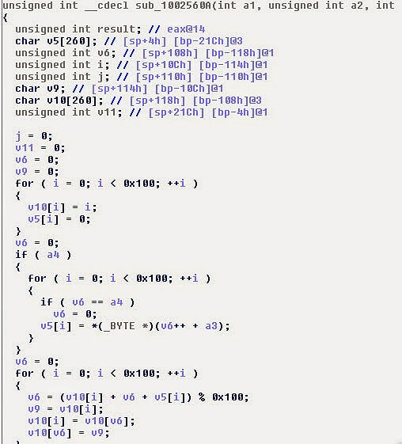
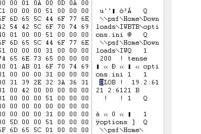

# Hacking 'I Wanna Be The Boshy' Game Saves
##### *A cursory glance at reversing Multimedia Fusion framework components*
Original Post: 2014-10-03

### Background
'I Wanna be the Boshy' runs on Multimedia Fusion 2's - an engine to help expedite game development in the days before modern frameworks like Unity or XNA.

During a playthrough, I wondered about how the game saves progress, unlocks, and potential secrets.

By default, data is passed around in MMF2 via *ini* files - IWBTB is no different:

Unlike normal ini files, however, these are encrypted:

### Initial Analysis
After some runtime analysis via procmon, we can see that it unpacks itself and operates out of a directory:

In the directory, we see a whole bunch of mfx modules which are basically renamed .dll files. The most interesting of which is INI++

### INI++
From a cursory glance, it looks like this *"INI++"* MMF2 module supports some type of basic encryption:

This module acts like a read/write wrapper for ini files; it takes a password and encrypts the data. It also supports MD5 hashing without changing the size of the output file (from the site). Hrmmm... password based, no padding...

Throwing the INIPP dll in IDA will get you something like this with IDAScope (I used it to see what crypto modules they were using):

As we don't see any AES constants or algorithms, the encrpytion is probably more like obfuscation and a basic cipher like RC4 or similar...

Well , guess it's time to start digging for "crypto" functions in the binary (Hint: just look for a bunch of bitwise operations and/or array shaking).

Bingo! This is classic unoptimized RC4...

*note*: Alternatively, we could have also looked at an open source python implementation of MMF2 called anaconda which has ported this extension module...

### ARCFOUR? What's an ARCFOUR? Weak Crypto!
**"ba dum tss"**

Well, now we know that it's using RC4... time to figure out where the key is coming from.
But first, let's build a POC for converting the data...

[Conversion Python Script](assets/20141003/code/converter.py)

So now we know the algorithm and have a POC... but we still don't know the damn password! Fortunately, MMFS2 is publicly available and so is this plugin.

### Getting the Password
After making a small test project that simply starts and writes an ini file with some data into an encrypted file, I find that the password allows no special characters and one line.

I compiled my project and set out in its running memory to find my password in plaintext because... #YOLO I guess...

Doing the same thing on IWBTB will net you a lot more text, but looking near the areas in memory where I found my password, theirs stuck out as well

The result:

The src below will decrypt/encrypt any of Boshy's INI files - the algorithm is reversible... just run again to re-encrypt. Decrypt a fully unlocked save available online if you want :)

[Boshy Python Script](assets/20141003/code/boshy.py)
