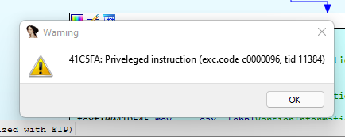
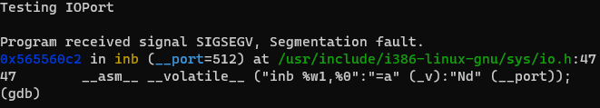
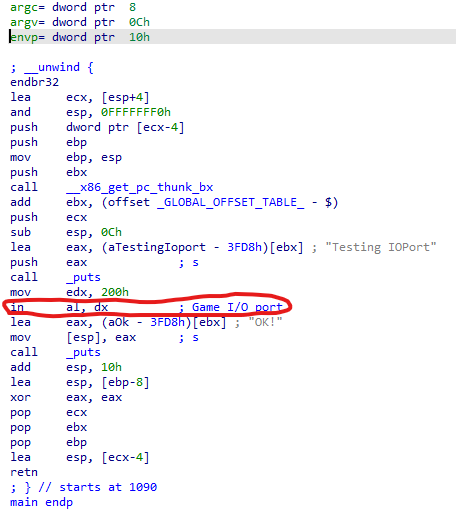
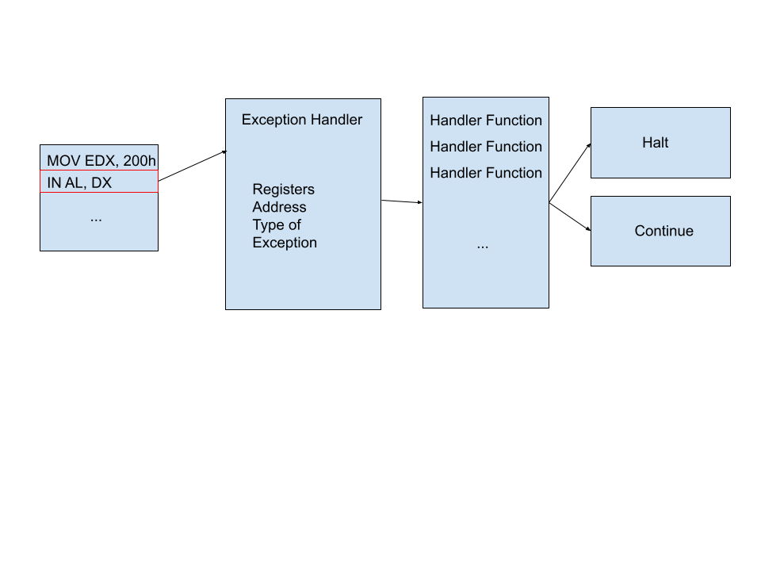

Working with old software presents interesting challenges from time to time -
especially when it came from an era around the shift between real mode and
protected mode. One of the biggest advancements between then and now was
hardware interaction, or, how software would communicate with the hardware
of your machine.

While direct communication is still supported for some devices, the x86 world
has dropped a lot of that in favor of abstraction through software for stability
and security reasons.

So, what happens if we try to run an application that relied on hardware
interaction today?



Or, we could give this a shot on Linux with a short sample:
``` c
// Compile with  cc -O2 -g -m32 test_ioport.c -o ./test_ioport
#include <stdio.h>
#include <sys/io.h>


int main(){

printf("Testing IOPort\n");
unsigned char value = inb(0x200);

printf("OK!\n");
return 0;
}
```

Which gets us:



So what gives?

# At the Assembly Level
Hardware communication at the assembly level in x86 works on a system of ports.
These ports work off of an addressing system that allows software to send/receive
8/16/32bit values to/from these ports as needed.

This wasn't limited to custom superspy satellite jammer hardware or nuclear
launch hardware, either. Traditionally, your onboard stuff (e.g. CMOS interaction)
and peripherals (think COM/LPT/GAMEPORT), they all used ioport addresses to do
their thing.

Some common ports included:
```
LPT for Printers and other Parallel Devices: 0x3BC, 0x378, 0x278
COM1: 0x3F8
COM2: 0x2F8
COM3: 0x3E8
COM4: 0x2E8
Gameport: 0x200, 0x208, 0x210 and 0x218
```


For more info, check out:
[List of PC IOPort Addresses](https://bochs.sourceforge.io/techspec/PORTS.LST)

Of course, this may vary depending upon configuration.

For instructions, we focus on two sets:

## IN : Input Data from Port
```
-- 8Bit Port Instructions --
E4 xx - IN BYTE from 8bit port xx to AL
66 E5 xx - IN BYTE from 8bit port xx into AX
E5 xx - IN BYTE from 8bit port xx into EAX
-- 16Bit Port Instructions --
EC - IN BYTE from 16bit port DX into AL
66 ED - IN WORD from 16bit port DX into AX
ED - IN DWORD from 16bit port DX into EAX
```

## OUT: Output Data to Port
```
-- 8Bit Port Instructions --
E6 xx - OUT BYTE AL to 8bit port xx
66 E7 xx - OUT WORD AX to 8bit port xx
E7 xx - OUT DWORD EAX to 8bit port xx
-- 16Bit Port Instructions --
EE - OUT AL to 16bit port DX
EF - OUT DWORD EAX to 16bit port address DX
66 EF - OUT WORD AX to 16bit port address DX
```

How to remember which is which? Think device-centric:

**IN**: Input FROM Device

**OUT**: Output TO Device

**NOTE**:

One important thing to note for those not familiar with x86, if we're working with
a 32bit process, we don't have dedicated instructions to work with 16bit data
for our in/outs because 32/64bit CPUs replaced that instruction with one that
represents the width of their registers.

As a result, we have to use the operand width override prefix by adding 66H before
our instruction to let the CPU know that we want it to handle this as if it were
a 16Bit CPU.

That's how x86 can get away with having instruction 0xEF mean both 32bit and 16bit
operations.   

# How IOPort Worked Before

Taking a look at our example in a disassembler shows that
we're calling an "IN" instruction - namely in AL,DX which would be 0xEC.



Traditionally, this would simply IN/OUT to memory where the hardware would read/write
wherever it was mapped at that would be it - simple!

# How IOPort Works Now

To do this nowadays, it's a bit more difficult. Modern Operating Systems have
abstracted a lot of this and require quite a few hoops to make this work
properly.

## Linux
For Linux, their io header gives you a function called ioperm - think of it
like port forwarding on a router where you have to select a range of ports
to allow in a process and the OS will allow communication provided permissions
are granted to do so - generally, a user would also need CAP_SYS_RAWIO to access the ports if they aren't root.

For more information about ioperm: [ioperm Manpage](https://man7.org/linux/man-pages/man2/ioperm.2.html)

## Windows
On Windows, this is a bit more tricky. One popular solution these days is a driver
known as giveio.sys. Essentially, this acts as a layer that restores the intended
functionality for select ports. It's something that must be installed and activated
prior to the process execution, however.

# Alternatives?
So, what if you want to run an application without giveio or ioperm? Further,
what if you want to run the application, and your system doesn't have the required
hardware? With only so many bytes per instruction, our options are limited right?
There are a few ways we can handle this...

## Approach #1 - Ignore
The simplest approach, find every IN/OUT instruction in the binary and NOP it out.
Because we're not dealing with stack manipulation or discrete function calls, it's
less likely this is going to crash your program.

However, if the program relies on input from hardware to do its thing, this won't
help considering no data will be received and whatever the register is set to will
be used instead so... not quite what we'd want in most cases, although this may
often be a good first step to get an executable running to see if any other
issues are present.

## Approach #2 - Memory Patch

This approach is tough - we only have about 1-3 bytes to play with depending upon the
instruction... not really a lot for hooking to do its thing. This is going to greatly
depend on what functions are calling the ioport IN/OUTs. If it's something relatively
simple or quite a bit is known about the calling function, this may work.
Although, it also means knowing the hook addresses in advance and making
portability for changes or alternate executables impossible.


## A Better Approach - Exception Handling

Although it's not perfect, one approach I've had the most success with in this
space leverages the exception handler for the target operating system.

Without getting into too many details, a process's exception handler helps to
intercept exceptions (imagine that) and halts the calling thread while specialized
handling functions can view the context of various registers and current instructions
to make a decision, handle issues, etc.



This is used quite a bit in regular operations, is how user-space debugging is facilitated on
modern OSes, things like debugprinting, and is widely available. Exception handlers
can be chained and called in sequence, and they only require that you push
the instruction pointer ahead (passed what raised the exception) in order to keep
running.

Now, there are some caveats:
- DRM that used exception handling may not appreciate additional handlers being
set. In those cases, there were always workarounds like not leveraging the catch-all
SetUnhandledExceptionFilter on Windows, etc.

- If this logic is going to emulate hardware, we're going to be hitting this handler a LOT... like a **LOT**.

The code within these handlers will need to be fast enough to let the software still do
its thing at a reasonable speed. Some believe that emulating hardware in an exception handler
is too slow... honestly, as anecdotal as it is, I've never run into an issue where this was the case,
but it's important to write these handlers responsibly and ensure there aren't too many
branches or waiting on other threads, etc...


## Linux

Linux uses a handler system provided by sigaction which allows you to specify
a function that will be called when a specific signal is raised, these cascade
in the order that they are set:

``` c
#include <signal.h>
#include <ucontext.h>
#include <sys/io.h>
void ioport_handler(int mysignal, siginfo_t *si, void* arg){    
  ucontext_t *context = (ucontext_t *)arg;    
  unsigned int eip_val = context->uc_mcontext.gregs[REG_EIP];  
  // ** Do Stuff **
  if((eip_val & 0xFFFF) == 0xED66){
    switch(context->uc_mcontext.gregs[REG_EDX] & 0xFFFF){
        case 0x200:
            context->uc_mcontext.gregs[REG_EAX] = SomeHandleInput();
            break;
    }
    // Skip over the instruction that caused the exception:
    context->uc_mcontext.gregs[REG_EIP]+=2;
  }
  
}

void set_handler(){
  struct sigaction action;
  action.sa_sigaction = &ioport_handler;
  action.sa_flags = SA_SIGINFO;
  sigaction(SIGILL,&action,NULL);
}


```

## Windows
Windows has two functions that deal with this and the approach depends on the application.

### SetUnhandledExceptionFilter
This is purely catching anything that doesn't already have an exception handler.
Traditionally, this function works out pretty well, although ideally, one should use:

### AddVectoredExceptionHandler
This allows better chaining and doesn't rely on uncaught exceptions. In addition,
its call allows to specify if this handler should be put at the top of the pile.
Not all legacy code likes to follow this function, so we can use either at our discretion.

One important item to note in the example, if you use OutputDebugString in your code, that itself
raises an exception to write to the DebugLog... as a result, this will cause a recursion issue
without a proper guard.

``` c
#include <Windows.h>

LONG WINAPI ioport_handler(PEXCEPTION_POINTERS pExceptionInfo) {
  // If this isn't what we want, skip it...
  if(pExceptionInfo->ExceptionRecord->ExceptionCode != EXCEPTION_PRIV_INSTRUCTION) {
      // Don't let Debug Prints Screw Shit up
      if(pExceptionInfo->ExceptionRecord->ExceptionCode!= DBG_PRINTEXCEPTION_C){
      }
      return EXCEPTION_EXECUTE_HANDLER;
  }
  // ** Do Stuff **

  unsigned int eip_val = *(unsigned int*)pExceptionInfo->ContextRecord->Eip;
  // -- Handle IN AX,DX --
  if((eip_val & 0xFFFF) == 0xED66){
      switch(pExceptionInfo->ContextRecord->Edx & 0xFFFF) {
          case 0x200:
              pExceptionInfo->ContextRecord->Eax = SomeHandleInput();
              break;
            }
    // Skip over the instruction that caused the exception:
    pExceptionInfo->ContextRecord->Eip+=2;
  }


  /*
  If another handler should be called in sequence,
  use return EXCEPTION_EXECUTE_HANDLER;
  Otherwise - let the thread continue.
  */
  return EXCEPTION_CONTINUE_EXECUTION;
}


void IOPort_Init(){
    SetUnhandledExceptionFilter(ioport_handler);    
}
void IOPort_Init_Alternate(){
    AddVectoredExceptionHandler(1,ioport_handler);
}
```

At this point, it's a matter of pushing our shim into the process and figuring
out the various handling we need for whatever hardware is being emulated.

Some common ones can be CMOS/RTC or an LPT based device, but that's a topic for
another time as those rely upon addressing and their own registers to track.

For a more practical example, refer to the compatibility layer that was written
for the Andamiro MK5 computer: [Here](https://github.com/pumpitupdev/andamiro_mk5)

# Wrapping Up

There is quite a bit that can be done with leveraging exception handlers... from
nanomites engines to custom debug logic... even user-space hardware emulation.

Cheers!
