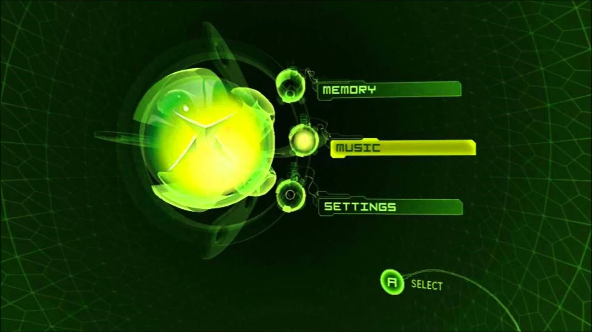
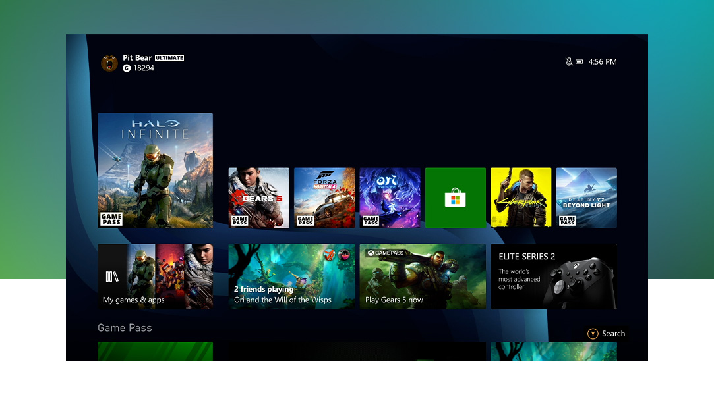

A homebrew experiment to bring the console experience to PC gaming - one hack at a time.

## Foreword

This is something I've been working on since roughly 2014, has gone through many **MANY** iterations, and is finally something worth sharing. It's taken a lot of reverse-engineering, further background in Windows/Linux internals, cross-platform code compliance, and a lot of sacrificed sleep. At this point, this will probably be the most ambitious thing I ever do before I let life cannibalize the rest of my free time, but it was absolutely worth it.

## Background 
For years, I've wanted to bring the convenience of modern console gaming to my PC game collection without many of the compromises that locked-down consoles bring. I would patch games and include dependencies, make them run from discs, or keep pre-installed files with dependencies so I could just play whenever I wanted. As consoles got more advanced, the allure of modern features such as frontends, containerization, and state management were hard to ignore, but incredibly difficult to replicate on Windows.

Instead of ranting for 70ish pages of how everything is put together, I'm going to attempt to break this up into different technologies as, by themselves, the components that make this up may be useful in their own right to someone or some project down the road. First of all, let's establish some context.

## Analysis of a Console OS

Depending on where you want to start this, game consoles roughly started to have "rich" OSes for only about the last decade or so, previous iterations offered little more than some settings for the BIOS, networking, etc:

However, these were some of the first that laid the groundwork - OSes with hard disk storage, multiple partitions, updateable Operating Systems, and interchangeable components. These offered updates for games, DLC, and basically everything that console gaming is now.

Over the last decade, most consoles have been publicly jailbroken. While homebrew and pirating games are valuable for the majority of those that decide to tinker with exploits, it's also interesting to dig into the internals of these Operating Systems and see just how similar their designs are.

From purely a super high-level design standpoint, what you'll find in a modern Console OS doesn't vary a whole lot from console to console and actually shares quite a lot with modern mobile devices:

- Some type of isolated Operating Environment that acts as a substrate.
- Software installed as a containerized (read: sandboxed) app with some type of isolation layer (normally kernel level) with granular ACL.
- Apps generally have a copy of their own dependencies with exceptions given to global APIs that may be offered from a specific OS revision or greater.
- Some type of way to manage versions and add files to an app's read-only memory.
- Some form of user profile-specific state for apps.
- Separate writeable area for an app to store and cache files.
- Some way to reset an app.
- Applications are generally not able to be modded unless it's from an approved mod source.

Of course, looking at your average PC gaming environment, things are a bit different:

- Apps are generally installed directly (e.g. direct download, GoG) or from some managed storefront (e.g. Steam, Epic, Origin, etc.)
- Installations affect the OSes dependencies (e.g. DirectX, PhysX, etc.)
- Writes to game files are not isolated and preservation varies by provider (e.g. Steam cloud sync, etc.)
- Locally run apps must be fully downloaded to play.
- Users may not have their own files, settings, or saves.
- (In Most Cases) Updates are destructive to original files.
- Games allow for user-based modding of arbitrary files.

## The Plan

So, what would we need to keep things like user-based modding, but add the convenience of managed apps, layered storage, universal cloud saving, and a pretty package to put it all in?

- A way to layer application files into a virtualized filesystem.
- A sandboxed environment for our applications to run.
- Support for multiple entry-points and subprocesses to share the same app "context".
- An app format to explain how an app should be constructed and executed.
- Some type of loader/launcher that understands our format.
- (Ideally) A way to cloud stream files which would enable streaming app rom files and universal cloud saving.
- (Ideally) Some pretty frontend package to make it look not terrible.

So - that's what we're doing, stay tuned for Part 2.

