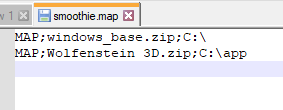
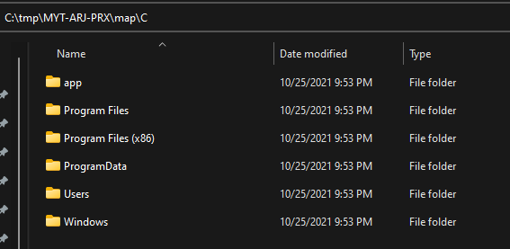
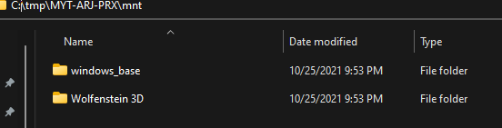

## Background
Software management generally includes some method of managing files and their respective paths. Several approaches to this exist, and solutions greatly depend upon if software is expected to be updated as a whole (traditional), updated with modules (plugin-based), updated incrementally (e.g. diffs, volumes), or a mix of all types.

Some solutions go far enough to include custom filesystem layouts within the software for maximum control.

Because we are implementing a system that should work with all (most) software, we have a few constraints:

- We need something that allows for incremental changes.
- We need something that can operate per-process.
- It has to be something that is somewhat portable to make code management easier.
- It has to be performant.
- It has to be customizable and (somewhat) dynamic.
- It has to allow for arbitrary changes.


## Initial Design Considerations

While we could create a virtualized filesystem layout and cache it in our application memory, this comes with a few constraints:
- It's far more brittle (real-time changes are more difficult).
- We have to track changes within the process itself (complicated and a lot of additional logic).
- Difficult to share a virtualized layout across processes.
- Difficult to manage it across platforms.

Console OSes have a few solutions based on their designs of these systems, they:
- Generally have a read-only package format that are "mounted".
- Have some type of description as to how and which packages are mounted.
- Understand some additional customized mount point.

Although we won't borrow the kernel-driven approach, modern Operating systems have some of these components, they:
- Have mountable images that allow us to mount packages as read-only.
- Allow us to create arbitrary mount-points.
- Give us some rudimentary path translation.

So - merging these ideas, we may get something like this:


## Enter Smoothie

For this, I created a compositing library to take arbitrary images and paths backed by a configuration, and create a layered filesystem of paths and various changes.

Smoothie takes a configuration file (called a map), mounts images of various formats (iso, zip, vhd, vhdx), and can make arbitrary changes (such as deleting files in a layer) and replacing others by way of leveraging the host Operating Systems symbolic linking. A map may look something like this:

```
# Comments - Semicolon-Delimited commands
MAP;example.zip;C:\
MAP;exiso.iso;D:\
MAP;windows.vhdx;C:\Windows
LINK;somefile_example.txt;C:\app\somefile.txt
```

The working root is then divided into multiple parts:
- The "map" root containing any drive roots (Windows only) or our root target (everyone else).
- The "mount" root containing all of our referenced mountpoints.
- A configuration file to keep track of everything mounted.
- A specified read-write layer (if appropriate).

While a lot of the compositing logic is cross-platform, image mounting and manipulation is not. As a result, several approaches are necessary for cross-platform support. On Windows, we have VirtDisk.dll that allows us to programmatically mount and manage ISO, VHD, etc.. On Linux, we have libguestFS.

The workflow, however, is essentially the same:

- Read the config, mount all images.
- Iterate all paths from the image and create/alter any symlinks and respective parent directory paths.
- Optionally composite a read/write layer on top of that.
- Let the process do its thing until done. If write compositing is enabled, make a copy of any modified files and replace the symlink with a real file.

When done, the process follows a fairly predictable flow:
- Read the config included in the working dir to determine what was mounted and unmount.
- Erase any symlinks from our "map" root.
- Copy any real files from our "map" root into the persistence (RW) layer paths.
- Any additional cleanup.

There are working examples written in C++ and .NET 5.0 (C#) for smoothie:

https://github.com/batteryshark/libsmoothie

https://github.com/batteryshark/Smoothie.NET

A working example map might be something like this for a Windows app:



Then, our working root would look like this:


And the map root for C:



Finally, the mount directory showing everything that was mounted:



# Additional Considerations
Now, we can't just tell a process that /path/to/root/thing is /root/thing, right? Further, we can't just expect a process to like the fact that we're mounting packages as read-only and stick to writing within our composite filesystem... we need some kind of redirection to happen from within the process. Let's get to that next!


