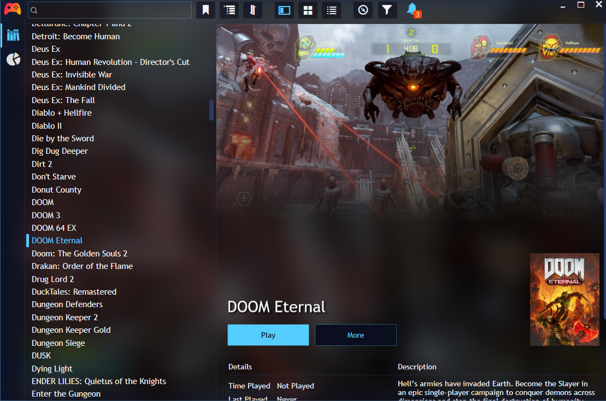
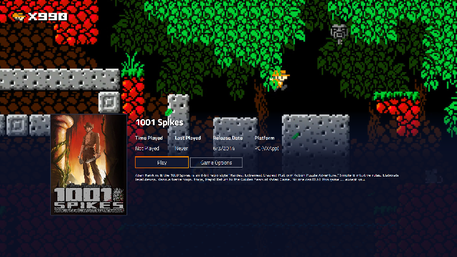

## Background

At this point, we can work on bringing the "console feel" to everything, but honestly, making a frontend requires a lot of overhead, you need:

- Some type of library manager.
- Graphics Libraries.
- Controller Support.
- Metadata management.

You essentially need the makings of a game engine to do this decently, and that's just the basics. Modern frontends include scrapers, icon/image management, and a ton of other features. Fortunately, we don't need to build this ourselves.

## Enter Playnite

Playnite (https://playnite.link/) is an open-source frontend hosted on github by one JosefNemec: https://github.com/JosefNemec/Playnite/ that will do pretty much everything we want:

- Scrapers for Metadata and Media
- Rich assortment of plugins and themes
- Controller Support
- "Big Picture" mode for TV selection and a more "console-like" experience.

Most importantly of all, it has a fairly robust API to create your own plugins, which will allow Playnite to (somewhat) understand the vxapp format and run our launcher, and with that:

## Enter VXApp4Playnite

The VXApp4Playnite (v4p) plugin (https://github.com/batteryshark/VXApp4Playnite) can be configured to read "repositories" of vxapp files from any given path and list them in the frontned.

Features:
- Multiple repositories with realtime updates can be specified.
- Controls to copy apps to a cached directory for faster loading.
- Controls to Suspend/Resume an app.
- Controls to clear cache and copy apps.
- Self updating to pull the latest copy of paradox libraries and supporting VXTools.
- Background splashes for loading apps.
- Controls to pull/push metadata updates (e.g. icons, ratings, etc.)

Main Screen:

Settings:

Game-Specific Context Menu:

Fullscreen mode now resembles something more like what we'd see on a console:

That's all well-and-good, but what about cloud saves? What about remote apps?

## Going CloudSide

Although we could implement something to handle all of this for us, something simple like Google Drive File Stream will work well for this.

For those not familiar, Google Drive has a driver that can mount your GDrive and Shared Drives as native filesystem paths and operate read/writes as normal. In this case, we simply put our vxapp folders onto GDrive and we have an online repository that we can stream the app files from as we need them. 

This allows us to read from the various images as needed without having to download the entire app. In this case, the "Install" option to copy the app locally is useful for offline play.

Also, because smoothie uses a read/write persistence layer, we can point our persistence root to Google Drive and support cloud saving for all of our apps!

## Looking Forward

At this point, remaining work is mostly:
- Improving paradox to support network emulation 
- Additional format support for smoothie (maybe xvc, squashfs)
- Better Linux Support
- Mac Support
- Additional Frontend support

But that's for another day,

Cheers!

