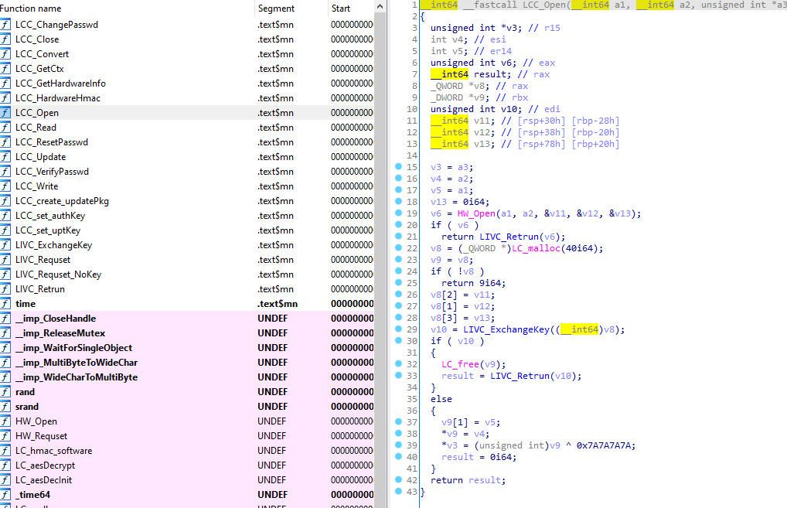
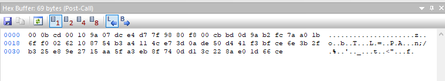
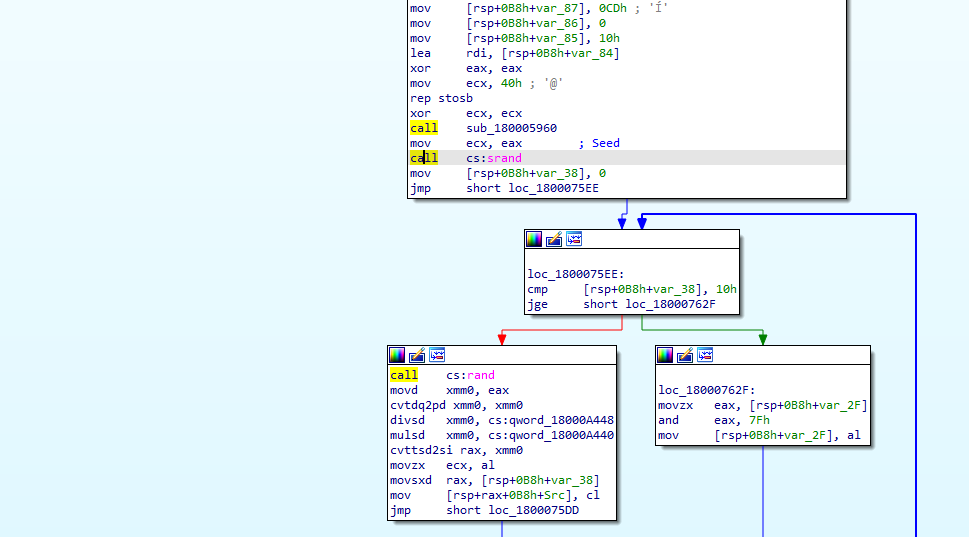
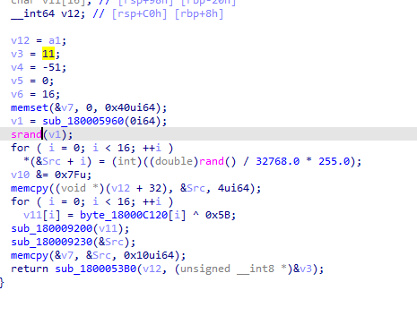
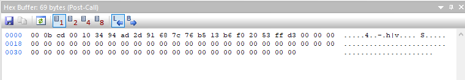
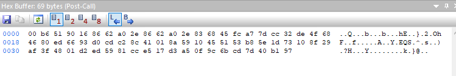
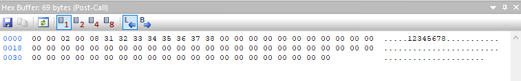

# Background
Jeez - well... didn't think I'd be doing another post on this SDK/Dongle, but here we are. To give some background, I've been trying to clean up a myriad of code projects. The unpacker I wrote last time, if anyone remembers, had some issues running on a 64bit Python instance mostly due to the handles not being written properly from the "open" call and some other quirks.

After statically compiling a new library, dynamically binding to another library, and countless other options - it was determined that there's just too much garbage in this client library for it to work consistently.

Seeing as how the Clave2 runs over HID packets, we're going to figure those out and make our own client library from scratch.

# Information Gathering
Just as before, the client library being unstripped helps us out quite a bit here:



In addition, running some example C programs in APIMonitor reveals that, predictably, we're sending the new exchange key in the clear out of necessity:




# Disabling Packet Obfuscation
From IDA, we can see that the library calls rand() and srand() to create its random data for the exchange key generation and padding.




We can easily patch these calls out via NOP and re-run our example in APIMonitor to make things a bit more clear :)  

[Set Exchange Key - Unpadded]

  

[Login Request - Before]

  
[Login Request - After]



There we go! Now it's time to run all the API calls and try to map out how this protocol works!

# Protocol Breakdown
The LC Protocol is broken down into various types of operations. In most cases, an operation will have different modes that affect given parameters. For instance, operation 0x09 (HMAC) is comprised of three modes (Init, Update, and Digest) where each have a different set of parameters and return values. In the case where a mode is specified, it takes the place of the first parameter.

As for communication itself, a new session will set an "exchange key" via an non-encrypted packet. 
The "exchange key" is created via the following steps:
```
1. XOR over the entire hardcoded client base key (b"\x70\x25\x4E\x4D\x73\xF5\x89\xFD\xF0\xAC\x4E\xD3\x52\x94\x14\x67") with 0x5B
2. Create 16 bytes of random data via 4 calls to: rand() * 0.000030517578125 * 255.0
3. AES-CBC Decrypt the random data with our XOR'ed exchange key with a NULL IV. 
```

# Packet Encoding 
The first 4 bytes of this key are xored over our packet bytes before being sent to hardware.
When a response is received, the 4 bytes must be xored over the response to decode the packet.

The packet format itself uses a fixed size of 69 bytes:
A leading NULL byte, packet data, and randomized padding.

The randomized padding follows the same 4-byte random routine that is used to create the "exchange key" data:
```
rand() * 0.000030517578125 * 255.0
```

## General Details:
Request packets are comprised of a 4 byte header, followed by any required payload data.
```
0x00 Operation
0x01 Parameter 1 (Typically - Operation Mode)
0x02 Parameter 2 
0x03 Parameter 3 (Typically - Data Length)
0x-- Data

Note: Sometimes, Parameters 1 and 2 will be a single 16bit value (Read/Write operations will generally do this).
```
Response packets are also comprised of a 4 byte header. In this case:
```
0x00 Status Code
0x01 Return Value 1
0x02 Return Value 2 
0x03 Return Value 3 (Typically - Data Length)
0x-- Data

Note: Sometimes, Return Values 1 and 2 will be a single 16bit value (Read/Write operations will generally do this).
```

Response status codes have an odd cross-mapping to the client API. That is, they reflect different states that correlate to the software API codes:
```
00 | 00 | LC_SUCCESS                    | Successful
01 | 12 | LC_OTHER_ERROR                | Other unknown exceptions
02 | 12 | LC_OTHER_ERROR                | Other unknown exceptions
03 | 03 | LC_INVALID_PARAMETER          | Parameter Error
04 | 12 | LC_OTHER_ERROR                | Other unknown exceptions
05 | 12 | LC_OTHER_ERROR                | Other unknown exceptions
06 | 12 | LC_OTHER_ERROR                | Other unknown exceptions
07 | 07 | LC_ACCESS_DENIED              | No privileges
08 | 12 | LC_OTHER_ERROR                | Other unknown exceptions
09 | 06 | LC_INVALID_PASSWORD           | Invalid Password
10 | 05 | LC_HARDWARE_COMMUNICATE_ERROR | Communication error with hardware
11 | 01 | LC_OPEN_DEVICE_FAILED         | Open device failed
12 | 02 | LC_FIND_DEVICE_FAILED         | No matching device was found
13 | 08 | LC_ALREADY_OPENED             | Device is already Opened
14 | 11 | LC_SYN_ERROR                  | Thread Synchronization error
```

## Operations:
### [0x00 Authentication]
This operation deals with setting an authenticated context by logging into the dongle.  
In addition, it handles clearing session data upon logout.

#### Request:
```
Parameter 1: Operation Mode
	> 0x00: Log in as Administrator/Developer.
	> 0x01: Log in as General User.
	> 0x02: Log in as Authentication User.
	> 0x03: Log out.
Parameter 2: None
Parameter 3: Data Length
Data: Password (8 bytes)
```
**Note: Log out expects payload to be '00000000'**

Examples: 
```
1:
  00 00 00 08 31 32 33 34 35 36 37 38
2: 
  00 01 00 08 31 32 33 34 35 36 37 38
3: 
  00 02 00 08 31 32 33 34 35 36 37 38
4: 
  00 03 00 08 30 30 30 30 30 30 30 30
```
#### Response:
```
Status Code: Result
Return Value 1: Operation Mode
Return Value 2: None
Return Value 3: None
Data : None
```
Examples:
```
1: 
  00 00 00 00 
2: 
  00 01 00 00 
3: 
  00 02 00 00
4: 
  00 03 00 00
```

### [0x01 Change Password]
This operation deals with password management (reasonably so).  
Note: This operation requires you to be logged in as Admin/Developer and only changes  
the authentication password. All other user types will throw an error.

#### Request:
```
Parameter 1: Login Type (MUST BE 0x02!)
Parameter 2: None
Parameter 3: Data Length
Data : Old Password New Password (16 Bytes)
```
Examples: 
```
1: 
  01 02 00 10 31 32 33 34 35 36 37 38 31 31 31 31 
  31 31 31 31
```
#### Response:
```
Status Code: Result
Return Value 1: Number of Retries Set for this User.
Return Value 2: None
Return Value 3: None
Data: None
```
Examples: 
```
1: 
  00 0d 00 00 
```
### [0x02 Hardware Information]
Retrieve hardware information about the device.
#### Request:
```
Parameter 1: None
Parameter 2: None
Parameter 3: None
Data : None
```
Examples:
```
1: 
  02 00 00 00
```
#### Response:
```
Status Code: Result
Return Value 1: None
Return Value 2: None
Return Value 3: Data Length
Data : Hardware information (32 bytes)
	> Developer ID  (4 digit widechar) -- 8 bytes.
	> Device Serial (8 digit widechar) -- 16 bytes.
	> Mfg Timestamp (Unix TS - LE) -- 4 bytes.
	> Flash Timestamp (Unix TS - LE) -- 4 bytes.
```
Examples:
```
1:
  00 00 00 20 31 00 36 00 39 00 31 00 30 00 35 00 
  31 00 36 00 36 00 38 00 37 00 36 00 6b 32 f1 5a 
  9b 3f a3 5e
```
### [0x03 Read]
Read data from blocks of internal memory.
#### Request:
```
Parameter 1: Memory Offset (High Byte)
Parameter 2: Memory Offset (Low Byte)
Parameter 3: Amount of Data to Read (Max of 64 Bytes)
Data: None
```

Examples:
```
1:
  03 00 00 40
```
#### Response:
```
Status Code: Result
Return Value 1: Internal Memory Offset (High Byte)
Return Value 2: Internal Memory Offset (Low Byte)
Return Value 3: Data Length
Data: Requested Data
```

Examples:
```
1:
  00 1c 00 40 ff ff ff ff ff ff ff ff ff ff ff ff 
  ff ff ff ff ff ff ff ff ff ff ff ff ff ff ff ff 
  ff ff ff ff ff ff ff ff ff ff ff ff ff ff ff ff 
  ff ff ff ff ff ff ff ff ff ff ff ff ff ff ff ff 
  ff ff ff ff
```

### [0x04 Write]
Write data to internal blocks of memory. Block 0 can be written by any privileges, whereas 1-3 can only be written by an admin/devleoper. 
**Note:** Because block 3 is logically located after sensitive blocks, additional steps are required to be able to write to this area.

#### Request:
```
Parameter 1: Memory Offset (High Byte)
Parameter 2: Memory Offset (Low Byte)
Parameter 3: Amount of Data to Write
Data: Data to Write
```

Examples:
```
1:
  04 00 00 40 ff ff ff ff ff ff ff ff ff ff ff ff 
  ff ff ff ff ff ff ff ff ff ff ff ff ff ff ff ff 
  ff ff ff ff ff ff ff ff ff ff ff ff ff ff ff ff 
  ff ff ff ff ff ff ff ff ff ff ff ff ff ff ff ff 
  ff ff ff ff
```

#### Response:
```
Status Code: Result
Return Value 1: Internal Memory Offset (High Byte)
Return Value 2: Internal Memory Offset (Low Byte)
Return Value 3: None
Data: None
```


Examples:
```
1:
  00 1c 00 00
```

### [0x05 Clear Memory]
Clear Blocks of Data.

#### Request:
```
Parameter 1: Memory Offset (High Byte)
Parameter 2: Memory Offset (Low Byte)
Parameter 3: Amount of Data to Clear
Data: None
```

Examples:
```
1:
  05 06 00 40
```
#### Response:
```
Status Code: Result
Return Value 1: Internal Memory Offset (High Byte)
Return Value 2: Internal Memory Offset (Low Byte)
Return Value 3: None
Data: None
```

Examples:
```
1:
  05 22 00 00
```
### [0x06 Initialize System Block]
Resets a given block (determined by the address provided) to 0xFF. Typical Write permissions apply here.
In addition, this is generally used for the "system" area (e.g. 0x600).

#### Request:
```
Parameter 1: Memory Offset (High Byte)
Parameter 2: Memory Offset (Low Byte)
Parameter 3: None
Data: None
```

Examples:
```
1:
  06 02 00 00
```
#### Response:
```
Status Code: Result
Return Value 1: Internal Memory Offset (High Byte)
Return Value 2: Internal Memory Offset (Low Byte)
Return Value 3: None
Data: None
```

Examples:
```
1:
  00 1e 00 00
```


### [0x07 Initialize Memory Block]
Resets a given block (determined by the address provided) to 0xFF. Typical Write permissions apply here.
In addition, this is generally used for memory block areas (e.g. 0x0200 , 0x0800).

#### Request:
```
Parameter 1: Memory Offset (High Byte)
Parameter 2: Memory Offset (Low Byte)
Parameter 3: None
Data: None
```
Examples:
```
1: 
  07 02 00 00
```

#### Response:
```
Status Code: Result
Return Value 1: Internal Memory Offset (High Byte)
Return Value 2: Internal Memory Offset (Low Byte)
Return Value 3: None
Data: None
```

Examples:
```
1:
  00 1e 00 00
```

### [0x08 Convert]
Transforms input data via onboard AES engine.
#### Request:
```
Parameter 1: Operation Flag
	> 0x00: Encrypt
	> 0x01: Decrypt
Parameter 2: None
Parameter 3: Input Data Size
Data: Input Data
```
Examples:
```
1: 
  08 00 00 10 aa bb cc dd ee ff 00 11 22 33 44 55 66 77 88 99
```

#### Response:
```
Status Code: Result
Return Value 1: Operation Flag
	> 0x00: Encrypt
	> 0x01: Decrypt
Return Value 2: None
Return Value 3: Output Data Size
Data: Output Data
```

Examples:
```
1:
  00 00 00 10 11 22 33 44 55 66 77 88 00 11 22 33 44 55 66 77
```

### [0x09 Sign]
Perform Signature Operations.  
**Note:** Only Authentication User (2) can use this.
#### Request:
```
Parameter 1: Operation Flag
	> 0x00: HMAC Init
	> 0x01: HMAC Update
	> 0x02: HMAC Finalize	
Parameter 2: None
Parameter 3: Init (None), Update (Input Data Size), Finalize (None)
Data: Init (None), Update (Input Data), Finalize (None)
```
Examples:
```
1:
  09 00 00 00
2: 
  09 01 00 11 54 48 45 5f 52 41 49 4e 5f 49 4e 5f 53 50 41 49 4e
3:
  09 02 00 00
```

#### Response:
```
Status Code: Result
Return Value 1: Operation Flag
	> 0x00: HMAC Init
	> 0x01: HMAC Update
	> 0x02: HMAC Finalize
Return Value 2: None
Return Value 3: Init (None), Update (None), Finalize (Output Data Size)
Data: Init (None), Update (None), Finalize (Output Data)
```

Examples:
```
1:
  00 00 00 00
2:
  00 01 00 00
3:
  00 02 00 14 13 2d 89 13 e4 bb a8 85 46 8f 73 8a 30 d1 bf a9 ea ae a6 b3
```


### [0x0A Update Package]
Operations that have to do with remote update packages.

#### Request:
```
Parameter 1: Operation Flag
	> 0x00: Set Block
	> 0x01: Write Block
	> 0x02: Validate Header
	> 0x03: Validate Signature	
Parameter 2: Set Block (Block Number), Write Block (Chunk Counter), Validate Header (None), Validate Signature (None)
Parameter 3: Set Block (None), Write Block (Chunk Size), Validate Header (Header Size), Validate Signature (Signature Size)
Data: Set Block (None), Write Block (Chunk Data), Validate Header (Header Data), Validate Signature (Signature Data)
```
Examples:
```
1:
  0a 00 00 00
2: 
  0a 01 00 40 ff ff ff ff ff ff ff ff ff ff ff ff 
  ff ff ff ff ff ff ff ff ff ff ff ff ff ff ff ff 
  ff ff ff ff ff ff ff ff ff ff ff ff ff ff ff ff 
  ff ff ff ff ff ff ff ff ff ff ff ff ff ff ff ff 
  ff ff ff ff
3:
  0a 02 00 11 30 00 35 00 31 00 36 00 36 00 38 00 37 00 36 00 03
4:
  0a 03 00 14 54 44 f6 c3 f7 04 1a c1 60 3d 73 f1 1e 6f c1 50 6b 08 64 ea
```

#### Response:
```
Status Code: Result
Return Value 1: Operation Flag
	> 0x00: Set Block
	> 0x01: Write Block
	> 0x02: Validate Header
	> 0x03: Validate Signature	
Return Value 2: None
Return Value 3: None
Data: None
```
Examples:
```
1:
  0a 00 00 00
2: 
  0a 01 00 00
3:
  0a 02 00 00
4:
  0a 03 00 00
```


### [0x0B Session]
Session-related operations. Called when a new handle is created.
**Note:** This is the only packet type that will not be encoded/decoded due to setting a new exchange key. However, the request is still padded with random bytes.
#### Request:
```
Parameter 1: Operation Flag
	> 0xCD: Set Exchange Key
Parameter 2: None
Parameter 3: Input Data Size
Data: Input Data
```
Examples:
```
1: 
  0b cd 00 10 ad b6 37 51 4c ca 39 92 24 2c d8 b7 5d bd 0a d5
```

#### Response:
```
Status Code: Result
Parameter 1: Operation Flag
	> 0xCD: Set Exchange Key
Return Value 2: None
Return Value 3: None
Data: None
```

Examples:
```
1:
  00 cd 00 00
```

## Memory Map
Memory Operations on the LC device leverage both physical and logical addressing.

A breakdown of logical blocks follows:
```
RW Flags:
A = Admin Only
E = Everyone

Offset Size  R W Name     Desc
0x0000 0x200 A A MBlock 0           | General Purpose Memory Block 0
0x0200 0x200 E E MBlock 1           | General Purpose Memory Block 1
0x0400 0x200 E E MBlock 2           | General Purpose Memory Block 2
0x0600 0x180 E E MBlock 3           | General Purpose Memory Block 3
0x0780 0x018 E A Unknown 1          | Unknown Block of Memory (generally initialized)
0x0798 0x014 E A HMAC Key           | HMAC Signature Key used for Hardware Operations [Default = \x0b * 20]
0x07AC 0x014 E A Package Update Key | Signature Key Used for Update Packages [Default = \x0a * 20]
0x07C0 0x010 E A Unknown 2          | Unknown Value [Default = 000102030405060708090a0b0c0d0e0f]
0x07D0 0x010 E A Unknown 3          | Unknown Value [Default = 2b7e151628aed2a6abf7158809cf4f3c]
0x07E0 0x00A E A Admin Creds        | Administrator Password + Number of Retries (always FF FF)
0x07EA 0x00A E A User Creds         | User Password + Number of Retries (always FF FF)
0x07F4 0x00A E A Auth Creds         | Auth Password + Number of Retries + Number Remaining
0x07FE 0x002 E A Unknown 4          | Unknown Value (FF FE)
0x0800 0xE00 E E Free Space         | Additional Storage which can be used.
```


# Interesting Quirks
- Any privilege can read the various keys and passwords with a simple read command... probably not what they were going for.

- The additional 3584 bytes of read/write memory is an interesting find. It seems like they used a larger module than needed.

- The fact that admin and user cannot have a set retry limit makes it possible to brute force the password - although an 8 byte password might take a while and most programs will just have the user password hanging out in them.

- The Auth privilege has a retry limit, but the attempt counter can be reset by overwriting the value.

# Rebuilding the API
This repository details a Python API for the LC hardware alongside several tests: [Link to Repository](https://github.com/batteryshark/io.clave2)

# Additional Thoughts
- It might be worth decapping one of these to check out what's under the hood and where the AES key lives.

- Perhaps I'll make an emulator at some point to simulate the hardware itself.