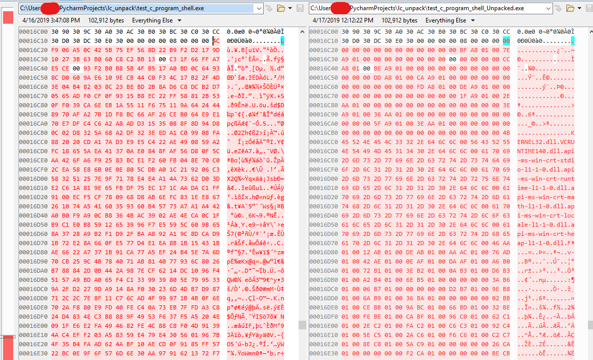

##### *The Faults of Hardware Token use in Commercial Thick Client Software*

```
This should be a fun and fairly straightforward example
of DRM via obfuscation with some anti-debug, anti-tamper, anti-vm, etc.
leveraging a rather common commercial hardware cryptographic device that
one can pick up from ali express for like... 15 bucks a piece or less.

It is by no means a sophisticated envelope, but employs some interesting
mechanics that may be easier to attack prior to taking something on that's
a bit more intense (e.g. HASP SRM, VMProtect SenseLock Edition, etc.)
```

___
### Background
___
I was recently asked to look into an obscure piece of Windows software that
leveraged a cryptographic token (USB dongle) where the executable itself goes
through some form of pre-processing and is packed and encrypted to deter use
without the dongle. The software no longer works on Windows 10 (probably due to some failure in the envelope protection logic.)

In reality, these envelopes are used partly in an attempt to
protect the dongle code from removal as something like:
```
if(!dongle_present()){exit();}
```

is pretty easy to patch out.

Some other cases:
* Hide Hardcoded secrets (yuck)
* Hide unreleased features
* Deter or complicate software duplication.

In the past, my colleagues and I have looked at several hardware-assisted
packed binaries of which not many variants exist. It stands to reason considering
packer code authoring is becoming a lost art relegated these days primarily
to crackme enthusiasts or malware authors; adding a hardware component that
at the very least needs to communicate via HID complicates any packer model
and significantly increases the attack surface for relatively little benefit.

This particular sample, however, was interesting as it seemed to not be the usual
AKS/HASP SRM envelope or VMP envelopes, but a cheaper offering also from Senselock.

___
### The Hardware
___


Enter the Senselock LC; also known as the Clave 2. This budget-level hardware crypto token
isn't as flashy as the Elite EL models, doesn't have a robust API, can't execute user-created custom firmware - it's definitely "entry-level".


The Gist:
*  2KB flash memory for built in storage.
  * Remote update of this memory area through the API and "update packages".


*  AES128 bit crypto with a burned in non-configurable hardware key.
  * Max input data of 16 bytes per call.


* HID (Driverless) Support for Windows/Mac/Linux 32/64 bit.

Another feature touted (for Windows 32-bit only) is an envelope utility to encrypt and pack
an existing, pre-compiled executable with the dongle with some extra options such as custom error messages or tying a particular enveloped executable to a specific dongle.

___
### The (Vendor Supplied) Software
___
Fortunately, the API to this dongle is freely available on the Senselock site including
the packer utility. It should be noted that, although other offerings such as HASP obfuscate the shit out of their client API libraries and packing utilities, that is not the case here.

One can rather easily grab a static library file from the API zip and unpack it:


Oh - they also aren't stripped... so that will be useful later on.


The envelope utility itself is a fairly basic GUI that extends out to an exe statically
compiled with the LC lib.

The API itself is fairly straightforward as well - to use the Clave 2, you:
* Open a handle with a given index.
* Log in with a password.
  * There are three passwords (admin (readwrite), general (read/encrypt/decrypt), and auth)
* Do whatever you want.

It should be noted that the way this API flow works infers that the general password at least
is likely hardcoded in most cases. As a result, provided that someone knows the required password, it's trivial to take this publicly available API and create software with a dongle meant for another piece of software. This will come in handy shortly.

**SIDE NOTE:** Most cryptographic token APIs do some initialization to bind static and dynamic libraries to a specific dongle or family of dongles for this very reason - to prevent people from interacting with a specific dongle through publicly available libraries.


___
### The Approach
___
Ok so, a bit of the background out of the way - what do we do now?

Well:
* We don't know enough about the target application, a better approach would be to envelope a super basic application which we will have both code and the original binary and use that for our tests.

* We will likely use the API libs to label vendor code and try to determine how this whole thing works more quickly.

* We probably want to determine how the packer works and either use a debugger and make a working dump.

* If we really want extra points and it's possible, we may be able to statically reconstruct the original exe without actually running the program at all.
  * It's doubtful that the packer is using external processes, nanomites, etc...
  * If the packer uses stolen bytes, that will be more of a pain to statically reconstruct.

  ___
  ### The Test Application
  ___

  A rather basic C program will be perfect for testing:
  ``` c
  #include <Windows.h>
  #include <stdio.h>

  int main() {
  	HMODULE h = LoadLibraryA("user32.dll");
  	printf("This is a test program: %p\n", h);

  	HANDLE hfile = CreateFileA("C:\\test.txt",
  		GENERIC_READ,
  		FILE_SHARE_READ,
  		NULL,
  		OPEN_EXISTING,
  		FILE_ATTRIBUTE_NORMAL | FILE_FLAG_OVERLAPPED,
  		NULL);

  	CloseHandle(hfile);
  	return 0;
  }
  ```

  Nothing special - compiled, it comes out to about 9KB (JFC Visual Studio).
  Processing it with the envelope results in a > 100KB exe with the suffix "_shell"


  Loading it in IDA confirms initially that the IAT gets shredded. and we're greeted with a new section in our executable:


It comes as no surprise that this is also where our new entry point is.

The first thing to do is to open up our static libraries and look for constants and various functions that are similar and check xreferences and try to label some of this stuff.

Quite a bit of tedium gets us the following:


Now - getting into some of the second level functions after the original entry point, we'll start to see some familiar friends such as :


and


Hey we have some textbook VM detection code :)

In fact, going through some of the functions in the packer entry-point, you'll see a LOT of copy-pasted code from links like this: https://www.cnblogs.com/zhangdongsheng/archive/2012/07/02/2573416.html

Normally, packers obfuscate the shit out of this logic to make it harder to identify or modify.
In this case, if you modify any bytes in this section, the application will close (not that it ran properly anyway) - the reason is not surprising:


There are a few checksums thrown around during the initial unpacking process to deter tampering, although this is more of a... check a hardcoded value which isn't used for anything else. As a result, one could easily either change the resultant value or remove the check entirely without consequence.

Other than that - pretty typical checks where it looks for process names (e.g. ollydbg, idaq, softice, etc.)

One thing to note, because we labeled the LC API functions, we can also see where these API calls are performed - as a result, we can see where LC_passwd is called and thus, where our hardcoded dongle password is!!!


Anyway - let's get onto the packer flow.

___
### Packer Process
___

After labeling most things, the packer process is pretty straightforward. Note, I'm simplifying this because there's a lot of boilerplate stuff like dynamic binding resolution, anti-debug checks, and anti-vm/anti-tamper checks - pretty common with most packed binaries and some housekeeping stuff, but the general gist is this:

```
* Iterate each section of the exe that is marked as executable (e.g. a CODE section)
  -> Log into the Dongle,
  -> Send the hardcoded exe key (16 bytes) to the dongle's "encrypt" fuction.
  -> Retrieve the 16 byte key result.
  -> Use the key result in a Rijndael function to decrypt the given section in place.

* Go to a hardcoded offset in the .lcsh section

* Decrypt the a blob of data scraped from the original Import Address Table (in place)
  using the same method of getting a key and Rijndael and all that stuff from the code
  sections.

* Read the original IDT in plaintext from a hardcoded offset in the .lcsh section.

* Use the newly decrypted original IAT and IDT to write various offsets to
  relocation points and additional locations to reflect the IAT's new location.

* Jump to OEP (this address is also hardcoded into .lcsh).
```

So realistically... what do we have?

* Nothing this packer does is necessarily lossy or destructive. As a result, there's a real chance of reconstructing a working unpacked executable statically. Granted, a 1:1 to original is probably still not doable, but we can get pretty close.

* We should be able to replicate all of these steps - it's worth noting that figuring out this entire process required no dynamic analysis - the lack of junk code, anti disassembly macros, and obfuscation tactics made this unbelievably simple to figure out statically.

* Since we understand the process, it stands to reason that we should be able to build out a script that can unpack a given executable. Granted with some constraints:

  * We will need to encrypt that exe key. The envelope generator randomly creates a 128 bit value to use with the dongle. As a result, all exes will be different. As a result, this will not fully remove the need for the dongle if newer executables are released.

  * We will likely want to optionally specify a pre-recorded encryption key so the dongle isn't always needed and have some kind of printout to see a generated encryption key when we do use the dongle.

  * We have a dll - we even have a 64 bit dll but the API is buggy and the vendor advises using the 32 bit version. As a result, we'll use the 32 bit vendor API dll with Python Ctypes and put legit dongle interaction in our unpacker!

  In addition to the hardcoded key and password for the dongle - the general area they reside in has some other interesting values:
  


  Opening our original exe in CFFExplorer - some of these values start popping up:
  


From this, we can start to construct what exists in this area, and what values will be important
to properly unpack the executable - something like:
* OEP
* Dongle password
* pre Encrypted EXE Key
* Original Image Base
* Encrypted IAT Offset and Size
* IDT Offset and Size
* Original Relocation Directory


  ___
  ### Writing an Unpacker
  ___  
**Note:** Code is included - follow along if desired.

  To make this whole process a lot easier, we will be using a couple Py3 Modules:
  * pefile https://github.com/erocarrera/pefile
  * py3rijndael https://pypi.org/project/py3rijndael/

  The PEfile module is fantastic for working on pe files or automating these kind of tasks!
  We're using a pure py3 implementation of Rijndael as that's what the packer uses to
  encrypt and decrypt blocks of code.

#### Step 1 - Load the Senselock Data Block
The first order of business is to load the PE file and dump the interesting
values from the data block, something like:


Note that we can derive the EXE key if the dongle is available using a minimal
binding I created against "LC.dll" (pylc). The password and developer ID can
be read directly from the executable. As a result, no additional configuration
is required.

Refer to "lcsh.py" for more information.

#### Step 2 - Decrypt all CODE sections in place.
Next, we have to iterate each section and determine if it is executable.
We can do this by checking each section for the "IMAGE_SCN_MEM_EXECUTE" flag.
If so, we decrypt the section using Rijndael and our EXE key.

Performing a comparison against our packed and unpacked variants, we can see
that the .text section has changed:


In fact, comparing it to the original, it looks like we're making progress!


Even loading this in IDA and going to the specified OEP, we can see
that things are getting back to normal :)


#### Step 3 - Decrypt IAT Information
Next, we need to decrypt that IAT block back to see what we're working with.
The built-in structure is something like:
* bytes - encrypted_iat_information
* bytes - original_idt



It's worth noting that this is not simply a copy of the original IAT. Thunk
entries have been excised and stored in a custom table which needs to be parsed
before the IAT can be reconstructed.

**NOTE:** The difficulty of the following sections will hinge on experience
with PE internals and imports. For a great reference, I'd advise
a page like this: http://www.reverse-engineering.info/SystemInformation/iat.html#sec3.2


#### Step 4 - Parsing the IAT Blob
The next task is essentially loading our decrypted IAT blob and treating it
like a multi linked table with a couple of string tables built in.


It's especially worth noting that this table also takes into account imports by
ordinal which will be indicated in their normal manner (IMAGE_ORDINAL_FLAG32).

At the end of processing, we should have a list that looks something like:
```
KERNEL32.dll
       CreateFileA
       LoadLibraryA
       CloseHandle
       IsDebuggerPresent
       InitializeSListHead
       GetSystemTimeAsFileTime
       GetCurrentThreadId
       GetCurrentProcessId
       QueryPerformanceCounter
       IsProcessorFeaturePresent
       TerminateProcess
       GetCurrentProcess
       SetUnhandledExceptionFilter
       UnhandledExceptionFilter
       GetModuleHandleW
VCRUNTIME140.dll
       memset
       _except_handler4_common
api-ms-win-crt-stdio-l1-1-0.dll
...
```

We'll "table" (LOL) this list
for now and come back to it after we deal with the Import Descriptor Table (IDT).

#### Step 5 - Restore the Original IDT


As mentioned previously, the original IDT is intact and follows the encrypted
IAT information blob. In fact, the IDT still retains its RVAs from when it
originally resided at the head of the IAT. It hasn't been modified and follows
the typical structure:

```
_fields_ = [('p_original_first_thunk', ctypes.c_int32),
            ('time_datestamp', ctypes.c_uint32),
            ('forwarder_chain', ctypes.c_int32),
            ('p_name', ctypes.c_int32),
            ('p_first_thunk', ctypes.c_int32)]
```

We also know that in this example, there are 8 entries - 7 real entries and
1 blank to signal the end of the table; each 20 bytes in length.

These assertions make reconstruction quite a bit easier. In fact,
if we wanted to take a stab at where this IDT used to be, technically we could:
* Look for the lowest OFT value
* (Subtract 0x14 * number_of_idt_entries)


In most cases, this should be the original location of the IDT - not the most
graceful, but it's important to remember that the packer does not accurately
reconstruct this table in the original PE image - it runs it "in place" within
lcsh and updates all the relocation offsets to match.

#### Step 6 (BONUS) - Restore the DLL String Locations!
Because we know where the IDT used to be and the name RVAs, we also
technically know where these dll name strings used to live as well.

As a bonus, let's just put them back where they were in order to leave those rva
values as valid and not waste additional space!


As evidenced, the compilation process kind of shoves the dll strings inline with
THUNK entries where they live next to _IMAGE_IMPORT_BY_NAME structures and
they're also out of order. Granted, some of them also have multiple trailing
nulls because of msvc not wanting to end an entry on an odd number (probably)
something with OG PE images and using u16... not sure.

** Note: ** Although we could likely find some method of reconstructing the
thunk entries and function names/ordinals - it's doubtful that consistency could
be achieved. That said, if this table could be consistently reconstructed 1:1,
a perfect reconstruction of the pre-packed executable would be possible.

For now, the tactical approach is to put our chaotic import entries somewhere
clean! Considering we no longer need .lcsh, we could truncate that section and
jam it in there - let's do that!

#### Step 7 - Create a new Thunk Array Location

To do this, we iterate through that handy import list made previously,
find the function name, then create an import by name struct. It should be
noted that no ordinal information is in this as ordinals don't need an
_IMAGE_IMPORT_BY_NAME structure.

For each import, however, we will be adding the offset where we're going to write
it into the list for later reference as these offsets will be needed later when
fixing the IAT.


#### Step 8 - Adjust Relocations

Now we're getting into the last major modification - we have to make a table
of values that either points via RVA to an _IMAGE_IMPORT_BY_NAME structure or
an ordinal by iterating our import list.

Where to we write them? Well - that's what the IDT is for :)

In fact, we're writing these offsets to two places:
FirstThunk and OriginalFirstThunk


#### Step 9 - Finishing Up
Now that everything material is written, it's time for some general housekeeping.
* We have to change the import section offset to the value where we wrote the
IDT head earlier along with changing the overall size of the import table.

* We have to adjust the EntryPoint to our real OEP.

* We should probably rename the .lcsh section to let us know that it has been
modified (maybe to something edgy like ".l33t")


Looks like it runs! Let's take a look at how close we got to the original :)


Not Bad - some of the PE header offsets will be different as we still have
that extra section, and the import offsets to the name tables are different,
and that added section at the end. Other than that, the unpacked exe
weighs in at 10,074 bytes (original was 9,216 bytes and packed was 102,912 bytes).

Now we can clean this up and make it a bit more cohesive - check out the
included "code" directory. You will need to download the LC.dll file from
the vendor SDK (Clave2 Basic_v2.2.2.2.zip), however.

  ___
  ### Final Thoughts
  ___  

  Some important takeaways from this:
  * There is a reason why vendors tend to lock client libraries to specific customers.


  * Sometimes a bit of obfuscation or anti disassembly tactics or in general additional hurdles to analysis can make a massive difference in level of effort to analyze packers.

  * There would be quite a bit less mileage with this if the executable actually used the dongle - like encrypted application files or network communication by leveraging dongle transactions. In essence, this would make operation without the dongle unrealistic. Don't rely on simply packing an executable with a dongle to save your bacon.


  * Hardware cryptographic modules mixed with packers rarely make a more sophisticated security model and are certainly not replacements for:
    * Responsible Crypto Implementation
    * Proper Security Controls
    * Responsible Software Design

See You!    
