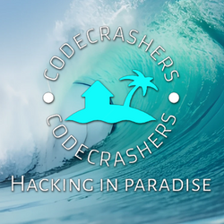

Please Make a Selection:

## 2023
[2023-02-01 Reversing an ASIC-Assisted Arcade Game](asic_arcade.md)

[2023-01-29 Go To Shell - Reverse Engineering Kernel Modifications with QEMU/gdb](Go-to-Shell---Reverse-Engineering-Kernel-Modifications-with-QEMU-gdb.md)

## 2021
[2021-10-25 Masterpiece - Consolizing-PC-Gaming](Consolizing-PC-Gaming.md)

[2021-08-20 IOPort Compatibility Patching](IOPort-Compatibility-Patching.md)

[2021-08-19 Time Travel - Win9x Heaps for the 2020s](Time-Travel---Win9x-Heaps-for-the-2020s.md)

## 2020
[2020-05-11 Pushing the Envelope - Part Deux](Pushing-the-Envelope-Part-Deux.md)

## 2019
[2019-07-21 WOW64 Rant](WOW64-Rant.md)

[2019-04-17 Pushing the Envelope](Pushing-the-Envelope.md)

## 2016
[2016-08-04 System N2 Exposed](System-N2-Exposed.md)

## 2015
[2015-11-25 Adding Keyboard Support to a Crazy Taxi Clone](Adding-Keyboard-Support-to-a-Crazy-Taxi-Clone.md)

## 2014
[2014-10-03 Hacking 'I Wanna be the Boshy' Game Saves](Hacking-IWBTB-Game-Saves.md)

[2014-08-07 Hacking 'Clocktower - The First Fear'](Hacking-Clocktower-The-First-Fear.md)

[2014-06-19 Compatibility Patching for Classic PC Games](Compatibility-Patching-for-Classic-PC-Games.md)

## 2013
[2013-12-23 pwning a SafeNET Microdog](pwning-a-SafeNET-Microdog.md)

[2013-11-12 Culdcept Series](Culdcept-Series.md)