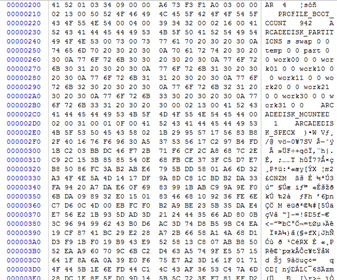

##### *A Tale of Reversing an NVIDIA/Namco Arcade Platform*
Original Post: 2016-08-04

### Foreward
This writeup serves as a collection of observations during a recent reverse-engineering effort of the arcade platform known as System N2.

Certain items have been redacted from this document in an effort to maintain privacy and mostly-comply with intellectual property restrictions. However, due to the system’s age and lack of proper fault tolerance, this guide may be used to better understand the N2 system as a whole and serve as a basis to maintain compatibility with replaceable components or leveraged for purposes of emulation and legacy compatibility initiatives (e.g. MAME).

### Background
The NVIDIA System N2, also known as the Namco System N2, was an arcade platform from the mid-to-late 2000’s that featured hardware commonly found in modern PCs at the time. From speculation, the move from Playstation 2 based hardware was perhaps a more accessible avenue for internal development teams and might have been leveraged for its greater processing power and customizability.

There are sparse details about the system N2’s release timeline and speculation over whether earlier versions of the system were released. At least one confirmed derivative (the N2 Satellite Terminal) may have used a different hardware configuration due to its release date in discrepancy with the availability of the graphics processor.

This document focuses on the System N2 that was originally shipped with Wangan Midnight Maximum Tune 3 — released around 2007.

### Hardware
The System N2 features various components that are not explicitly marked — presumably, these components were sourced directly from the manufacturer and not intended for retail.

#### The Motherboard
The motherboard appears to have no manufacturer-specific identification other than a fairly cryptic model number.

However, it is rather apparent that this board sports the nForce2 chipset:

The two 8-megabit flash chips (U15 and U16, respectively) on the right side of Figure 2 contain the BIOS image. Dumping the image yields some fairly descriptive information on the base model of this board:

 

This board is based on the MSI MS-6777 family - more specifically, the K7N2GM-IL:

 
Note that most of the identifying markers have been removed from the SystemN2 motherboard, a DIP switch has been added near the memory slots to switch between Athlon Mobile and Desktop CPUs, and the single BIOS slot has been replaced with two slots… oh, and the N2 board also isn’t red.

Interestingly enough, the last BIOS release (1.06) for the MSI model was released in 2004 while this BIOS states that it was constructed in 2007. It’s safe to assume that this is either a custom BIOS or a derivative of an internal and not publicly released BIOS for this board.

#### Hard Disk
The hard disk type varies, but appears to be a standard 3.5” IDE disk which contains an MBR, but no bootloader:

There also appears to be a raw area of the disk where various statistics are written:

In addition, there is an accessible linux partition which contains a few files:

- **exec\boot** – Encrypted AES Loop Partition, squashfs used for mastering or resetting the hard disk data.

- **exec\v337** – Encrypted AES Loop Partition, squashfs with the game data, executable, and shared libraries.

- **aecat** – Works like cat except it decrypts and hash checks the result.

- **aeinitrd.img** – AE file Version 2: Contains the intermediate rootfs used during boot.

- **aeprofile** – AE file Version 3 (uses HASP Dongle): Contains the manufacturer initialize / reset script.

- **aevmlinuz** – AE file version 2: Contains a compressed linux kernel.

- **prod.img** – Encrypted AES Loop Partition, the final rootfs that is used by the game.

We’ll go into greater detail later on.

#### HASP Dongle
The dongle in use is a HASP HL MAX or HASP RTC depending upon the timeframe. This dongle is used to decrypt any files with AE version 3 (of which there is only one, aeprofile). In addition, the dongle has some readable/writable memory which is used to keep track of card statistics ingame and also used to identify the machine region and cabinet type both now and in future games.

#### NAMCO FCA-1 JVS

This could be an entire article on its own. Namco would later switch to the NA-JV for future games, but it operates how most other JVS-compliant I/O boards do with the exception of a few additional commands that are used for PL devices and MagCard / Hoppers. Connected to a JVS I/O using the USB type A connector and seen in the Linux OS as a serial device, the JVS I/O generally responds in software control flow mode on /dev/ttyS2 or /dev/ttyS4, but games may vary their endpoints.

#### NAMCO STR Board

There have been quite a few revisions of this board, but its purpose is to relay force-feedback data to the JVS board — most of the time, the game will also speak to this board directly. This board is outside the scope of this document.

#### NAMCO MGCard Reader/Writer

This device is also outside the scope of this document, but may be included in a future revision.

### Initial Tests
Upon initial testing of the System N2, it appears that it is not possible to boot from any external device. In addition, keyboard interaction has been disabled during the boot process.

Various hardware components have been swapped in the past, and although some will still boot the game, others will do nothing.

In a virtual machine, the hard disk will refuse to boot.

### BIOS Analysis
The BIOS of this system is probably one of the more interesting pieces. The original board required one 512KB bank for the entire BIOS, yet this machine contains two 8-megabit banks. Simply flashing a vanilla BIOS will result in no POST. It is important to note that, although the U15 chip contains the BIOS information, there is far more at play.

The U15 and U16 chip can be seen as one bank, split into two physical halves. The U16 bank is actually the top half, while the U15 bank (the bank that actually contains the standard BIOS code) is actually a direct continuation of that.

The top of the U16 bank looks like the following:

The header contains various values:

 - 0x0000, 4: The Signature “NVq”
 - 0x0004, 4: Offset to the start of the gzip compressed Linux Kernel
 - 0x0008, 4: Offset to the start of the initial loader code.
 - 0x000C, 4: The Size of loader image (Linux Bootloader + Kernel)
 - 0x0010, 4: The Size of the Header+Loader+Kernel
 - 0x0014, 4: The Alignment Size (16 bytes by default)
 - 0x0018, 4: Offset to the start of the gzip-compressed CPIO initrd
 - 0x001C, 4: The size of the initrd
 - [Padding until 0x100 bytes]
 - 0x0100, 0xA0: JPG Image (1x1 black pixel)
 - 0x01A0,ldr_size: Loader Code
 - …

 The rest of the binary dump follows the offsets above.

 It’s important to note that the initrd will exceed the size of the U16 bank, this is expected as roughly less than 300KB remain after the compressed kernel. In this instance, the rootfs data continues directly onto the top of U15 until it is fully read.

 As a result, U15’s structure can be simplified as such:

  - 0x00000,rest_of_initrd: The remaining initrd data
  - 0x?????,????: Blank space
  - 0xC0000, 262144: Start of the actual BIOS

 As expected, this appears to be the only device that the BIOS can boot from with its current configuration.

### The Kernel
A brief analysis of the kernel shows that it is a debian-based kernel compiled in 2006 with Linux version 2.6.18. An interesting item to note, however, is that this kernel contains a small footer at the end with a gzip compressed cpio archive that contains a ‘root’ directory and ‘/dev/console’ which also exist in the final initrd.

### The BIOS Initrd
A fairly simplistic rootfs with a rather small size to match. This rootfs contains busybox (albeit stripped to roughly 130KB), a binary of kexec to swap kernels, libc, ld-linux, aecat which will be discussed shortly, and an init.sh script to start everything up.

### BIOS Linux Startup Process

The init.sh script performs some fairly standard mounting of proc, usbfs, sysfs, etc.. It then waits 8 seconds for any USB devices to be detected as I’m sure this early in the boot process, that might still be an issue.

What happens after that is where things start to get interesting:

1. Unpacks aecat.gz from bin/aecat.gz

2. It runs mknod on /dev/boot

3. It then checks loop0, and hda5–1 and attempts to find aevmlinuz, and aeinitrd.img on the device. Of course, the boot will fail if this doesn’t happen.

4. After that, it runs the aecat program to decrypt aevmlinuz and aeinitrd.img into memory. This is a fairly rudimentary software cipher, however, the hash of the resultant file is then signed and checked. Of course, if this hash check fails, aecat will return 1 and the script will skip until it will eventually fail to boot.

5. It then mounts the decrypted aeinitrd.img, now called initrd.img to /dev/boot .

6. If everything is good to go, it will then show a banner, and then run kexec with given boot flags on the new aevmlinuz (now just called vmlinuz).

Code Snippet from init:

### Intermediate OS
Namco loves to have multiple OS layers in their games. It makes quite a bit of sense for compatibility reasons, even if it makes analysis a bit more work.

The intermediate OS has a bit more stuff in it — it’s starting to look like an actual OS with ifconfig, telnet stuff, ssh stuff, etc.

The two most interesting parts of this OS, however, would have to be the /sbin/init script and a program called ‘aepass’.

#### /sbin/init

This script is fairly lengthy… as a result, the summary is as follows:

1. Mounts /proc, tmpfs, etc.

2. Suppresses all output unless the $BOOTDEBUG flag was given by the BIOS init script.

3. Loads a bunch of kernel modules (loop, ide-generic, ide-disk, ide-cd, usb, etc.

4. Creates a few tmpfs directories for mount points along with empty directories for dev,proc,opt,home,mnt,tmp,sys,root, and arcade

5. Decrypts and mounts prod.img with aepass and Overlays it on top of the intermediate OS with unionfs.

6. Decrypts and mounts the game package file (v377 in this case) into unionfs

7. Pivots to the root of the unionfs and calls the real init.

#### aepass

This program is responsible for supplying the password for our loop-aes mounts. The password structure is denoted by the flags given which determine order (e.g. pdm which is the default). As a result, aepass does the following:

1. Reads /proc/bus/pci/devices and converts the first two values of every row (interrupt and VendorID+ProductID) to two 4 byte integers and appends that to the key data.

2. Reads /proc/ide/hda/identify (which results in the entire ATA IDENTITY buffer represented as 16bit byteswapped values) and grabs the following values and appends to the key data:

2a. 0x14:0x28 HDD Serial
2b. 0x2E:0x60 HDD FW Revision, Model, Max Block Transfer, Vendor Unique 2c. 0x78:0x7C Total Number of addressable logical sectors
2d. 0x80:0x8A PIO Modes, Multiword DMA transfer cycles, mfg advised DMA transfer cycle time, Min PIO transfer cycle time
2e. 0xA0:0xAA Major Revision Number, Minor Revision Number, command sets supported, …)

3. Reads the last argument given to aepass (the target encrypted file name) and appends that to the end of the key data.

4. MD5s the key data and prints the result to stdout.

As a direct result of how aepass works, changing anything from the hard disk used to virtually any hardware component will result in a different key which will fail to decrypt the squashfs filesystems within. It has been reported, however, that a GPU replacement is possible if one were to flash the GPU with the vBIOS of the original, this may or may not be due to the VendorID/ProductID reported.

### Exploit Time!
As the Linux loader portion of the BIOS contains no signature checks, we are free to modify and flash as we please provided the structure and sizes remain correct by updating the header.

Working backward, the first objective is to determine what /proc/bus/pci/devices actually contains at boot time. As the BIOS Linux kernel might set things up differently, it is better to modify the intermediate OS which should produce the correct result and remove the hash signature check from aecat, entirely.

An alternative method (and the method eventually used) was to replace usage of ‘aecat’ in the Linux on the BIOS to simply use ‘cat’ instead and replace our aevmlinuz and aeinitrd.img with their decrypted and somewhat modified copies.

The modification by this point becomes fairly trivial: during /sbin/init on the intermediate OS, aepass runs after partition 5 on the hard disk is mounted. As a result, we simply cat the result of /proc/bus/pci/devices (and optionally /proc/ide/hda/identify) to files on the real disk.

We can now unpack v337 and prod.img with a linux kernel that supports loop-aes.

### Additional Analysis

#### prod.img
A standard linux OS, lots of dependencies, some modem stuff (presumably for debugging) and a script to start the game.

#### v337
The game root - contains a few interesting items:

- data/ (game data)
- etc/ (hasp daemon, some perl scripts, file checker scripts, restore script)
- ext/ (some ruby scripts, partition manager)
- libso/ (shared objects such as libCg, boost, etc.)
- modules/ (kmods like forcedeth, nvidia, nvsound, r8169, xr17c15x)
- main (the main game executable — 28MB unstripped)
- .exerc (startup script)
- .profile (timezone adjustment)
- achemy.ini (game engine config file)

A brief note on the game - it uses a wrapper around glx libraries and inits vt0 and tries to create its own screen… no SDL or X11 stuff here (common in the later games).

The FCA-1 can be emulated fairly easily if you have a generic JVS emulator and can fill out some of the namco specifics. The dongle is also trivial as well via shared library injection if you know the few items they read from it.

#### boot

Not mounted by default, contains some interesting items:

- .profile (initialization script for debug work)
- aehcat (a derivative of aecat which supports version 3 files)
- aksusbd (standard HASP daemon)
- cmos.bin (114 byte backup of the CMOS/NVRAM)
- fillzero (ruby script to zero a drive)
- stat (it’s stat… exactly what it says)

There was one “AE” file that could not be unpacked with aepass or aecat because it was AE version 3 - aeprofile. Version 3 not only uses the aepass information (pci devices and hdd info), but also the HASP dongle. However, it can be unpacked with aehcat, the dongle, and the hdd / pci dumps.

#### aeprofile

A fairly lengthy script that basically initializes the system. A brief summary follows:

1. It sets up some path variables.
2. Creates a default ‘master password’ which appears to be NVIDIA-supplied.
3. Modprobes some stuff like nf2flash.
4. Grabs a copy of the modified BIOS from an external path and ‘seals’ it with the aepass key.
5. Uses the cmos.bin from boot to set the CMOS settings.
6. Sets up the game partitions on the drive.
7. Pulls decrypted copies of the prod.img and initrd.img from an external source, creates a loop-aes endpoint and copies everything and encrypts with the current pci devices / hdd info (it will sanity check against a hardcoded list to ensure it is being installed on the right system).
8. Writes registry information raw to the hard disk in the first few sectors (number of times powered on, etc).
9. Reboots.

### Future Work
From this point, there are a few possibilities:

- Make it easier for operators / technicians to change hardware while keeping the game operational.
- Find an N2 Satellite terminal to denote any differences.
  - UPDATE: The N2 Satellite terminal uses the same hardware profile with the exception that the GPU is plugged into a different port address which changes the system profile.
- Emulation of the software on a native system (modern Linux) or VM.
- Lower level emulation in about one millennia once MAME can actually support x86 emulation.

### Final Thoughts

This was a fun one — made at a time before the industry relied on TPMs to a fault (which can still be compromised), it’s interesting to see the lengths that they would go to protect hardware/software from modification via fingerprints.

It was also interesting to see how well NVIDIA worked with them to help create a modern (at the time) PC-based architecture that could run what they wanted, but have some security built into the system by default.

See You Down the Road!

