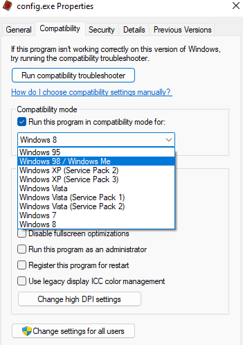
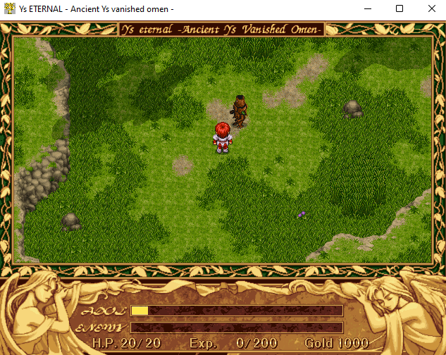
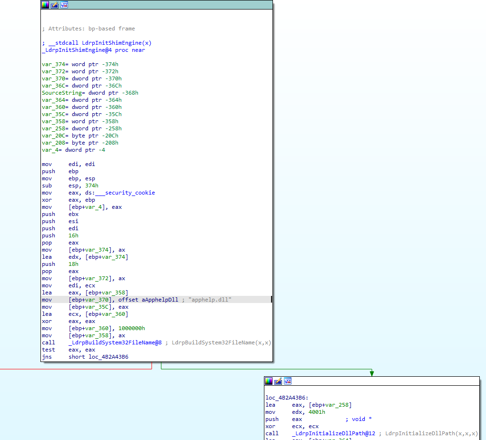
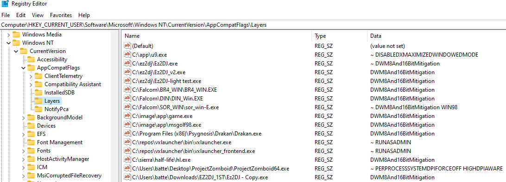
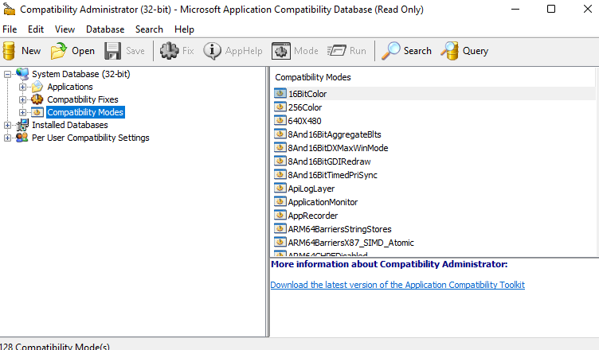
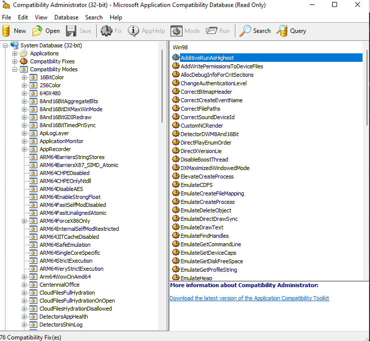
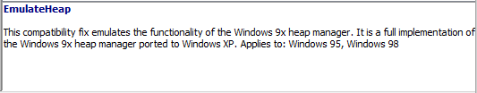
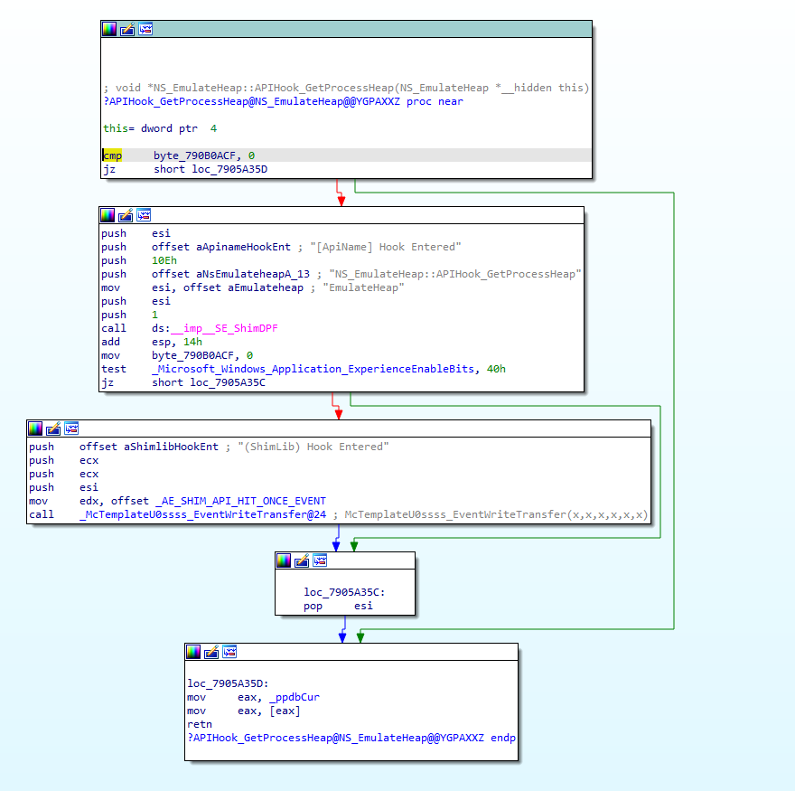

# Background

Compatibility patching, much like OS development, comes with balancing methods
to fix certain issues with known software where the solution can be flexible
enough to stick around for a while.

Nothing shows that more, I think, than Microsoft's own Application
Compatibility layer (AppCompat) which has been shimming processes at creation
since the beginning of the mass NT migration in the 2K era.




What was once used to make the transition from 9x->NT less of a painful
existence, and then again between 32 and 64bit OSes with WOW64, has now
become a massive part of how Windows does its thing across practically all
of their application portfolio - including newer concepts like app isolation.

Yet it's important to remember that this is, at its core, a collection of
shims on various OS components and designed to be as transparent as possible
to the overall experience - good for your average user, a bit concerning for
anyone in AppSec.

Sometimes, however, we may want to apply one of these fixes in a way that
is a bit more portable... maybe for process isolation, maybe to ensure
an older app works the same way on your colleague's system, maybe even
to ensure it works properly on Linux/Wine.

To do that, we have to understand the AppCompat engine, how it works,
how to find the fixes we need, and port them to something a bit more flexible.

# Digging In




I ran into an issue making an old Win9x game work on Windows 11 where a quirk
of DirectDraw 5s texture shading from the clouds in the above image cause memory
issues that were ignored. I noticed that, if Win95/Win98 compatibility mode was
selected, the game wouldn't crash... so what gives? Let's find out.

As a bit of background, when a process is created, a hardcoded library name
called apphelp.dll is initialized in the process space at startup from
*ntdll:LdrpInitShimEngine*:



This will read from registry keys/envars that list various compatibility shims
which are located in Shim Database (sdb) files in the Windows\apppatch.
Then, various shim libraries are loaded such as aclayers.dll and acgenral.dll
which register hooks via IAT patching and patching dynamic library loading which
allow layering.




Now - generally, the compatibility tab doesn't say a whole lot about what fixes
are being leveraged - and that's what the application compatibility toolkit
is for.

# Compatibility Administrator

https://docs.microsoft.com/en-us/archive/blogs/yongrhee/download-windows-10-assessment-and-deployment-kit-adk

Microsoft offers a compatibility toolkit that honestly should have been
included by default with Windows. It offers a far more granular approach
to their compatibility shims.



The compatibility database is organized where "Modes" are a collection of "Fixes".

As of Windows 11 Build 22000.132:

**x86**: 128 Compatibility Modes made up of 443 individual compatibility fixes/shims.

**x64**: 72 Compatibility Modes made up of 170 individual compatibility fixes/shims.

As can be expected, x86 fixes have the longest history and official support needed
for 9x -> NT and WOW64 support. Items such as registry redirection, Filesystem
redirection (where Program Files became Program Files (x86)), and even older
stuff like how 9x put system components in C:\Windows.

So what do all these fixes do? It's hard to say, some of them have been given a
description in the app, but you can also read the descriptions here:

https://docs.microsoft.com/en-us/windows/deployment/planning/compatibility-fixes-for-windows-8-windows-7-and-windows-vista

One thing the Compatibility Administrator lets us do is pick a mode, disable
various fixes, and find which shims actually do what we want. For instance,
clicking on Windows 98 shows that it enables 76 fixes by default:



We don't need all that! By running the app and disabling the various fixes,
we can find which one or more definitively fixes our issue. After doing that,
we are left with this:



# EmulateHeap?

So wtf is EmulateHeap doing? To figure that out, we have to look into apphelp
to see that it points to aclayers and then acgenral which we find the EmulateHeap
class:



So essentially, this hooks a bunch of the heap and local/global memory functions
in Windows to implement the alternatives. Of course, if heap allocation
already happened before the shim was installed, it will have to handle bypass
as well.

In fact, this particular fix shims the following 29 calls:
```
GetProcessHeap
GlobalAlloc
GlobalFlags
GlobalFree
GlobalHandle
GlobalLock
GlobalReAlloc
GlobalSize
GlobalUnlock
HeapCompact
HeapCreate
HeapDestroy
HeapFree
HeapLock
HeapUnlock
HeapValidate
HeapWalk
LocalAlloc
LocalFlags
LocalFree
LocalHandle
LocalLock
LocalReAlloc
LocalSize
LocalUnlock
RtlAllocateHeap
RtlFreeHeap
RtlReAllocateHeap
RtlSizeHeap
```

Where it checks if the handle is in our 9x heap domain and bypasses otherwise.
It is important to note that all new heap, local, global alloc calls will be
carried out in the 9x code, and will not bypass.

Now, if we wanted to just call this from a Windows machine with appcompat,
we could call apphelp in process and just ask to load the shim via
acgenral:GetHookApis which, when given the shim name, returns a collection
of PHOOKAPI structures:

```
typedef struct _HOOKAPI{
    PCSTR LibraryName;
    PCSTR FunctionName;
    PVOID ReplacementFunction;
    PVOID OriginalFunction;
    PVOID Reserved[2];
} HOOKAPI, *PHOOKAPI;
```

But we don't really want to do that here. It makes more sense for us to
maintain portability and not interfere with other stuff the shim engine is
doing by hooking these ourselves.

Now, this particular fix involves reimplementing the entirety of Win9x's heap
management - note for note. One option would be to dig into the binary and
approximate this functionality.

# A Questionable Approach
If you aren't shipping a solution and/or are less... *ethically* inclined,
it should be noted that the 9x heap management code has been a fix practically
forever, which means it's in the leaked XP source code that has been floating
around... including on Github itself.

Specifically in the "windows/appcompat/shims/layer/" path which includes:
```
emulateheap.cpp
emulateheap_heap.c / h
emulateheap_lmem.c
emulateheap_support.c
emulateheap_kernel32.h
```

Upon inspection, it's apparent from the copyright date that this is literally
the heap management code from 1994 - they weren't kidding.

In short, the cpp file is where all the shim logic lives for apphelp, and the
actual implementations are in the c files.

For the most part, the code was pretty portable. The only real changes
made were cosmetic to make linking make more sense:

```
In emulateheap_kernel32.h:

+BOOL _IsOurHeap(HANDLE hHeap);
+BOOL APIENTRY _HeapDestroy(HHEAP hHeap);
+BOOL _IsOurLocalHeap(HANDLE hMem);
+HANDLE APIENTRY LocalFreeNG(HANDLE hMem);
+HANDLE APIENTRY LocalAllocNG(UINT dwFlags, UINT dwBytes);
+HANDLE APIENTRY LocalReAlloc(HANDLE hMem, UINT dwBytes, UINT dwFlags);
+LPVOID APIENTRY LocalLock(HANDLE hMem);
+BOOL APIENTRY LocalUnlock(HANDLE hMem);
+UINT APIENTRY LocalSize(HANDLE hMem);
+UINT APIENTRY LocalFlags(HANDLE hMem);
+HANDLE APIENTRY LocalHandle(PVOID pMem);
+LPVOID APIENTRY HeapAlloc(HANDLE hHeap, DWORD dwFlags, DWORD dwBytes);
+LPVOID APIENTRY HeapReAlloc(HANDLE hHeap, DWORD dwFlags, LPSTR lpMem, DWORD dwBytes);
+BOOL _IsOnOurHeap(LPCVOID lpMem);
+BOOL _HeapInit();
```

A bit of inline hooking and, you too can be the proud owner of 9x heaps in your
modern applications!

I've made a public repo of the shim code, minus the 9x heap code which was
lifted from the XP source and can be dropped in to overwrite the placeholder
files.
Feel free to give it a shot yourself if you don't mind using legally/ethically
questionable source code.

[9xHeap Public Repo](https://github.com/batteryshark/9xheap_public)

# Closing Thoughts

Sort of a long way to get to a point, but I find the whole idea that modern
Windows has such an extensive collection of shims that are silently loaded as
a part of process init somewhat concerning. Most of the time, shims are
automatically and silently loaded without any user intervention or notification.

It's such a critical and prevalent part of the OS, and so much core functionality
having to do with WOW64 and other layers depend on it to operate, it's not hard
to imagine what would happen if certain fixes were removed... or added.

Fixes such as those that arbitrarily copy registry keys, redirect paths, try to
shim in order to fix dated DRM (Securom7's Fix), or handle how pointer
exceptions work may pave the way for a more sophisticated exploit that may have
been mitigated in the past and resurfaced for the sake of compatibility.

All it takes is a compatibility flag ticked, a registry key made, or similar,
and apphelp will happily hack up your application and because it's in process
init, there's not a lot that can really be done to mitigate it if those are set.

Of course, this is a part of what makes application compatibility work on
Windows and has been for years. But considerably more should be done to
alert and notify on shim changes and, at the very least, block shims
from newer applications that don't require them... maybe even get it out of
the process loader altogether.

Still, it's worth a dive at a later time to see what else the appcompat engine
has that may be interesting.

Cheers!
