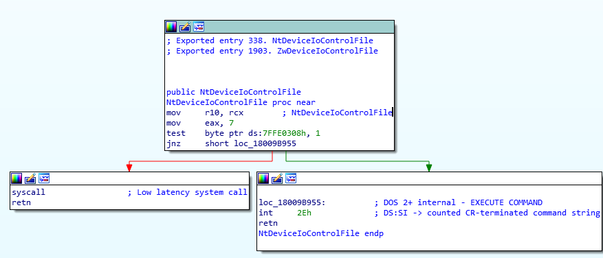

# It's 2019 and we still can't disable WOW64.

## [tl;dr]
- WOW64 is a 32bit emulation layer on Windows OSes that:
  - Exists on every Windows build.
  - Significantly increases attack surface.
  - Is no longer required for most system components.
  - The average user might never use due to the reliance of 64bit software and browser-based computing.


- Why then, is there no supported way to disable or remove it on Windows 10?
- Why would we want to?
- What happens if we try to?
- What does this mean going forward for the average user, appsec, etc.?

## Foreward
This one has been in the works for a while as a sort of... side effect from other efforts. Apart from ranting, we'll be digging into some technicals as well and writing some code - feel free to follow along! :)

## Background
I'm going to try and keep this part short as there are already a ton of excellent resources on WOW64, heaven's gate, et. al. - I'll put a dump of links at the bottom though if you want to look at all the stuff I was looking at.

Skip this section if you don't care about the nerdy stuff.
## -- WARNING: super_nerdy_stuff

Microsoft has had the monumental task of attempting to maintain a semblance of software compatibility within their flagship OSes over the past 3 decades or so.

#### The 90s  (16/32 -> 32 bit)
In the early 9x days, Windows booted on top of MSDOS - that is, Win9x actually contained and required a copy of the DOS kernel within MSDOS.SYS... this was kind of a common chain loading process in those days.

The 9x kernels weren't the only effort going on, however. At the same time, Microsoft was developing a separate, 32bit only, kernel branch dubbed "New Technology" or NT.

So... this created a massive problem right out of the gate as MSDOS binaries could be 16bit as well and require direct hardware access and other "real-mode" stuff that NT was designed to distance itself from.

Enter NTVDM or NT Virtual DOS Machine which has been around about the same amount of time. This emulation layer was driver supported and the complexity of how it all works is beyond our current scope. In fact, NTVDM is still supported on 32 bit editions of Windows 10. Why not 64bit? We'll touch on that later.

#### The Mid -> Late 00's (32->64 bit)
The transition from 32 to 64 bit Operating systems, for those of us who remember, calling the transition "ungraceful" would be a pretty nice way to put it (lol).

Confusion surrounded Windows XP 64 bit Edition or x64 Edition, Itaniums, AMD64, Intel eventually getting into 64 bit architecture, etc... and it has kind of been a mess ever since at least in the Windows world.

The traditional 32bit Windows OS (we'll just call it IA32 NT for now) was a massively complex beast - to say "far more complicated than DOS" would probably be one the biggest understatements in existence.

Further, it didn't live inside of a host process like how NTVDM spawned its emulated environment through COMMAND.COM, there was a lot more that had to be done in terms of building a subsystem to support IA32 NT stuff. For this, a far more complicated and robust compatibility layer had to be created.

### Enter Windows On Windows 64 (WOW64)

With x64 editions of Windows, Microsoft took an expanded and considerably more complicated direction from how they approached NTVDM - this is pretty much ignoring the fact that kernel level code such as drivers would have to be ported as no real compatibility layer would help here.

In fact, this is a rather sizable reason for the lack of NTVDM on x64 versions of Windows. Other than the fact that NTVDM relies on components that WOW64 has to emulate, NTVDM also required drivers that don't exist for x64 builds for one reason or another.

#### Some Design Changes
- A registry had to be supported in a way that might affect other programs. For that and a host of other reasons, an alternate set of registry hives had to be created under a node accessible by 64 bit processes (WOW6432Node).

- A storage area for 32bit program installations was created, "Program Files (x86)".

- A place for 32 bit dependencies was required along with system components that 32 bit NT programs would expect to talk to. For this, SysWow64 was created.

- The legacy programs wouldn't know to look at all these other paths for their system components, programs, registry stuff, etc... As a result, some hooks had to be built for filesystem and registry redirection.

#### Under the Hood
To fully explain what happens after you execute a 32bit process on 64bit Windows would take a bit, but here's the gist:

**Note:** It's important to keep in mind that a process on 64bit Windows always is and will be, a 64 bit process at its core.

##### Process Creation

- After a process is created, before linking dependencies, before thread creation, before anything - ntdll.dll is loaded into the process address space which contains amongst a lot of low level system functions, a ton of syscalls that talk to the NT kernel.

- Next, the process flow ends up in "ntdll!LdrpInitializeProcess", which determines if a flag has been set that signals use of the WOW64 subsystem for this process.
  - Fun fact #1, Native .NET binaries also require a patch here with a flag 'UseCOR'.

  - Fun fact #2, This function is where all your AppInit patches and shims happen too. Seriously, if you like internals, totally nerd out about this function and give it a read.

- If the flag was set, LdrpLoadWow64 is executed which loads a 64 bit library called wow64.dll into the process address space - remember that every process is inherently 64 bit, so these support libraries are also 64 bit.

- Wow64.dll has a static dependency that it links in - wow64win.dll, and dynamically loads in wow64cpu.dll.
  - Wow64.dll will also try to load wow64log.dll, but this library is not present on retail copies of Windows and is likely used for debugging purposes.

  - These libraries are also barred from being loaded from anywhere but SYSTEM32 by default due to "KnownDLLs":  `[HKLM\SYSTEM\CurrentControlSet\Control\Session Manager\KnownDLLs]`

- At this point, it's up to the wow64 subsystem components to:
  - Enable registry and filesystem redirection.
  - Load a fake version of 32bit NT's ntdll into the process.
    - Note: This is NOT actually a 32bit ntdll as in it's not the same thing as the 32bit ntdll you'd get on a 32 bit Windows OS.
  - Load any 32 bit dependencies.
  - A bunch of other stuff.

It should be noted that, at this point, the collection of 64 bit libraries still exists in memory, albeit in non addressable regions to the 32bit process. There are ways to find libraries in 64bit space from a 32bit process but that's another topic.

##### Process Runtime

Like the Linux world, for Windows, a lot of... stuff ends up happening with a process via syscalls. Eventually, your library calls will boil down to more and more granular requests to the kernel dealing with stuff like:
- Object Operations
  - Filesystem requests
  - Hardware IOCTLs
- Thread Operations
- Subprocess Operations

The list goes on - read the syscall list if you're interested :)

In a lot of cases, following a low level call chain will end up in a system library (kernel32, user32, etc) and eventually end up in ntdll as sort of a "last stop" before kernel space.

Even a custom piece of hardware with its own driver will eventually touch ntdll for a request to talk to the hardware.


A Native 64bit ntdll function will perform a syscall to the kernel:



By replacing the 32bit ntdll with a stub library and helpers in 64bit space (those wow64 libraries), Microsoft has created a sort of... proxy which can take syscall requests from a legacy 32bit application, jump to a known address in wow64.dll, convert the pointers, jump to 64bit space, make a 64bit syscall (through our 64bit dll), and return a proper result in 32bit space:


It should be noted that this **does** come with a noticeable performance penalty.

Back in the day ****shakes cane*\***, it made sense to run demanding 32bit software on a 32bit OS as benchmarks were often higher due to the lack of this translation. These days, however, those performance deltas have become less of an issue and, arguably with the advent of multithreading, better 64bit drivers, and other factors, it's hard to say if the majority of cases still have that same result.

In fact, this "High Level Emulation" for those familiar with the emulation scene is a key component of how more sophisticated emulators work as a lot of modern consoles have entire OSes that need to operate with their own internal states and dispatch calls. An example that demonstrates this the most intuitively within Windows might be CXBX-Reloaded [https://github.com/Cxbx-Reloaded/Cxbx-Reloaded] where XBOX calls are translated to modern functions and eventually native syscalls.

In many cases, some of the more basic syscalls can be directly mapped to syscalls in the host OS, where some have to be patched and adjusted or fully emulated if there isn't a parallel.


## -- END super_nerdy_stuff

## The Present

### WOW64 Today
The WOW64 subsystem is still a standard feature within Windows 10. For a long while, core OS utilities and services for both Windows Server and Consumer builds were 32bit only.


### If it ain't broke, don't fix it?
If this subsystem offers greater compatibility and additional features, why  remove it? A few reasons:

- Utility
  - Casual home/office tasks, for the most part, can be done via existing 64bit native applications or even a browser in most cases.


- Security
  - As software ages, the components used to build it lose security posture through exploit releases, compatibility layers, and additional bugs that pop up. An emulation layer constantly battles these issues, and WOW64 is no different. [https://www.symantec.com/content/dam/symantec/docs/security-center/white-papers/32-bit-virus-threats-64-bit-windows-02-en.pdf]

  - The subsystem is a reliable attack surface as every 64bit Windows OS will have it and it can't be fully removed or disabled without breaking some components (we'll dig into how accurate this is in a sec).

  - The subsystem itself is designed with modification in mind for interoperability and is a collection of patches and shims along with a global hook entrypoint for the entire subsystem - for instance, someone can silently install a wow64log library to auto inject into any 32bit process.

  - Emulation layer components must live in predictable regions which make bypassing exploit mitigations such as DEP and ASLR easier with WOW64 (MS13-063).

  - For 32bit processes, force injecting a 64bit library into the invisible process layer is a way to install hooks to tamper with software in a way that can't be easily detected by anti-tamper code without drivers.

    -> For instance, a syscall hook at the 64bit level would normally be undetectable by a 32bit process checking for syscall hooks at the wow64 level - partially because the 64bit ntdll is in an out-of-addressable range, but also because to the 32bit process, the 64bit syscalls are unknown.

  - It is difficult for security software to inspect these processes as there is no supported way to "get into" the 64bit layer that invisibly lives underneath every 32bit process [https://www.duosecurity.com/blog/wow64-and-so-can-you]:

    >"One of the most important limitations imposed by the WoW64 subsystem is
     that it makes it very difficult for security software to effectively
     hook low-level functionality from userland. Windows does not provide
     any ‘official’ mechanism for inserting 64-bit modules into 32-bit processes.

     >A significant portion of the API functionality a piece of security software (i.e. EMET) would want to monitor is implemented in the
     64-bit copy of ntdll.dll (process creation, module loading, etc.).
     ”   -- Duo Labs (2015)


- Efficiency / Simplicity
  - WOW64 adds a ton of additional components and binaries to a system that a number of users will rarely (if ever) take advantage of, taking up space and complicating troubleshooting.

  - A computing experience with one supported architecture simplifies things considerably.

  - Visibility becomes problematic - even in the days of NTVDM, it was far more apparent that a DOS program was running due to the COMMAND.COM process. This is not the case with WOW64 processes.

  - The wrapper layer is complex - even thread control has its own WOW64 derivative functions that need to be called. In some cases, calling native32bit functions incorrectly results in unpredictable or undefined behavior. That is, Microsoft cannot guarantee what will happen. For fun, check out the "Remarks" section of the WOW64-specific functions to see the corner-cases and undefined behavior. [https://docs.microsoft.com/en-us/windows/win32/api/winbase/nf-winbase-wow64suspendthread]

  - Without supporting these kinds of wrapper functions, like any other software, it could greatly improve turnaround of bugfixes and enhancements.

- Conformity (everyone else is doing it)
  - Major Linux distributions have not included 32bit by default for a while, 32bit images are losing support, and there have been talks to remove x32 ABI support in the kernel itself. [https://lkml.org/lkml/2018/12/10/1151]

  - Apple has told developers that it will be dropping 32bit support in OSX Catalina and is sending deprecation notices currently to 32bit applications that run.

- Timing
  - Microsoft is making massive strides with Hypervisor-based computing (credential/device guard, WSL, Windows Sandbox, etc.), if there was ever a time to consider isolating WOW64 stuff for attack surface reduction, this is it.

### Experiment - Blocking WOW64 execution
Let's see what a world would be like if Windows let us disable WOW64...

There are a few ways to test this, but a relatively quick way is to copy a 64bit library with the name "wow64log.dll" to our SYSTEM32 directory. We'll do something fairly basic and either not link against anything or link against ntdll to close the application once WOW64 is force loaded, something like the following:

``` c
// Compile (64bit) as "wow64log.dll" and place in SYSTEM32.
#include <libloaderapi.h>
#define EXPORTABLE __declspec(dllexport)
#define NAKED __declspec(naked)
#define NTAPI __stdcall
#define WINAPI __stdcall

#define STATUS_SUCCESS 0

typedef long NTSTATUS;
typedef int BOOL;


EXPORTABLE NTSTATUS NTAPI Wow64LogInitialize(void){return STATUS_SUCCESS;}
EXPORTABLE NTSTATUS NTAPI Wow64LogMessageArgList(unsigned char Level,const char* Format,void* Args) { return STATUS_SUCCESS; }
EXPORTABLE NTSTATUS NTAPI Wow64LogSystemService(void* ServiceParameters) { return STATUS_SUCCESS; }
EXPORTABLE NTSTATUS NTAPI Wow64LogTerminate(void) { return STATUS_SUCCESS; }


BOOL WINAPI DllMain(void* hinstDLL, unsigned int fdwReason, void* lpvReserved) {
    // The exit code doesn't matter as there's nothing loaded
    // yet to set an error or return value.
    exit(0);
}
```

**Note 1:** The exports for this library are required - although I guess if we're killing the process on bind, that probably doesn't matter.

**Note 2:** The example above is a bit different from the repository version [https://github.com/batteryshark/stfuWOW64/blob/master/src/stfuwow64.c] as it does not make the exit syscall directly, and instead asks the 64bit ntdll to do it which will aid compatibility.

**Note 3:** I was going to include a precompiled copy of the library, but you should never trust strangers on the Internet asking to stick dlls into SYSTEM32.

Placing the wow64log.dll library in SYSTEM32 should not have any immediate effects. After all, wow64log is only dynamically loaded on process creation, but feel free to try and execute C:\Windows\SysWow64\notepad.exe and watch it not start.


#### On Windows 7
Removing WOW64 subsystem components from Windows7 will break several items:

- The personalization menu and some other components will respond with:


- appwiz.cpl (Add/Remove programs) will not start.
  - Oddly, most other control panel items work.


- Windows Media player


#### On Windows 10

Microsoft has made some serious strides (probably partially due to UWP/OneCore) in getting away from the older 32bit system utilities.

We can take this a step beyond as well by ripping out two major WOW64 parts, the WOW64 system directory and "Program Files (x86)" directory.

While this is entirely possible, it may be difficult to do so due to permissions and external 'unlocker' tools might have to be used alongside several reboots. In the end though, it would look something like this:


Now... what breaks with Windows 10 when WOW64 is missing?
By default, nothing at first. Some notes, however:

- Most installations of Office 365 are the 32bit version. If the 64bit version is used, that should work properly.

- Visual Studio is 32bit only. The claim is that there's a performance hit with the extra pointer size, but the real reason is probably updating core components for 64bit code and preserving cross compilation.

- Google Chrome is 64bit, but installs in the 32bit Program Files directory. This is something that has come up as an issue with no actual push to correct it. Although it's certainly feasible to just move the installation out into "Program Files".

- A lot of installers like to use 32bit for both 32 and 64 bit installations.

- Multiple digital distribution platforms such as Steam, GoG Galaxy, and Origin use 32bit builds on 64bit machines. Epic's launcher installs in Program Files (x86), but is one of the few to offer a 64bit build.

- Insider updates (and presumably other large updates) may fail as some of the Windows update processes are also 32bit.

#### On Windows Server
Around Windows Server 2008, Microsoft decided to allow removal of WOW64 compatibility with a "Server Core" configuration - essentially removing the role itself. This feature also exists in Server 2016 and 2019:


Based on tests, however, it does not remove ones ability to run 32bit applications and is somewhat of a common question: [https://social.technet.microsoft.com/Forums/office/en-US/f3520ba5-f73c-4acf-ab85-3598d0a7e0cb/simple-32bit-exe-runs-even-after-wow64-feature-is-removed-intended-supported-bug?forum=ws2016].

Instead, it removes some 32bit components on Windows server (presumably to replace them with 64bit components.)

A full list of removed files from Server 2019 is included [here](assets/20190721/server2019_wow64_removed.txt).


## Summary

Background, tests, and rambling aside, what's the point here?

The security challenge of compatibility is nothing new. The "battle in the browser" with Flash has been going on for years as more and more issues eventually caused it to become disabled by default and ultimately removed in browsers by 2021.

For security professionals, the writing is on the wall... we can "see the train coming".

Forget specifics for a second and look at this from an AppSec point of view - you have an
ubiquitous legacy component full of duct-tape code with a ton of undocumented workings whose primary
environment is unknown to every process that it runs on with a ton of undefined functionality and it
can't be easily disabled or removed. If this was any other system, what would be the responsible mitigation approach?

Things have been somewhat fortunate with WOW64 so far, but we're probably one serious incident away from having to have a rather rushed  and uncomfortable set of conversations.

Let's start having this conversation now while we have the benefit of being proactive - this wasn't supposed to be an open letter to colleagues in appsec, reverse engineering, or Microsoft themselves, but let's talk about this and what we can do before we're forced to.

Cheers!


### Extra Links
- https://github.com/batteryshark/stfuWOW64/
- https://github.com/j00ru/windows-syscalls
- https://www.codesec.net/view/469253.html
- https://wbenny.github.io/2018/11/04/wow64-internals.html
- https://hitmanpro.wordpress.com/2015/11/10/mitigating-wow64-exploit-attacks/
