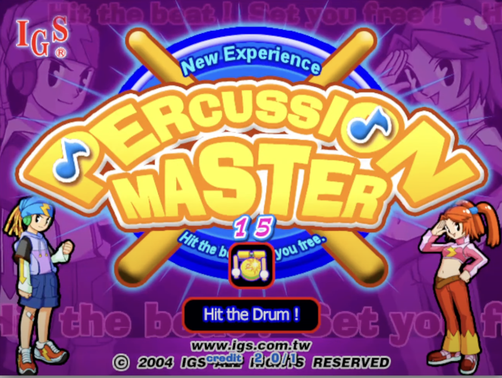

# Reversing an ASIC-Assisted Arcade Game

## Background


This one has been in the works for over a decade. 

Had I known the amount of work that this game would require, I'm not sure that I would have ever started working on it. 

However, the skills both used and learned while putting this together have been one of the most valuable reversing projects I have ever worked on. 

To best illustrate everything that happened, I should probably start from the beginning...


## First Attempt: ~2012

While working on other projects, I stumbled across a hard disk image for "Percussion Master" - an arcade game from IGS circa 2004 that was one of those knockoffs of drum-based music games such as Taiko or Drummania.

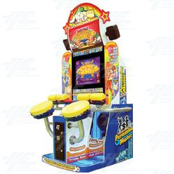
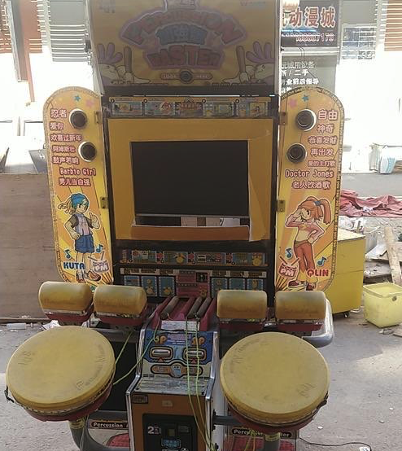
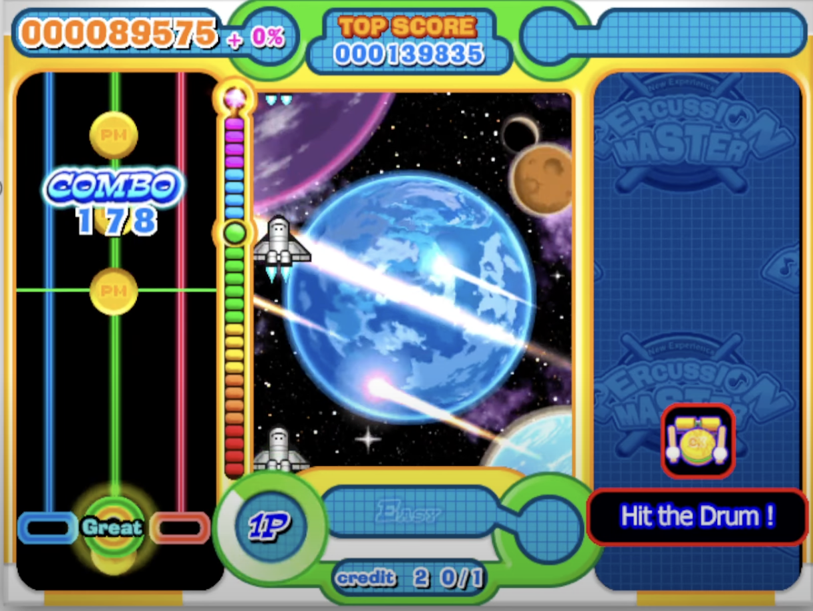


I decided to dig into the image and see what it was about.


***

### HDD Image

The HDD image itself had a few partitions:

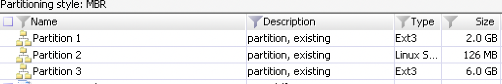

* The OS partition was pretty full-featured and uses a Linux 2.4.21 Kernel with a fairly stock Red Hat distro (around 7.3).

* It contained a rather basic swap partition with nothing of interest.

* It also had a game partition with data and an executable (`peng`) alongside some logs, webcam captures of players, and settings.
  * It's interesting that this game put writable data mixed in with its read-only assets, as corruption might screw up the game itself.

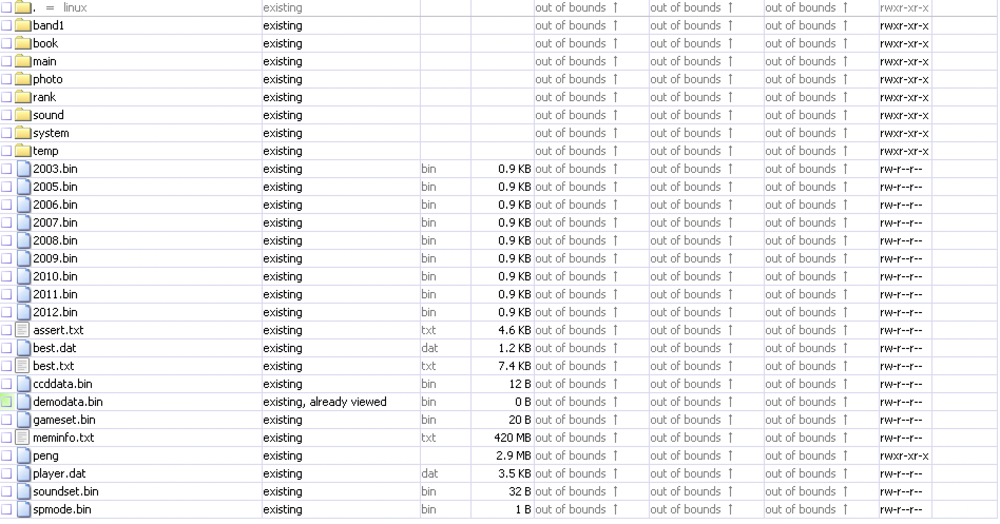

It was originally rumored to not be protected, although there was what appeared to be a kernel module alongside the game data.

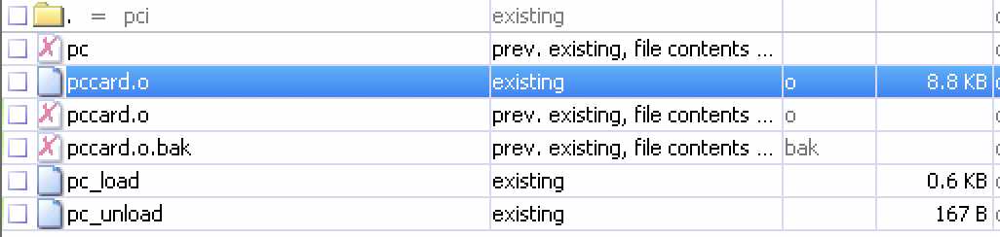


I decided to dig into the game executable to see more.


***

### The Game 

The game executable was unstripped and based on SDL - a set of libraries that act as a framework to develop games and other 'media-based' content. 

Normally, stuff like this doesn't have function names available, so it was even more interesting to me as I could see all of the various functions and sort of piece together what they did:


I also noticed some relatively rudimentary "security" functions and figured that might be all that the game was doing from a protection standpoint...

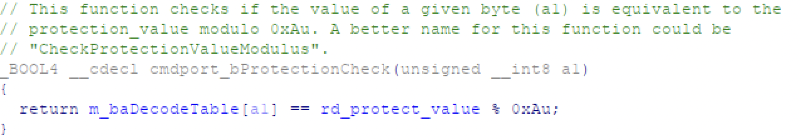


***

### Testing the Game

At this point, running the game in a VM, I was greeted with this:


At the time, I didn't have much experience beyond trying to patch over functions, but I could skip the pccard checks and a few others. However, I spent a ton of time staring at this screen:

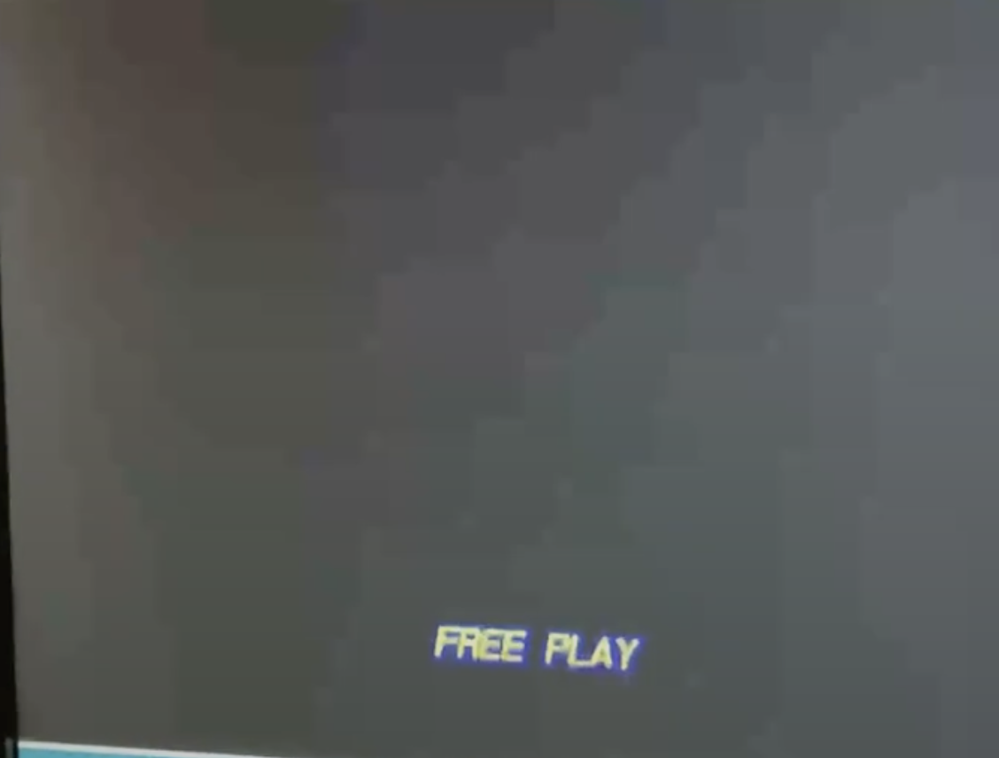


I suspected maybe the `pccard` was to blame, so I looked at the unstripped `.o` kernel module:


But I couldn't really make heads or tails of what it was doing other than opening a character device at `/dev/pccard0`, using seek as a read/write counter, and reading/writing a static amount of memory to/from the game and card every frame.


Also, this game was silent because it was based on OSS - and the developers statically compiled the SDL Mixer library into the game (gg) - so replacing it was an impossibility at this time. Eventually, I discovered Alsa-OSS and got the default IGS startup sound, but was still stuck at that black screen. 

**Note From the Future:** Later on, I would start using libpulsedsp and eventually osspd which is easier to use.


***
### Giving up... for now
After a while, interest fizzled out - I was busy with grad school and had plenty of other projects to work on. I knew that it needed to connect with `/dev/pccard0` and wasn't too sure what it was using that for.


## Second Attempt: ~2016


### Game Engine Revisited

After working on several other games and getting used to figuring out custom IO and hotpatching functions, I decided to take another crack at the game.

This time, lending from my previous work with JVS-based games, I decided to try and emulate the `pccard0` device based on understanding what the game was asking for. I had gotten away from the rudimentary `patching shit out so things kind of work` methodology that I think a lot of us start out with while reversing software and wanted to make something more true to the real thing.

Instead of patching out functions like the protection function above, I started writing code to handle the requests:

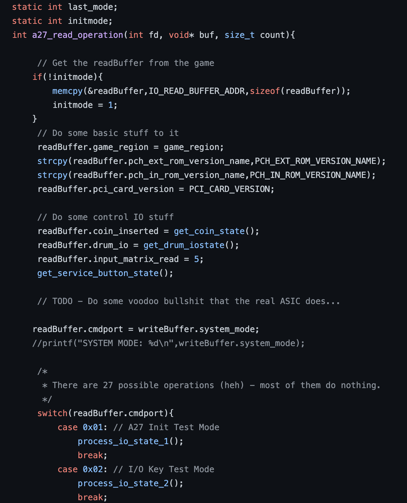


I even started a [repository](https://github.com/batteryshark/game_hacking/tree/main/Percussion%20Master) with my IO code and separated the logic from the what I now understood was an ASIC called the IGS027A or `A27` for short.


I also figured out how to get into the test menu:

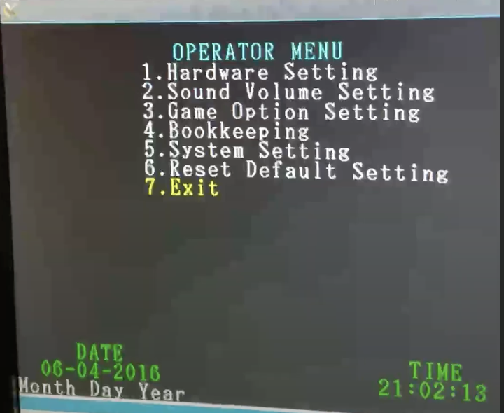


From here, I could map out the I/O controls and figure out how to hijack the game IO functions to get keybaord controls working.

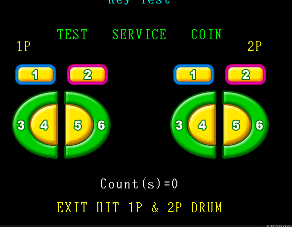


I could now get into the game menus by bypassing the attract opening, but I figured the A27 was being used for playing the song and music, as it was then stuck on the song gameplay screen with no sound playing.

This was an era where I'd document things on video so...

**Video:**

[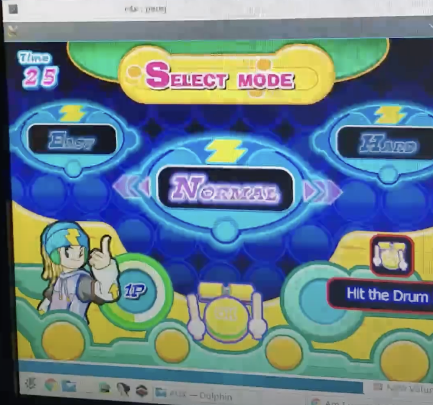](https://youtu.be/C6NRnglinwM "PM from 2016")


I figured it had something to do with the `SongProcess` and `SongProcessWrite` functions, that call out to the A27 and take input:

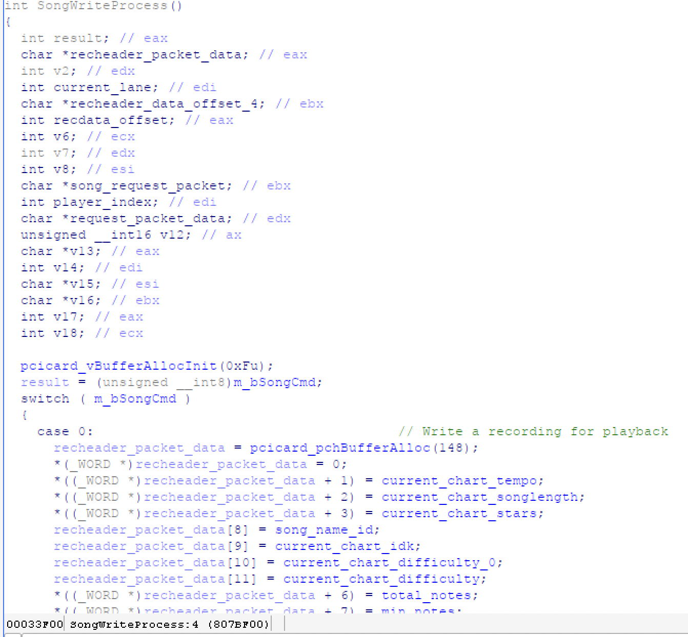

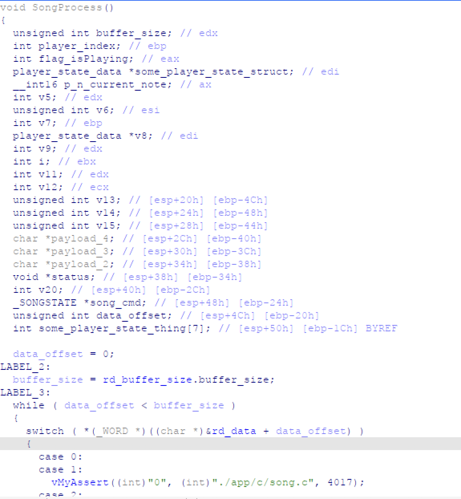


From here, things were looking grim - I figured that the A27 had special data stored on it that the game used, or that it was telling the game in some special way to start the song. The A27 also used a read/write buffer and expected various "system_mode" values to dictate what kind of request was being sent:

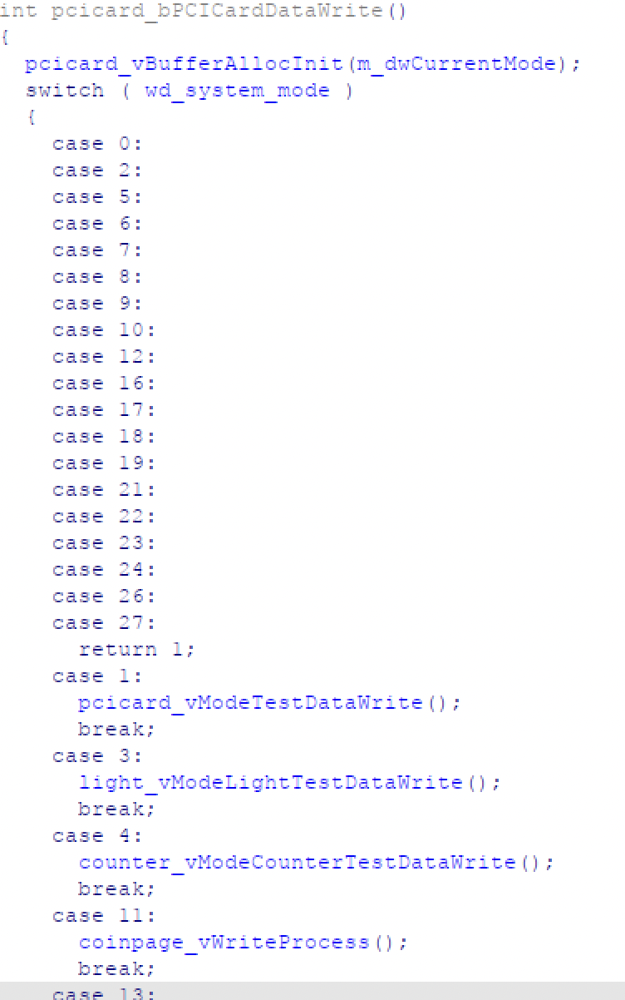


Alongside what responses were supported:

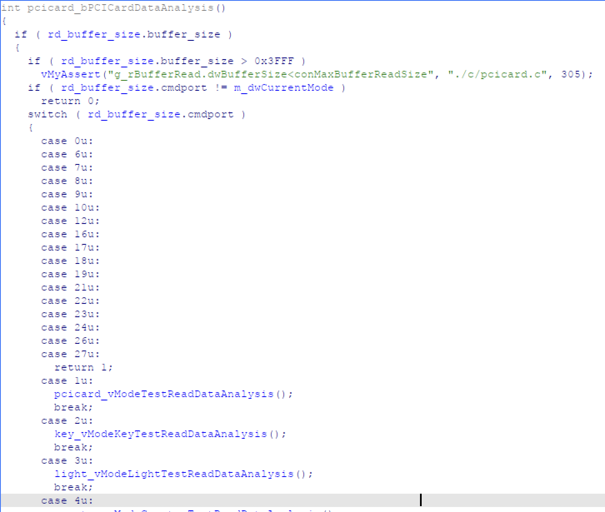


And while some of these requests/responses made sense, others were far more vague:

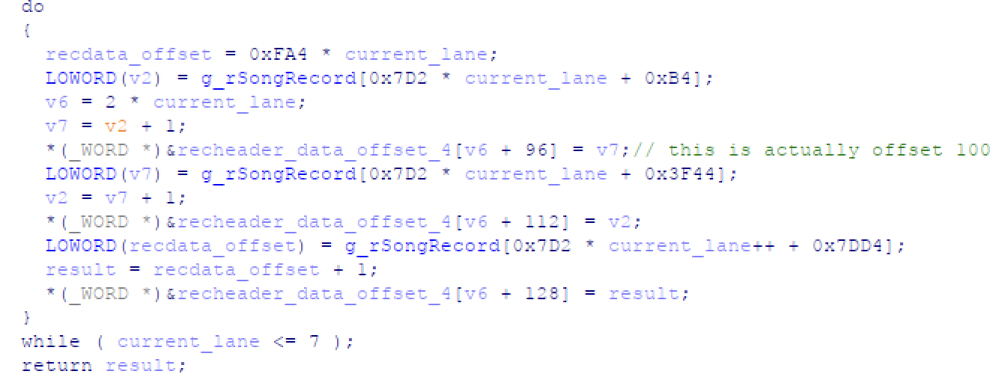


***
### Giving Up - again...
I figured that I needed someone with a real machine and A27 to capture request/response pairs, but this game was already super obscure and availability was so limited, that it was unlikely. I then shelved all my work again.


## Third time's a charm? - 2020


### Getting the Hardware

So... during the COVID-19 Pandemic in 2020, I stumbled across several eBay listings for arcade machines and one jumped out at me:

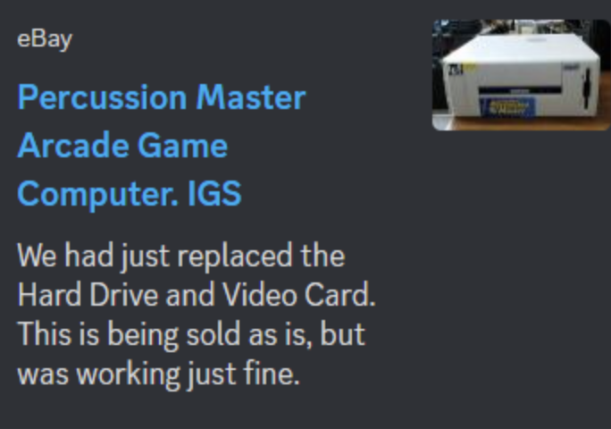


I had it shipped to me and yup - early 2000s PC

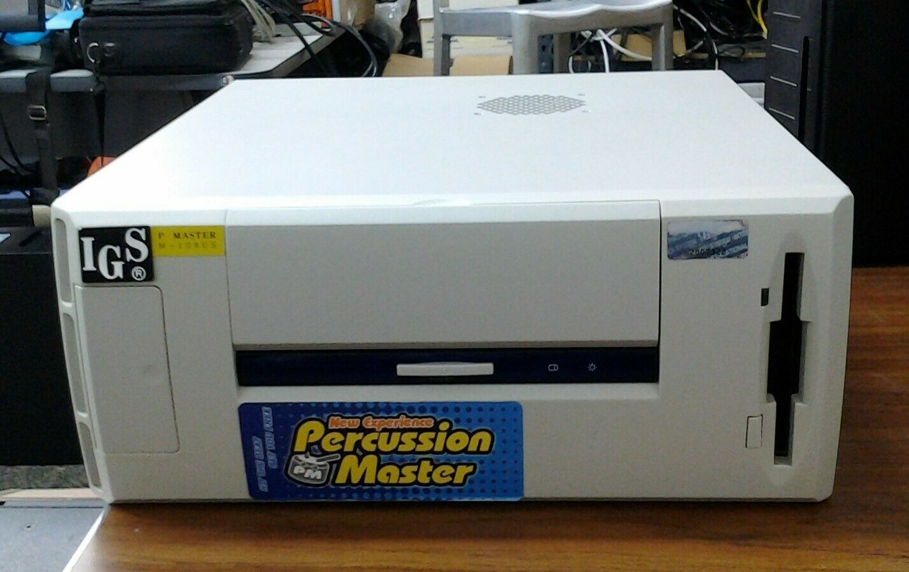


I immediately tried to turn it on, but it appeared to have a bad graphics card and not boot:

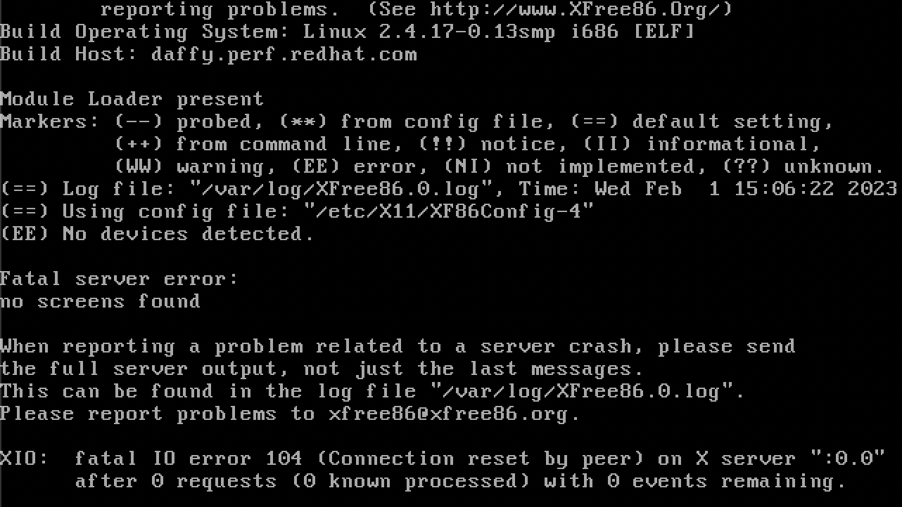


There were many variables - I wasn't sure if it had something to do with my converter:

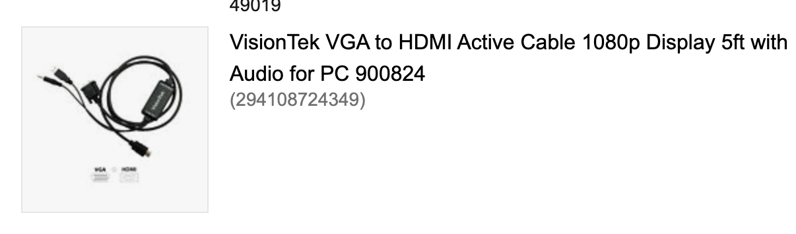


I didn't have a VGA-native display anymore... I figured that maybe the X11 configuration understood a CRT monitor with 4:3 modes or something incompatibile with every TV I tried.

Also, the HDD was clicking when starting up, so I had to copy it several times to get a working image to restore:

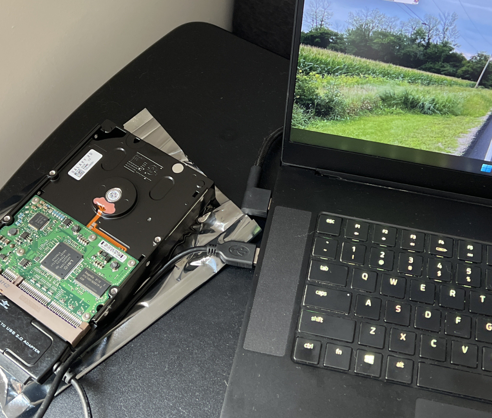

So much for: `just replaced the Hard Drive and Video Card`...


***
### Cracking it Open
I also opened the PC to take a look at the inside and get a better look at this `A27` that had given me so many problems:


The card itself was built with a Texas Instruments PCI1410 CardBUS controller, some other chips, a Varta battery, and a few LEDs that lit up and blink when the system boots.


***
### Putting it on Pause
Seeing as how it wasn't booting, I then shoved it into my closet with a promise that eventually, I would get around to finally running logging on the hardware, then maybe it would work! 

Due to other reversing projects, it would be another two years until I'd end up pulling the machine down and trying to get it going again.


## Okay... Maybe Fourth time? - 2022


### Troubleshooting the PC

Pulling this PC back out, I wasn't sure of where to go next... I had a few options:

1. Figure out what was wrong with why the PC won't boot, fix it, then run the logger I had written years prior.
2. Build my own machine, plug the PCI card in, install Red Hat 7.3, and use the kernel module to connect with the A27 and hope the game works.
3. Get the real PC to run another `more-compatible` OS, build my own kernel module, and ssh from my VM to the real pc and pass requests from the game to the card or run the game as normal.


Each item had their own benefits and drawbacks:

* Approach 1: I didn't know what was wrong with the PC, and maybe I wouldn't be able to find the right parts. After all, the graphics card was an unmarked MX400 and the motherboard appeared to be from ECS which would be harder to find at this point. Even if I could get the PC working, I would still have to modify the startup and figure out whatever else had to happen after collecting logs.

Oh also, no keyboard I had tried worked - so it was also possible that keybord support was not compiled into the kernel.


* Approach 2:  Red Hat 7.3 at this point is a pain to work with. Also, I was greeted with the following message when trying to insmod their kernel module and wasn't sure why;

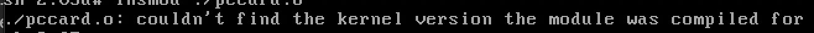


* Approach 3: I hadn't been able to reproduce the kernel module, even though it seemed rather basic. I worried that being a 2.4 kernel module, things had changed for PCI card drivers since 2004. It was also assuming that a custom OS would be more viable than just modifying their original OS. However, having a kernel module I could compile would help me run the game on different hardware, which I might need if the PC crapped out.


After a couple of attempts, the PC no longer booted (powered up, but no POST). I decided to finally go for broke and reimplement the kernel module - expecting that I might need to replace harware in the PC or build a new one altogether...


***
### Reimplementing the Kernel Module

Reimplementing the kernel module consisted of reconstructing each function in the `pccard.o` file that was on the hdd. After several attempts, I had built what looked like a [replacement](https://github.com/batteryshark/igstools/blob/main/pccard/pccard.c) - things were looking up!

However, I continually got this message:

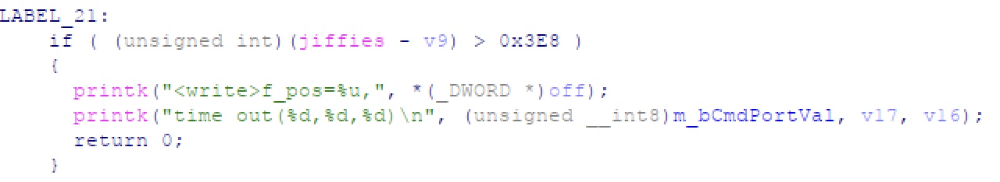


Recovering files from the hdd - I also saw additional kernel modules that appeared to be for other Linux 2.4 versions, and it still bugged me that the kernel module wasn't insmodding on a real Red Hat 7.3 install. As a result, I chalked this one up to a dead end - there were too many variables that might make the card not work, and figuring that out wasn't even my goal - I just wanted to have the PCI card talk to the real game on the real OS.

When I started digging into the files on the OS partition for answers, however, things got more clear...


***
### Analyzing the OS Partition

The developers had left several artifacts from their build on the HDD - no source code for anything we cared about, unfortunately, but a fully built Linux source tree otherwise!

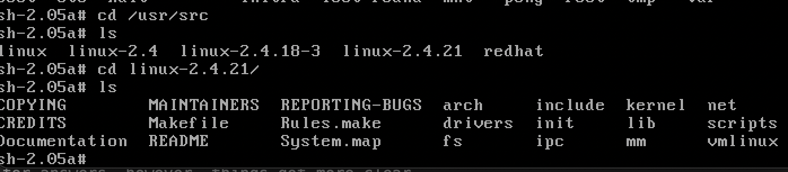


Looking into the files, it was apparent that `pccard.o` was the object file from this compilation, and not a kernel module!

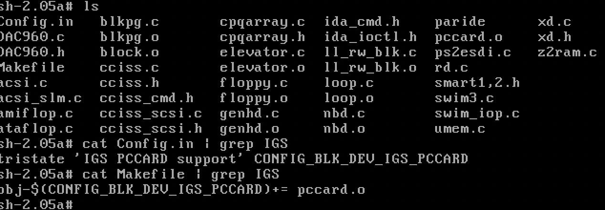


Taking the vmlinux image out of the src tree and throwing it into IDA confirmed that, yes, they built the pccard driver into the kernel!

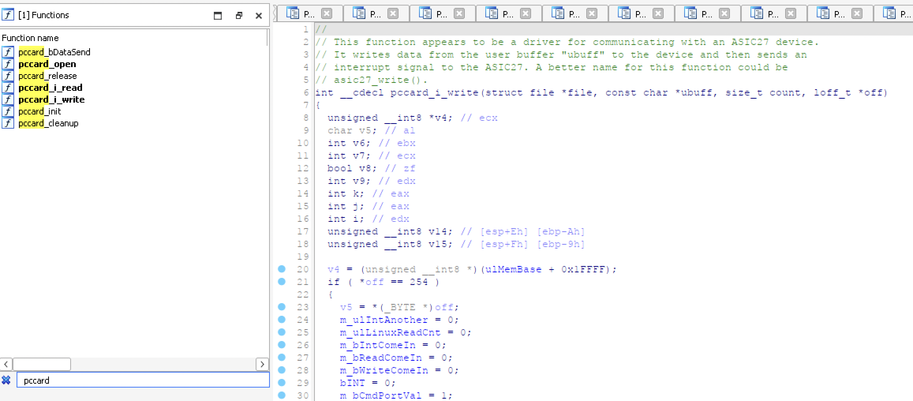


Looking back at the original startup as well, it was apparent that the real OS startup script was insmodding a file that wasn't a kernel module, erroring, and continuing as normal. It's unclear as to why they put this file in there. Perhaps the file not existing was causing an error with the script and they wanted to fix some edge case? Seeing as previous games that used this OS configuration used kernel modules, perhaps it was a design choice made for this game to not include a separate module, but it's hard to say.

At this point, I knew I had to fix the PC and get it booting - having the PC boot to the OS would give me the best chance. Even if I was still back at square one with X11 not starting, I could always write a tool that would talk to the A27 and do what I needed...


***
### Fixing the PC

I took a wild guess at the no POST symptom and bought a replacement power supply. I decided to get the exact PSU that was already in the case for compatibility.

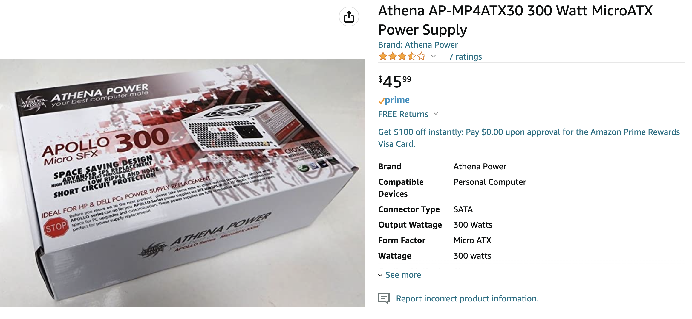


Right away, the PC booted - I was back in business!!! Except the X11 issue remained. I still couldn't boot into the game, anything graphical, nor could I get keyboard working. 

I decided that getting the game working to ensure the A27 still worked correctly was the best initial goal. After all, anything could have happened before the machine got to me as it wasn't a guarantee that this thing even worked beforehand.

I decided to get a new graphics card (an MX440) to see if the artifacting card was the issue.

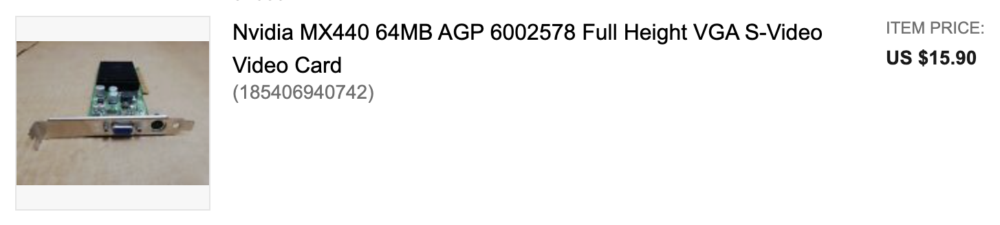


At the same time, I also bought a Dell Monitor from eBay to ensure I had something that would be compatible:

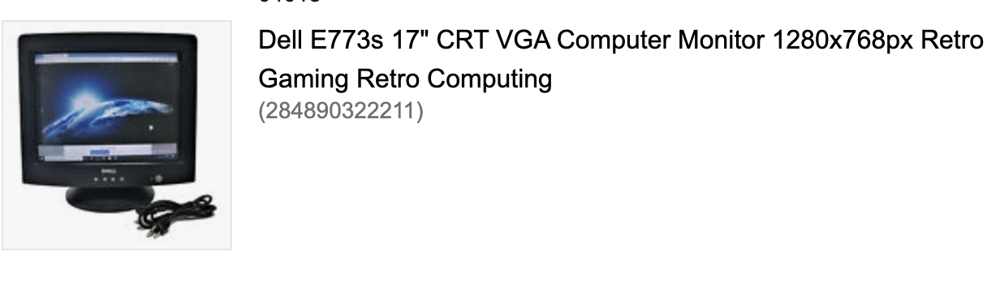


Aaand the damn thing still didn't boot! 


***
#### Getting Keyboard Working

I decided that I wasn't getting anywhere until I figured out how I could get keyboard working or network so I could SSH into the machine and poke around - changing files and rebooting while putting everything in scripts would be way too tedious.

- I took a wild guess and pulled out a PS/2 converter for my USB keyboard... which didn't work.
- I found an old USB 2.0 keyboard as well... which didn't work. I later discovered that most USB keyboards still around aren't able to understand the request from the converter to change their communication.
- I finally decided to buy a super cheap PS/2 keyboard and to my amazement, that worked! I was in shell!

I had also built a test program in C that would talk to the card like the game would to at least try one packet
which worked!

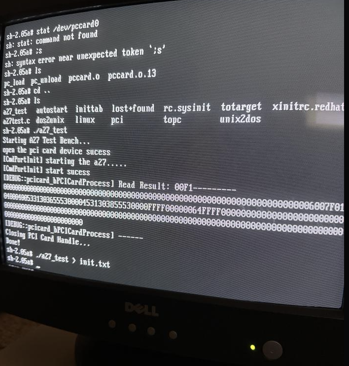


I knew that the built-in pccard driver was working! The next step would be getting the real game working... 


***
#### Getting the Game Working


Looking at the log messages from trying to insmod the NVIDIA kernel module, it appeared that the card was unsupported, but how!? 

It turns out that I had recevied a P118 (FX5200), when I had really wanted a P70 (MX400) or P73 (MX440).

To be fair to the seller, they **do** look similar:


As this kernel module wouldn't be able to support this card, and I really didn't want to compile a newer (older) version of the kernel module and stick it in the OS, I bought a replacement card - actually, I bought two just in case:

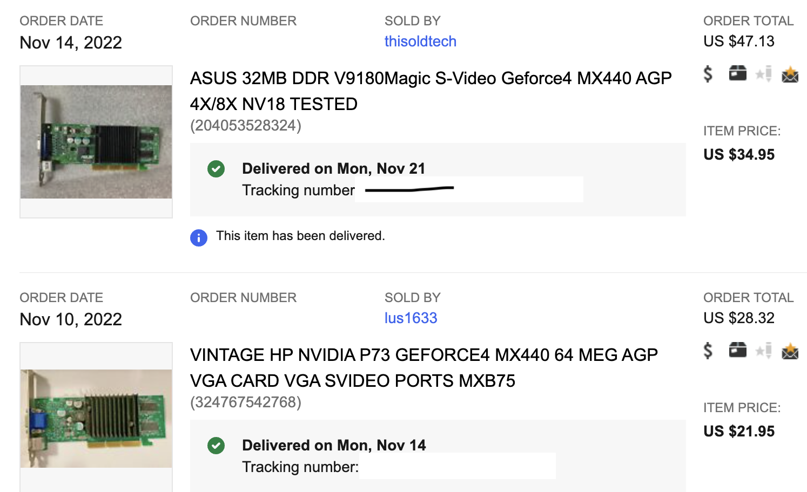


I installed the new card aaaaaaand...

no POST... 

I put the FX5200 back in - no POST

I put the original MX400 back in... also no POST.

Had I killed the motherboard this time? The Ports? Did the PSU fry again?

I bought another PSU - figured maybe I had a short somewhere killing this cheap piece of crap...


no POST...


***
#### Fixing the PC (Again)

At this point, I had sunk so much into this, I had to continue, but getting the motherboard would be a challenge. ECS isn't typical like your average Gigabyte or MSI motherboard. In addition, I'd be looking for models from a specific era - ideally the same one. Fortunately, there was an identical motherboard online:

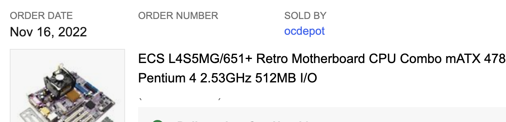

and a sister-model that was a little newer but had a mostly similar chipset that also should have worked:

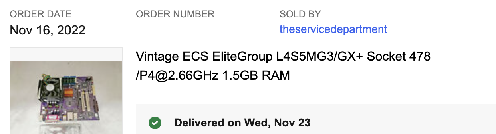


I bought them both to have a backup that might reasonably work, and noticed that the original board was not fully mounted on standoffs to the case. In addition, I had read that the AGP slots on these models were notorious for shorting out the board.

Anyway, replacing the board, the PC finally booted again!


***
#### (Almost) Back in Business

I started up my test program aaaand it no longer worked - every time I tried to talk to the A27, I would get a kernel panic!

Had I killed the ASIC this time? It was possible - changing the motherboard, multiple shorts due to shoddy original installation.

After reinstalling all of the hardware (again), I decided to try something - knowing that the replacement motherboard came with its own RAM, and 1.5GB to boot, along with the fact that PCI card memory maps its IO, I decided to pop out the extra memory and stick to the original 512MB.

After that adjustment, the test was once again working. My only guess is something BAR related screws up when memory is mappable after a certain amount... clearly this was a bug from the driver.


Also, the game fully booted!

**VIDEO**

[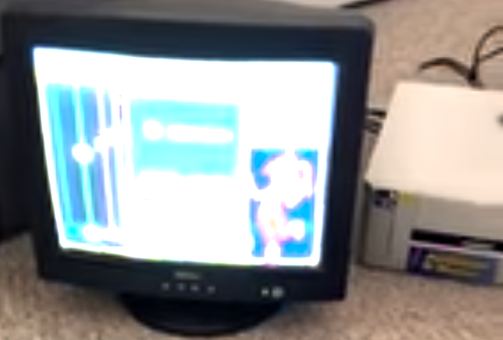](https://youtu.be/vxlgEJyL0NQ "Finally Booting!")


Finally - I could start really working on getting this game emulated... but the fun was just beginning...


***
### Focusing on the Game

At this point, I had decided to write a [hook](https://github.com/batteryshark/igstools/blob/main/pm_patch/src/log/a27_log.c) on reads/writes for the A27 in order to understand what was happening. While I could see the original structures in the game executable, I wasn't sure what all of the structures actually did.

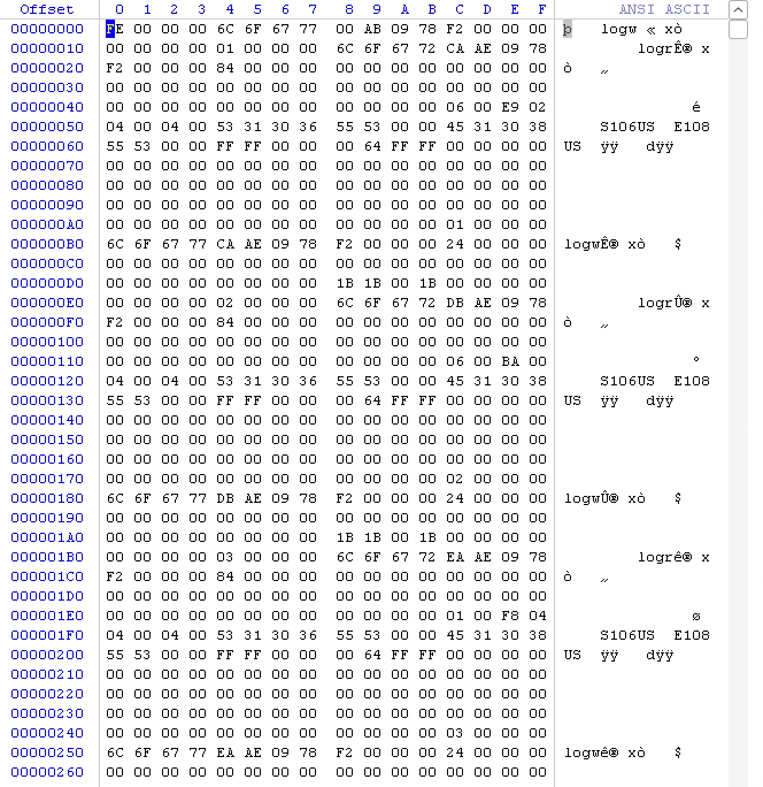


Working through each screen of the setup menu, I recorded the various requests and responses to document each and understand their context.

I eventually documented the full request and response packet sent to the A27!


***
#### A27 Request Packet

The request packet consists of the following structure:

``` c
#define PCCARD_DATA_BUFFER_SIZE 0x4000

typedef struct _TRACKBALL_DATA{
	unsigned short player_index; 
    unsigned short align;
	unsigned short vx;
	unsigned short vy;
	unsigned char direction;
	unsigned char press;
	unsigned char pulse;
    unsigned char align2;
}TrackballData,*PTrackballData;

typedef struct _A27_WRITE_HEADER{
	unsigned int data_size;
	unsigned int system_mode;
	unsigned int key_input;
	TrackballData trackball_data;
    unsigned char checksum_1;
    unsigned char checksum_2;
	unsigned char light_disable;
	unsigned char key_sensitivity_value;
	unsigned char light_state[4];
	unsigned char light_pattern[4];    
}A27WriteHeader,*PA27WriteHeader;

typedef struct _A27_WRITE_MESSAGE{
    A27WriteHeader header;
    unsigned char data[PCCARD_DATA_BUFFER_SIZE];
}A27WriteMessage,*PA27WriteMessage;

```

- `data_size`: each request may include a payload of data dependent upon the operation. This field tells the kernel module (and subsequently the card) how much extra data after the structure to read.

- `system_mode`: the request command value. Think of this as a 'program' or operation number considering we're looking at something an ASIC is going to perform some logic on.

- `key_input`: development only - this value is given to the ASIC as a replacement for the real IO input coming from the gameport on the back. The idea behind this to allow keyboard control for testing.

- `trackball_data`: certain games used a trackball. There's actually a hidden an unused test menu for this as well... not sure what the consequence is of this control but it exists in the request.

- `checksum_1`: An addition-based checksum of byte values within the request up to this point. The card won't honor the request if this is wrong.

- `checksum_2`: A copy of checksum - also if it's wrong, the ASIC won't do anything but return an error.

- `light_disable`: A directive for the I/O to turn off all the lights.

- `key_sensitivity_value`: Unused - not sure what it's for.

- `light_state`: A bit mask that determines if certain lamps are lit or not.

- `light_pattern`: A bit mask that determines what flashing pattern each light is using.

- `data_payload`: A buffer of data that can be up to 16KB sent to the ASIC.

  


***
#### A27 Response Packet

The response packet has a lot more going on - also, reading from the A27 responds with `0xF1` if successful:

```c
typedef struct _A27_READ_HEADER{
    unsigned int data_size; 
    unsigned int system_mode;     
    unsigned char coin_inserted; 
    unsigned char asic_iserror;  
    unsigned short asic_errnum;  
    unsigned int button_io[6];
    unsigned short num_io_channels;
    unsigned char protection_value;   
    unsigned char protection_offset;  
    unsigned short game_region;    
    unsigned short align_1;
    char in_rom_version_name[8];  
    char ext_rom_version_name[8]; 
    unsigned short inet_password_data; 
    unsigned short a27_has_message;    
    unsigned char is_light_io_reset;   
    unsigned char pci_card_version;    
    unsigned char checksum_1;          
    unsigned char checksum_2;          
    unsigned char a27_message[0x40];              
}A27ReadHeader,*PA27ReadHeader;

typedef struct _A27_READ_MESSAGE{
    A27ReadHeader header;
    unsigned char data[PCCARD_DATA_BUFFER_SIZE];    
}A27ReadMessage,*PA27ReadMessage;

```

- `data_size`: the same deal as the request, indicates how many bytes past the header are allocated for response data dependent upon the mode (operation).

- `system_mode`: same as before, but more like a response command value. That is, the request command and response command may differ.

- `coin_inserted`: flag if a coin was inserted and detected by the IO sensor.

- `asic_iserror`: flag if the ASIC returned an error. The game may handle errors in different ways.

- `asic_errnum`: the error code set if asic_iserror flag is set.

- `button_io`: a series of 6, 32bit values representing switch states for IO. These masked values relay button/switch/whatever state to the game.

- `num_io_channels`: value that tells the game how many of the 6 possible 32bit values above are in use.

- `protection_value`: a value derived from a pre-determined 'protect' table which is also located in the game binary. This is used as a challenge/response check.

- `protection_offset`: an offset in the protect table within the game binary that holds the byte value that matches the above value. The offset will modulo against the size of the protect table.

- `game_region`: a numeric value that defines the game's region code: (enum Taiwan, China, HongKong, Intl, America, EN, EU, Korea, Thailand, Intl (again), Russia)

- `align_1`: padding value, is a copy of game_region.

- `in_rom_version_name`: version string given by the ROM located within the ASIC

- `ext_rom_version_name`: version string given by the UVEPROM located on the board.

- `inet_password_data`: used for internet ranking password calculation.

- `a27_has_message`: flag that denotes a string-based message for the a27 is present.

- `is_light_io_reset`: confirmation flag that the lights have been reset to off.

- `pci_card_version`: version of the pci card, hardcoded into the kernel module as 100 or 0x64.

- `checksum_1`: an addition-based checksum just like the request packet.

- `checksum_2`: a copy of checksum_1.

- `a27_message`: if the `a27_has_message` flag is set, this buffer will have a string-based debug message.

- `data_payload`: Just like the request packet, this is a buffer of data that can be up to 16KB retrieved from the ASIC whose size is defined by `data_size`.

  

***


#### A27 System Mode Codes

In addition, the A27 programs were also figured out at this point (for the most part):

```c
enum A27_Program{
    A27_MODE_HEADER_UPDATE,
	A27_MODE_READWRITE_TEST = 1,
	A27_MODE_KEY_TEST = 2,
	A27_MODE_LIGHT_TEST = 3,
	A27_MODE_COUNTER_TEST = 4,
	A27_MODE_TRACKBALL = 5,
	A27_MODE_SCREEN_COIN = 11,
	A27_MODE_SCREEN_MODE = 13,
	A27_MODE_SCREEN_SONG = 14,
	A27_MODE_SONG = 15,
	A27_MODE_SCREEN_RANKING = 20,
	A27_MODE_CCD_TEST = 25,
	A27_MODE_RESET = 27
};
```


* Mode 0: Header Update

  * No operation pertaining to data, simply update the header. The game uses this to tell the asic it just wants I/O state updated, for example.

* Mode 1: ReadWrite Test

  * Only used in the debug "Dev Test" menu.
  * Prints a buffer of data with an incrementing counter onscreen.

* Mode 2: Key Test

  * A request from this will query the I/O (the real I/O) and ask for switch states. It will also keep a counter of last state and if switches are held down and send them back in a response.

* Mode 3: Light Test

  * A request from this, depending upon index values, will give you the current state of specific lamps.

* Mode 4: Counter Test

  * A request from this will tell the A27 to increment the onboard coin counter and return the current total number of coins.

* Mode 5: Trackball

  * A request from this will return the current state of 2 trackball devices, their switch states, along with X/Y coordinates.

* Mode 11, 13, 14, 20: Screen Coin/Mode/Song/Ranking

  * A request from this with a given `subcmd` of 0,1, or 2 value will return 0 for no error, and the following `subcmd`(e.g. 1,2,3).
  * Used to check for the A27's presence at the title screen (coin), mode select, song select, and ranking screens.

* Mode 15: Song

  * Used during the Opening Attract Loop, Demo Loop, How to Play, Staff Credits, and Song gameplay.
  * Controls the current game state.
  * Every screen that uses song has a `chart`, whether it's a playable song or not.

* Mode 25: CCD Test

  * A health check on the webcam-based functionality that takes a picture for high scores, returns 0 for no error.

* Mode 27: Reset

  * This is only ever called once when the `/dev/pccard0` handle is opened and supposedly resets the A27 to an initial state, however, subsequent runs may leave the card in an inconsistent state that requires a system reboot.

    

It's believed that the A27 gets its name from 27 programmable subroutines that it has available. It should be noted that other games (e.g. Rock Fever 4, Speed Driver, etc.) likely reorder programs, may not use the same programs, or any combination of the two.


Now that I had a better understanding of what the game wanted at each screen, it was time to see if I could get gameplay working on the real machine with keyboard support!


***

#### The I/O

While the 'button_io' component of the response packet appeared to be read by the game for the menu, I couldn't actually play any of the songs! 


The reason behind this is that the game evaluates menu controls within the game executable, but the note 'hits' and 'judgement' are all happening on the I/O... from the serial/gameport on the A27 card from the original drums... which I didn't have.

**Speculative Note**: From an architectural standpoint, having the ASIC perform the judgement would allow for much more granular timing and accuracy than what would be guaranteed on a single-threaded program from the early 2000s. By not having judgement happen every frame, and offloading that logic to the ASIC, an extended draw call or anything else that would screw up timing wouldn't affect input. Also, it's a handy way to break the game if you don't have the ASIC!

However, as we've covered, the developers were kind enough to include the `key_input` on the request packet, which the A27 happily accepts as an alternate input... I could finally play songs!


***

#### The Patch... and Other Game Weirdness

While collecting packets from the ASIC data, I started writing a patch in an attempt to reproduce the game state presented on the real PC. Short of dumping the ASIC logic, I would be stuck with behavioral analysis in an attempt to approximate what the ASIC should be doing at any given point.


Digging into the game binary and being able to test on the real thing opened more interesting artifacts:


- An old QC Test Menu that performs a hash check of files, and some additional checks. This may be from Rock Fever or similar.
  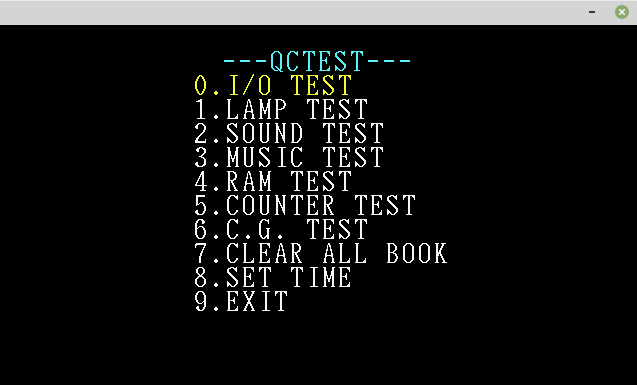

- A hidden mode unlocked by hitting certain drums at startup that specifies Taiwan as the home country (normally this is replaced with `China`).
  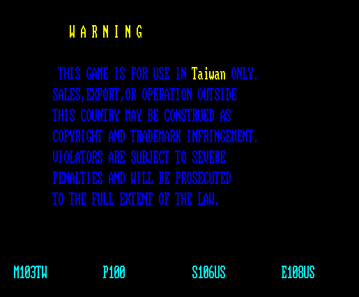

  

- A language select menu (unlockable by button combo).

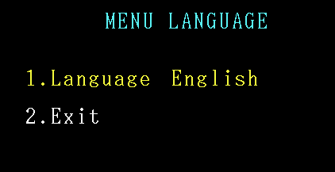


- A hidden bookkeeping stats menu (unlockable by button combo).

  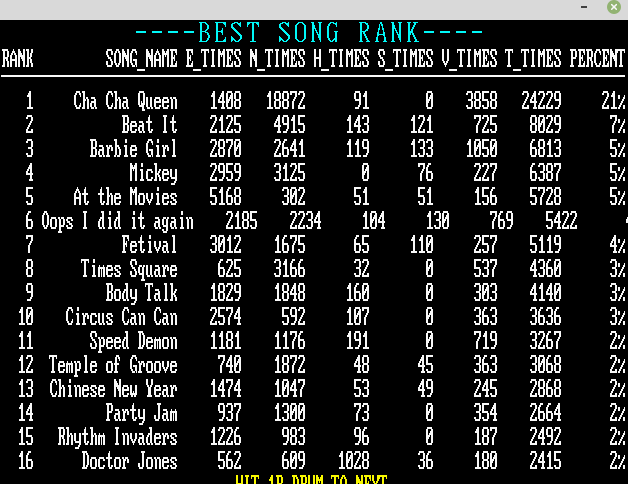

- A trackball test menu.
  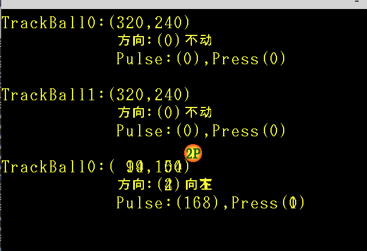

- A Dev Test menu.
  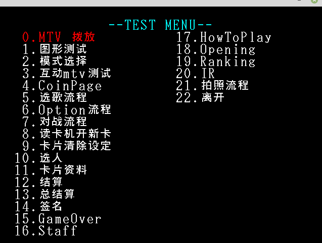


  The dev test menu lets you launch every 'screen' of the game - including a cardreader screen for saving gameplay progress which to my knowledge isn't in this version of the game and wouldn't appear until later.

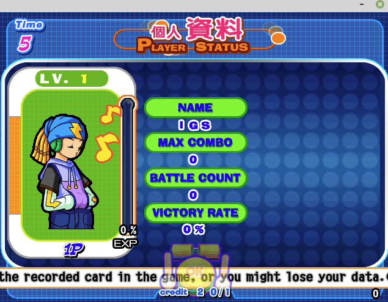


Also a character select menu which isn't present.

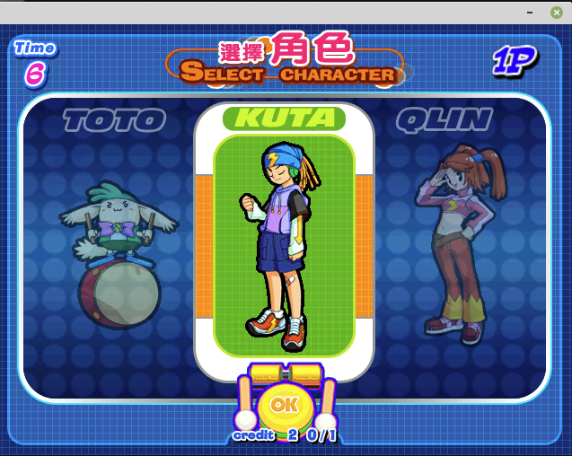


- A Song Test menu that allows you to play any chart and any song / settings (this would come in handy later).
  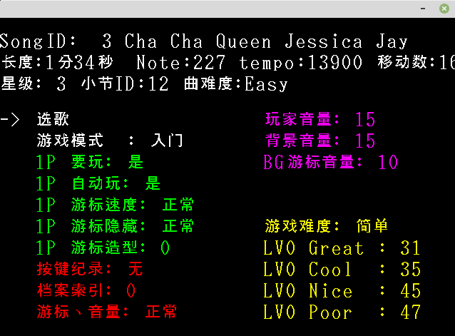


  I also translated this menu to English:
  


The game also appears to have a `Drum King` or `Percussion Master` mode that isn't in use, but utilizes both player drum controls at once.

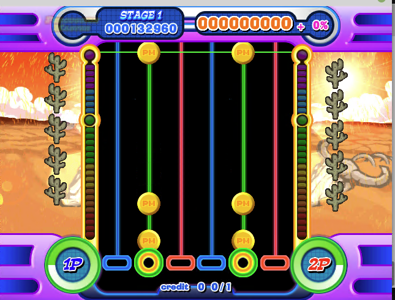


Along with these options, I also added a windowed mode and some additional quality-of-life fixes (such as changing hardcoded paths to run the game from any path) and put them all under envars in the patch [here](https://github.com/batteryshark/igstools/blob/main/pm_patch/src/patches/patches.c).

It all started coming together... until I started working on the songs.

At this point, the intro, how to play, staff screen, demo loops, and the actual songs were still not running... and it's all due to Program 15 - the 'Song' state.


***

#### Figuring out the SongState

Starting with the opening as a simple example, I wrote a [script](https://github.com/batteryshark/igstools/blob/main/scripts/print_songevt.py) to parse all of the packet data to understand how this command works, and what is happening for each song. 

As it turns out, the 'Song' command itself is actually broken down into several subcommands:

```c
enum A27_Song_Subcommand{
 A27_SONGMODE_PLAYBACK_HEADER,
 A27_SONGMODE_PLAYBACK_BODY,
 A27_SONGMODE_MAINGAME_SETTING=3,
 A27_SONGMODE_MAINGAME_WAITSTART,
 A27_SONGMODE_MAINGAME_START,
 A27_SONGMODE_MAINGAME_PROCESS,
 A27_SONGMODE_RESULT=9,
 A27_SONGMODE_RESULTDATA_SET=11,
 A27_SONGMODE_RESULTDATA_COMPLETE=12,
};
```


* Mode 0: Playback Header

  * This is a development-only mode (accessed via the Song Select DevTest Menu)
  * This uploads the header of a pre-recorded `rec` file to the A27. This data tells the A27 the incoming song's settings, bpm, length, number of notes, notes per player, how many sound events, etc.
  * Because the game usually relies on the A27 to supply this information, this appears to be a way for developers to test new charts without uploading them to the ASIC.

* Mode 1: Playback Body

  * This is a development-only mode (accessed via the Song Select DevTest Menu)
  * This uploads the `event` cursors and soundevents for the song (more on this later).

* Mode 3: Maingame Setting

  * First song command generally executed that provides parameters to the A27 such as:
    * How many players are playing
    * What their modifiers are (e.g. speed 2x, cloak 2, noteskin 3)
    * If any players are on autoplay
    * The song index, artist index, and chart index
    * The chart version (because charts on ASIC can have mulltiple versions in BCD)
    * What stage it is
    * If key recording is on
    * What the `song mode` is (enum Normal, Demo, Opening, Staff, HowtoPlay) which tells the ASIC if this is actual gameplay or not.
    * A flag if the game is set to 'Challenge Mode' which may have something to do with stage break... it's not used.
    * Judgement zones in pixels for how many deviations from the judgement center is Great, Cool, Nice, Poor, and Miss
    * Judgement ratings (in float) for how many life points (out of 28) does each player gain for hitting a Fever, Great,Cool,Nice,Poor, and how much they lose for Miss.

* Mode 4: WaitStart

  * Resets the response data to 0 - assuming this clears incoming memory, and sets the current beat to -1.

* Mode 5: Start

  * This request is what actually starts gameplay, its response will always be subcmd 6.
  * Assuming this is what starts the internal timers, etc.

* Mode 6: Process (or Update)

  * This is executed every frame until the song ends or is interrupted.

  * This has its own state buffer that tracks several things:

    * ```c
      typedef struct _PLAYER_ANIMATION{
          unsigned char track[8];
      }PlayerAnimation,*PPLayerAnimation;
      
      typedef struct _PLAYER_HIT_STATE{
          unsigned char track[8];
      }PlayerHitState,*PPlayerHitState;
      
      #define PLAYER_CURSOR_MAX_ACTIVE 150
      
      typedef struct _CURSOR_STATE{
          unsigned short flags;
          unsigned char exflags;
          unsigned char fever_flags;
          short y_pos;
          short fever_offset;
      }NoteCursor,*PNoteCursor;
      
      typedef struct _PLAYER_CURSOR{
          NoteCursor cursor[PLAYER_CURSOR_MAX_ACTIVE];
      }PlayerCursor,*PPlayerCursor;
      
      
      typedef struct _SONGSTATE{
          unsigned short cmd;
          unsigned short state;
          unsigned short current_beat[2];
          unsigned short sound_index[32];
          PlayerCursor player_cursor[2];
          unsigned short player_combo[2];
          unsigned short player_fever_combo[2];
          unsigned char player_isplaying[2];
          unsigned char player_fever_beat[2];
          PlayerAnimation player_judge_graphic[2];
          PlayerAnimation player_track_hit_animation[2];
          PlayerAnimation player_cursor_hit_animation[2];
          unsigned int player_score[2];
          unsigned int player_score_copy[2];    
          unsigned int idk_maybepadding2; 
          unsigned short player_life[2];    
          unsigned short lifebar_align[2];
      }SongState,*PSongState;
      ```

    * The current beat for each player.

    * A 32 `slot` index of values that correspond to loaded wav files for each song such as voice tracks, background music, or keysounds that should be played on this frame.

    * A 150 `slot` set of cursor states for each player. A `cursor` in this case could be a note or a measure bar. Essentially, it's anything that scrolls on the play area for each player. These cursors contain. flags that tell the game what `lane` each cursor is in, if it's visible, if it's a `hitless` cursor which receives no judgement, the type of note (e.g. drum, rim, blue), if it's an extended note (e.g. fever), what y position it's at within the play area, and how long the `tail` of the cursor is if it's a fever note.

    * Current player states such as if a player is enabled, their current combo, their current fever combo, the current fever hit minimum (during a fever, there is a minimum number of notes to not combo break), the player animations onscreen pertaining to lanes being hit, animations for notes being hit, animations for any judgement graphics (e.g. great, cool, miss), the player score, and player life.


I started songs and fuzzed the various bytes to determine which had an effect. To determine which were relevant, I looked at the `SongProcess` and `SongProcessWrite` functions in the game again. While most of these commands are fairly straightforward, aren't necessary to figure out at this point, or are unused by the card, the 'SongUpdate' (6) command appeared to be next target.


Knowing most of the packet data structures, it was now possible to at least get something akin to notes showing up:

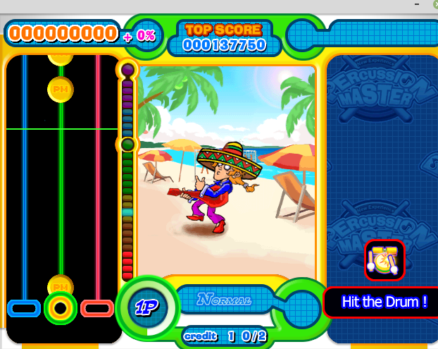


However, there were still several questions:

* How were notes being stored?

* How could I reproduce the note charts (which we clearly didn't have)?

* What were those values on some of the notes (called 'cursors') after their offset?

* How much of the engine would I need to support in code?

  

***

#### Dumping the Charts

Constructing some note charts from early dumps, it appeared that things were starting to come together, albeit not accurate by any stretch.


As no note data was being sent to the A27, it was appared pretty early on that the A27's UVEPROM contained the note data for each song and difficulty. In addition, the song test menu had an option to record your own charts and play them back:

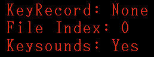


However, one other source of notes happen to be the game executable! I had never noticed before, but the development code for key recording included a copy of every note chart. I would assume the idea would be to build a new chart based on existing notes.

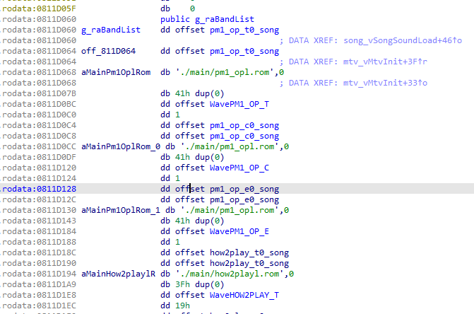


And yet another source of notes would technically be the packet dump I performed of every song and every chart thanks to the song test menu.

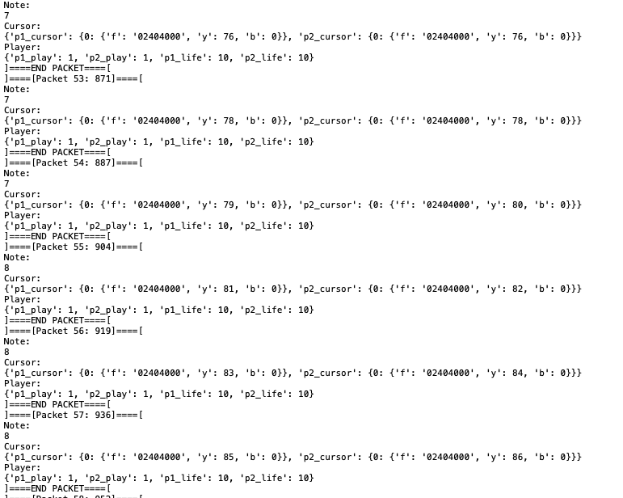


Seeing as I had three sources to reproduce the notes, I had a few options:

1. Dump the UVEPROM, hope it's not encrypted or something more of a pain, and figure out that format to play the real charts.
2. Assume the charts in the executable were accurate, and dump them with a script.
3. Read my packet dumps and approximate when a cursor appeared to reconstruct a chart.
4. 

At this point, converting the built in note charts to a format that could be replayed seemed to be the best path forward. As a result, I wrote a [script](https://github.com/batteryshark/igstools/blob/main/songdata_extractor/recxtract.py) to extract the note charts from the game executable, and convert them into the very 'rec' format that the debug code used.

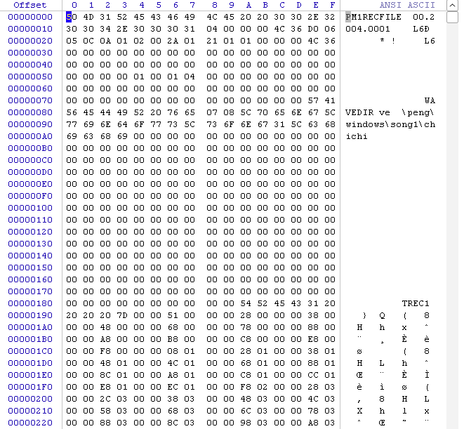


Now I had somewhat reasonable charts, yet didn't have actual gameplay to use them with...


***

#### Rebuilding the Engine

At this point, it was pretty apparent that all of the stuff in SongUpdate required the ASIC to provide logic:

* The song progression in some unknown amount of 'ticks' or `beats`.
* Telling the game to play a keysound or BG audio file.
* Giving the current state of every 'note/cursor' on the screen, including measure bars.
* Keeping score, combos, life meters.
* Performing judgement calculations through given values (in our EnumCmdSongSetting packet).
* Setting animation cues for each 'lane' per player to show when a drum is hit, if a note is hit, and the right judgement graphic.


While recreating the whole engine was an option, the purpose of this was to faithfully recreate the ASIC logic as a best effort short of dumping the logic itself. As a result, I measured the values between dumps (frames) to make some determinations such as :

- Our 'ticks' are actually 32nd notes which is the smallest unit that our charts are based on.
- Depending on if a player is enabled or not, different fields are not updated.
- Background and Voice tracks are only populated on the last 16 SoundIndex channels.
- Our cursors always spawn at y offset 0 and end at y offset 0x200, but the judgement zone center is 0x179.
- Our combos are used with a hardcoded 5,4,3,2,1 value to determine score additions.
- Our life meter has a min/max of 0/28 and are incremented with a value more granular than the integer given (likely a float).


To support this kind of logic, I'd need quite a bit of [code](https://github.com/batteryshark/igstools/tree/main/pm_patch/src/a27/song).


To pare down what had to be implemented:

* A [song timer thread](https://github.com/batteryshark/igstools/blob/main/pm_patch/src/a27/song/song_timer.c) to keep track of what current 32nd note 'beat' the song was on.
* An [event timer thread](https://github.com/batteryshark/igstools/blob/main/pm_patch/src/a27/song/event_timer.c) to spawn new notes and predefined audio based on the current 'beat'.
* An [inputstate thread](https://github.com/batteryshark/igstools/blob/main/pm_patch/src/a27/song/inputstate_timer.c) that will take our inputs and determine what drums are being hit to light up the right 'lanes'.
* A [scrolling thread](https://github.com/batteryshark/igstools/blob/main/pm_patch/src/a27/song/scroll_timer.c) which will update the state of our currently active 'cursors' per player based on the elapsed time of the cursor and its target beat (thanks chatGPT for the assist!)
* All [code](https://github.com/batteryshark/igstools/blob/main/pm_patch/src/a27/song/song_judge.c) to judge notes.
* All [code](https://github.com/batteryshark/igstools/blob/main/pm_patch/src/a27/song/song_recfile.c) to read our note data into [something our patch](https://github.com/batteryshark/igstools/blob/main/pm_patch/src/a27/song/song_event.c) and the game engine understands.
* All [code](https://github.com/batteryshark/igstools/blob/main/pm_patch/src/a27/song/song_result.c) to calculate our scoring at the end of a song, determine letter grades, whether we passed or failed, etc..
* A song [state manager](https://github.com/batteryshark/igstools/blob/main/pm_patch/src/a27/song/song_manager.c) to tie everything together. 


All of our gameplay logic at this point relied on the current 32nd note beat - established from elapsed time in ms based on when the song started. 

To calculate this, we have a 2 byte value in each note chart that represents the tempo/bpm (e.g. 13900 or 8755). These are binary coded decimal (BCD) and need to be converted to a float first (e.g. 139.00 or 87.55):

```c
song_event->tempo = Short2Float(rec_file->header.hbpm);
```

Next, since we can't make a thread that loops on beats natively, we have to convert it to something we <b>CAN</b> control - milliseconds.

We need the `ms_per_beat` for the song. To calculate this:


```c
ms_per_beat = (60 * 1000) / bpm;
```


We'll also need the `ms_per_measure` to determine where our measure bars are rendered - along with stretching the 'fever' notes the appropriate amount of pixels:


```c
ms_per_measure = ms_per_beat * 4
```

Lastly, we'll need the `ms_per_32nd_note` to determine what beat we're on for each iteration based on the elapsed time of the song. Instead of having numbers in variable names because that's ugly, we'll call it `ms_per_ebeat`:

```c
ms_per_ebeat = ms_per_beat / 8;
```

While we could deep dive into the logic that relies on this this code, at a high level:

- A song starts, and settings are sent to our fake A27.
- At this point, states are cleared and the right 'rec' file is loaded with the song chart data.
- Afterward, the song is started from the `Start` command (5), at this point, all of our song threads are started.
- Every 1ms, the patch checks inputstates, updates active cursors, and adds new cursors if necessary. It also increments the beat counter if we're at a new beat.
- Every frame, the patch will check if players are enabled and request if any active cursors need to be judged based on the current input state. This will also update our score, combos, and life meter. We also clear out any keysounds or bgm alongside any animation cues after sending the response to clear the queue for the next frame.
- When the song is interrupted or ends, we are sent the SongEnd subcommand (9). Regardless of method, the game requests the results of the song as-is. We then send the result data. The structure of that request/response is [here](https://github.com/batteryshark/igstools/blob/7f21e4d1f34f3e690982300222fe1c6eee757da4/pm_patch/src/a27/song/song_result.h).

At this point, everything appears to be working as expected:

**VIDEO**

[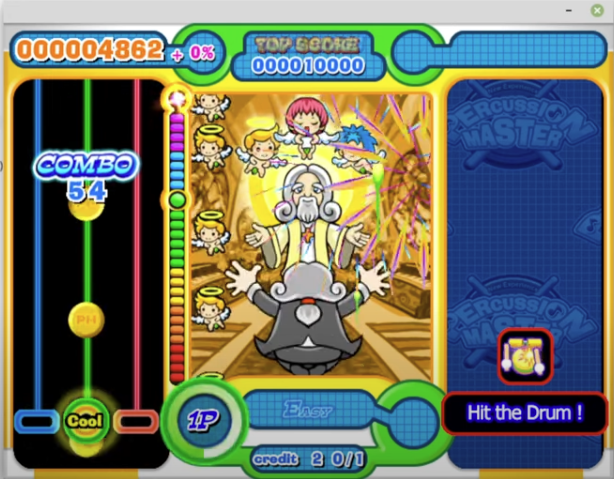](https://youtu.be/Yw-LKoHlA8o "Playable Patch")


### Wrapping Up

I suppose the lesson here is - short of decapping or cloning the custom logic on the ASIC, handling the functionality essentially involves monitoring the behavior somehow and recreating part of the runtime - sometimes quite a bit of it. 

It's worth noting that PercussionMaster is similar to the previous game (Rock Fever 4) with the exception that RF4 contains a rearranged set of 'commands', it's missing a few, and contains more 'lanes' than the given 6 per player (up to 36). Realistically, one might be able to somewhat easily convert [pm_patch](https://github.com/batteryshark/igstools/tree/main/pm_patch) to work with that game as well once the notes are dumped from the game executable, and the inconsistencies from the A27 are addressed.

It's also worth noting that the A27 contains two roms - an 'external' program rom and an 'internal' program rom inside of the ASIC package. While it's possible to dump the external program rom, it's likely encrypted with a key from the internal rom or something similar. But a truely accurate emulator will one day need to dump these along with recreating the ARM7 code or lifting it into llvm and then translating or something else. 


Ideally, with a dump of the ROMs and logic from the ASIC along with some kind of lifter, a truly accurate solution can be made. Until then, we'll just have to do things the hard way.


Cheers!
