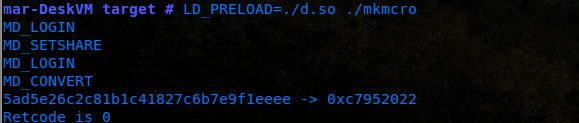

# pwning a SafeNET Microdog
##### *An exercise in hardware security module analysis*
Original Post: 2013-12-23


Note: The full code can be found at the following repository: https://github.com/batteryshark/io.microdog

### Overview

The SafeNET Microdog (originally owned by RainbowChina) is a USB/Parallel based hardware security module that has historically been popular due to its low cost and wide range of cross-platform compatibility.


#### Features
- Read/Write flash memory 200 bytes
- Access Control via password protection
- Client library that contains basic obfuscation and anti-debugging features
- Unique manufacturer serial number
- Vendor ID to bind a software package with a particular run of dongles
- Embedded cryptoprocessor
- Support for use of multiple dongles in sequence (cascade)

#### Components
1. The dongle itself contains a cryptoprocessor accessed via a proprietary protocol through HID from the driver/daemon.

2. The driver/daemon is an intermediary between any client library calls and the hardware interface. For all revisions given a specific platform, this layer is unchanged.

3. The client library is the furthest abstracted layer which a given user-space process interacts with to perform a crypto request. Microdog leveraged two main revisions of this client library.

    a. The 3.4 revision requires direct driver access via ioctl/DeviceIoControl to carry out transactions. For Linux, this meant communication with a kernel module - likewise, Windows uses a driver.

    b. Revision 4.0, for the purpose of platform compatibility, removed this kernel module and simply operates on direct HID calls exposed via a user-space daemon and IPC over sockets. It should be noted, however, that Windows still employs a driver for this revision.

It should be noted that the protocol of the packets to the driver are the same; irrespective of revision.

### Hacking up the Client Library
#### Background
The client library is the primary point of interaction for a developer.

SafeNET supplies a header file (gsmh.h) and a static library (e.g. mhwin.lib/mhlinux.o). The library exposes some administrative and user-based functions to change the dongle's developer password, write to the dongle's flash area, get the manufacturer serial number, get the VendorID of the dongle, or convert any stream of bytes to a 4 byte response (DogConvert) through a secure hash process that leverages some on-chip blackbox algorithm and developer defined seed generation.

As a result, DogConvert is the primary function used for obfuscation or as a primitive to an expanded encryption function. Of course, a 32bit value on its own is pretty weak. As a result, this function is not designed to be used on its own.

#### Version 4.0
Through normal operation, each copy of the client library is tied to a specific vendorID and line of dongles. As a result, a client library will not fully operate without a dongle that belongs to the same vendor line.

As a result, the first thing to do will be to determine how a given client library differs from another. Comparing two yields the following block as the only difference:


In unstripped variants, this is called the DataPool - it contains encrypted metadata about the dongle (VendorID, internal IDs, etc.). By copying this data over a program in the right location (it's pretty easy to find this block in a given binary), the target should communication with the alternate dongle. It is important to note, however, that DogConvert will most likely not give the same response as the hash is seeded from a table of values where a configurable byte decides which seed is used.

In some cases, an application may merely check the existence of the dongle via an API call. In this case, changing the DataPool may allow someone to use a given dongle and spoof the existence of a real dongle for a given piece of software.

Just copying this isn't interesting, however... let's actually decrypt the block and see what's up:

As a note, mhlinux.o (the linux static libs) generally put the key for this block at 0xB500.

The entire block is a 112 byte sequence:
000->016 (iv)
016->096 (ciphertext)
096->112 (key)

The ciphertext is Rijndael block encrypted (128 bit block size) - decrypting it yields several fields, but the one we're most interested in is the vendor ID (also known as the DogID):


It should also be noted that this DogID value (0xF9BDE in the example) can be retrieved via the device descriptor which could be leveraged to quickly repack a library with support for a new dongle.

#### Version 3.4
The legacy client library used a different method to obfuscate the Dongle Serial and ID which doesn't use AES or any kind of hashing.

The "DataPool" in this case is prefixed by "NEIWAIJM". Not too far after that, we have two blocks referenced by the functions "PickupDogID" and "PickupSerialNo". The blocks are 48 bytes and 96 bytes respectively.


The... algorithm behind this obfuscation is relatively straightforward.

In essence, the blocks are separated into sequences of 12 bytes. As each sequence is read, it's either subtracted from the current value, added, or XORed in a cycle.

For get_serial:
- bytes 0,3,6,9 are added
- bytes 1,4,7,10 are subtracted
- bytes 2,5,8,11 are XORed

For get_dog_id:
- bytes 0,3,6,9 are added
- bytes 1,4,7,10 are XORed
- bytes 2,5,8,11 are subtracted

```
def get_serial(indata):
    out = bytearray(4)
    v3 = 0
    for i in range(0,4):
        out[i] = 0
        for j in range(0,12):
            v2 = j % 3
    if(j % 3 == 1):
        out[i] = (out[i] - indata[v3]) & 0xFF
        v3 +=1
    elif(v2 > 1):
        if(v2 == 2):
            out[i] ^= indata[v3]
            v3 +=1
    elif(v2 == 0):
        out[i] = ( out[i] + indata[v3]) & 0xFF
        v3 +=1
    return out

def get_dog_id(indata):
    out = bytearray(8)
    v3 = 0
    for i in range(0,8):
    out[i] = 0
    for j in range(0,12):
    v2 = j % 3
    if(j % 3 == 1):
        out[i] ^= indata[v3]
        v3 +=1
    elif(v2 > 1):
        if(v2 == 2):
            out[i] = (out[i] - indata[v3]) & 0xFF
            v3 +=1
    elif(v2 == 0):
        out[i] = ( out[i] + indata[v3]) & 0xFF
        v3 +=1
    return out
```

How do we repack?

Well, we COULD reverse this algorithm, but the algorithm itself is inherently weak...

Think about this: What happens when you Add, Subtract, or XOR 0? That's right, Nothing!!!

Technically, we could take an 8 byte DogID and 4 byte serial, split the bytes up and stick one at the beginning of each 12 byte row and it would work! Something like this:

```
def enc_vals(indata):
    out = bytearray(len(indata) * 12)
    for i in range(0,len(indata)):
        out[i*12] = indata[i]
    return out
```

## Emulating the 3.4 Client Library
To emulate something to a degree of accuracy, we first have to understand what it is and what it does. In this case:

- We want to learn all we can about the library prior to debugging.

- We want to optionally run a client library modified with a real dongle (if we have one) and collect some data on how it's actually supposed to work including some transaction result data samples.

- We want to find any kind of documentation that would help us better understand our reversed functionality.

- We want to emulate the driver itself - the endpoint which the client lib performs all transactions.

- We, also want to rebuild pseudo dongle functionality in the driver to act as if it's actually talking to the real hardware which will likely be the most complicated part.

### Overall Design


In most cases, the client library is unstripped and not obfuscated. As a result, functions and some static values will retain their original names.

Now, there are a couple of ways to attack this, we can either:

A. Check out the exports table, map the interfaces and come up with a header ourselves.

B. Hunt down the developer documentation that's all over online.

To save the trouble, this is what we're looking for (super paraphrased):

#### [Globals]
1.unsigned short **DogAddr**
  - The address of the 200 byte internal flash memory a read/write operation should start on.

2.unsigned short **DogBytes**
  - The number of bytes in DogData - if reading/writing, can't exceed 200-DogAddr. Normally between 0-200, but DogConvert() operations only allow 1-63.

3.unsigned long **DogPassword**
  - Some functions such as setting a new password, reading, or writing flash memory require a password to work. Password is 0x00000000 from the factory.

4.unsigned long **NewPassword**
  - A buffer only used to set a new password with SetPassword()

5.unsigned long **DogResult**
  - A buffer where the results of DogConvert() are stored.

6.unsigned char **DogCascade**
  - For LPT Microdogs, they can be daisy chained with a max of 16. This value (0-15) keeps an index number so the lib knows which one you're talking about. This is always set to 0x00 for USB.

7.void * **DogData**
  - A buffer that can be used to convert data or read/write data to/from the flash memory.

#### [Exported Functions]
1.DogCheck()  
Reads: DogCascade   
Writes: None  
Returns: 0 on success - errcode otherwise.  
Desc: In short, this asks the driver if it can talk to the dongle. Useful for a simple isDonglePresent() check, although not very secure.   

2.ReadDog()   
Reads: DogCascade,DogAddr, DogBytes, DogData,DogPassword Writes: DogData   
Returns: 0 on success - errcode otherwise.  
Desc: Reads n bytes from the 200 byte flash memory area starting at y where n is DogBytes and y is DogAddr. Dongle password is required for it to work properly.

3.WriteDog()
Reads: DogCascade,DogAddr, DogBytes, DogData,DogPassword   Writes: None   
Returns: 0 on success - errcode otherwise.   
Desc: Writes n bytes to the 200 byte flash memory area starting at y where n is DogBytes and y is DogAddr. Dongle password is required for it to work properly.   

4.DogConvert()   
Reads:   DogCascade,DogBytes,DogData   
Writes:  DogResult   
Returns: 0 on success - errcode otherwise.   
Desc: Take the buffer of 1-63 bytes in DogData and send it to the dongle where it returns a 4 byte hash of the data based upon the current algorithm selected. The last 4 bytes of the 200 byte internal flash memory determines the algorithm; byte 196 decides the algorithm and bytes 197,198, and 199 decide the algorithm descriptor. As a result, 16,777,216 possible algorithms exist.   

5.DisableShare()  
Reads: DogCascade  
Writes: None   
Returns: 0 on success - errcode otherwise.   
Desc: Disables the ability for a dongle to be shared across parallel port sharing solutions... only used for parallel port dongles.  

6.GetCurrentNo()  
Reads: DogCascade, DogData  
Writes: DogData  
Returns: 0 on success - errcode otherwise.  
Desc: Read a unique manufacturer serial number from the dongle. Unlike the vendor ID, this one is always unique to ONE specific dongle. Useful to identify customers, etc. and normally 4 bytes.  

7.SetPassword()  
Reads: DogCascade,DogPassword,NewPassword  
Writes: None  
Returns: 0 on success - errcode otherwise.  
Desc: Sets a new dongle password.  

8.SetDogCascade()  
Reads: DogCascade, DogPassword, DogData  
Writes: None  
Returns: 0 on success - errcode otherwise.  
Desc: Sets the dongle cascade to 0-15, determined by the byte in DogData.  

#### [Internal Functions for Client Library]
The following functions are present in the library, but are only used internally.

1. EnableShare() Called before any DogConvert transaction to ensure the dongle attached isn't being used and can be shared with our program.

2. ProcessInput() This is what determines the opcode that the driver needs so the dongle itself knows what to do, it also does checks to make sure that we aren't trying to send more than 200 bytes to the dongle (client side input validation), and basically that the global variables are sanity checked and make sense before continuing.

3. ProcessOutput() A stub that returns 0 - no purpose.

4. ProtectEntry() Determines which order each step in obfuscating our globals into a packet execute. Also contains all the auditing code for our response to determine if the dongle responded properly or at all and then populates the globals based on valid data. This one will be very important to look at later.

5. PickupDogID() From the previous blog post, this decrypts the 8 byte ID from the client lib and keeps it in memory, you'll see why later.

6. PickupSerialNo() From the previous blog post, this decrypts the 4 byte DogSerial from the client lib and keeps it for sending to the driver. The idea is that the serial should match the one that our driver finds when it calls the USB device descriptor and requests it, but I'm getting ahead of myself.

7. PlatformEntry0-9() Ten steps (functions) of hell - essentially a maze to fuck with people. In the end, NOTHING is changed that isn't reversed. They just did this to piss people off. Platform entry 9 is the most interesting because it's actually the point that calls the data to be encrypted and sent in a packet form to the dongle driver... it's really the only function in this series that ACTUALLY does anything.

8. ResetDriverData() Once a response comes back from the dongle's driver, it has to be decrypted... this is what does that.

9. InitializeDriverInData() Starts a chain of events that pushes all of our global variables through a maze of code design to irritate the hell out of reverse engineers. It also creates a random number, adds 0x646C6F47 to that number, and XORs all the data in the packet after the first 8 bytes with it as a rolling key.

10.GetMaskKey() Get the seed mask key and add 0x646C6F47 (or 'dloG) to it.

11.GenerateRand() Get the time of day and return that as a seed mask key.

12.LinuxDriverEntry() Open a file descriptor to /dev/mhdog, do a 0x6B00 ioctl call with an 8 byte arg (memory offsets to a request packet buffer and a response packet buffer).

13.LinuxUSBDriverEntry() Open a file descriptor to /dev/usbdog, then follows the same flow as LinuxDriverEntry().

From 30,000 feet, we have a device with the following data somewhere in it:

- 200 byte flash memory
- 4 byte VendorID (DogSerial)
- 8 byte DogID
- 4 byte Manufacturer ID
- 4 byte DogPassword
- 1 byte DogCascade
- 1 byte DogShare

With just this information, we can start to build our emulator by abstracting the internal memory requirements of the dongle.

```
//Even though the last two values are byte, I'm super lazy and don't want to deal //with alignment issues later.

struct MicroDog_Memory{
  unsigned int vendor_id;
  unsigned char dog_id[8];
  unsigned int mfg_serial;
  unsigned int dog_password;
  unsigned int dog_cascade;
  unsigned int dog_share;
};

//We also know that every DogConvert request is going to deal with a 4 byte response and 1-63 bytes of data based on DogBytes.

struct MicroDog_Convert_Tx{
  unsigned int DogResponse;
  unsigned int DogBytes;
  //yes, this should be a short. unsigned char DogRequest[64];
};

```
With client library in hand, our goal now shifts to making the client library talk to our own code. Let's start with each exported transaction, look at how the dongle client library handles it, and then what gets sent to the driver.

#### DogCheck

A good place to start here is to create a sample program and link it with our client lib.

```
#include<stdio.h>
#include "gsmh.h"

int main(){
  int errcode = DogCheck();
  if(errcode){
    printf("Fail! Errcode :%d \n", errcode);
    return -1;
  }
  printf("Success!\n");
  return 0;
```

Ok, pretty basic - we make a call to the dongle and it returns zero if it's there and 1 if it's not. What does it do in the client library?

```
return ProtectEntry(1, (int)ProcessInput, (int)ProcessOutput);
```

So ProtectEntry takes 3 params:
1. A number which correlates to the opcode (1 being  DogCheck)
2. The result of ProcessInput (an errcode)
3. The result of ProcessOutput which is always 0 because that's all it does.

Reading the notes above will tell you what each function does, but the stack trace will show that DogCheck's path looks like this:

```
DogCheck->ProcessInput()->ProcessOutput()->ProtectEntry()-> PlatformEntry0-8 (in calculated pseudorandom order) -> PlatformEntry9->InitializeDriverInData()->LinuxDriverEntry/LinuxUsbDriverEntry()->PlatformEntry9->P rotectEntry()->ResetDriverData()
```

Skipping all the platformEntry0-8 crap of just xoring and shifting bytes around, we come to PlatformEntry9 which constructs our request packet from the globals to send to the driver.

InitializeDriverInData is responsible for creating the request packet that gets sent to the driver.
Here's what it looks like somewhat reconstructed:


In short, this is constructing our packet from another data structure that was created with ProcessInput(). I have created the struct in IDA to make stuff a bit more readable:

```
struct_request_buffer {
  _WORD magic; // 0x484D
  _WORD opcode; // Depends on what we're doing - for DogCheck, this would be 0x01
  _DWORD VendorID; // Our vendor ID from the library.
  _DWORD MaskKey; // Pseudo-random number used as an IV to encrypt the packet.
  _WORD DogAddr; // Our dog address (used for read/write) _WORD DogBytes; // Number of bytes to read/write
  _BYTE DogData[256]; // Our payload... why 256? Why anything.
  _DWORD DogPassword; // Because this is where we put that. _BYTE DogCascade; // The cascade value.
};

```

The part we care most about from a driver standpoint is:


This guy is where the magic happens. We send two pointers via ioctl to our kernel module.

The first pointer goes to 277 (aligned to 280) bytes as our request 'packet'. The second pointer goes to a block of 268 bytes as where the program expects the driver to write its response 'packet'.

We'll make a simple hook of ioctl in linux to dump packets and inspect them - preventing the program from letting data leave userspace.

```
/* The Hook */
#include <stdio.h>
#include <stdlib.h>
#include <string.h>
#include <dlfcn.h>
#define MICRODOG_XACT 0x6B00

//Globals
static void *io;
static void (*realIOCTL)(int fd, int request, unsigned long data);

typedef struct request_packet{  
  unsigned short magic;  
  unsigned short opcode;  
  unsigned int dog_serial;
  unsigned int mask_key;  
  unsigned short dog_addr;  
  unsigned short dog_bytes;  
  unsigned char payload[256];  
  unsigned int dog_password;  
  unsigned char dog_cascade;
};

//Setting our real ioctl function.
void __attribute__((constructor)) initialize(void) {      
   io = dlopen("libc.so.6", RTLD_NOW);    
   realIOCTL = dlsym(io, "ioctl");  
 }

int ioctl(int fd, int request, unsigned long* data){
  if(request == MICRODOG_XACT){ /* DO SOMETHING ALREADY */ return 0;   
 }
  //Any other ioctl we don't care about.  realIOCTL(fd,request,data);  
}
```

Running our target application hooked against this lib and:
```
RetCode is 20019
DogResult is 0000
```
Oooooook... this particular error code isn't even documented anywhere, but it's relatively simple to figure out if you remember that this is expecting to endpoint a kernel module that has special ioctl's set. If the kernel comes back and says 'really, /dev/usbdog is just a file, isn't a chardev file, and has no module loaded that will talk to you', then this error gets thrown.

Making a quick kernel module will result in the RetCode changing to 43210 - another undocumented code, but we can't expect much to happen right now. After all, we aren't even **doing** anything.

The next step is to dump a request packet and see what's up. Dumping a DogCheck() packet gets us this:


Something isn't right yet... Oh yeah! We still have to reverse InitializeDriverInData.

In essence, we take each value starting with DogAddr to the end of the packet and XOR each value against our key (mask_key + 0x646C6F47) which gives us this:


All the values are messed up, the opcode is 0x14 which... doesn't even exist in our lib... how can this be!? wtf is going on? Let's put this on hold until we look at the driver.

#### Slight Detour - The Driver's Request Decryption
Like any kmod that uses a chardev, we can have extended operations other than file ops if we use ioctl.

Our trace for the driver (if we could run it as it's for 2.4 redhat) would look like this:

```
ioctl_usbdog0->DecodeInParam()->UsbDendOutputData->UsbRecvInputData->USBAKernelEntry()-> EncodeOutParam()
```
We pull in our request buffer, decrypt it, validate the data, use parts of it to initially log into the dongle and do some stuff, set some things, convert things, whatever.

Then, we get the response from the dongle, make a response packet, encode that with our key (the same one as the request packet), and then copy the response to a buffer in our program's memory... done!

Before we can inspect the packet, it must be decrypted. Although we already know how the packet was encrypted (InitializeDriverInData), we can also look into our driver (usbdog.o) to be certain.


Decode leverages a time-seeded mask_key, adds a static value, then xors the input packet against it.

We can now verify that the packet is being properly decoded... then what is opcode 0x14? What does it want? What does error code 0x43210 mean?

#### Back to the Client Library
Searching for the error code in the client library yields the following result:


Well, **this** is interesting! The logic above is executed after the packet is received and decrypted which means the issue is something related to our request payload.

It looks like a failure condition if something that's in a loop of 8 bytes doesn't match another buffer of 8 bytes with the global name IdBuffer_0. following this value reveals that the logic refers to the vendor id.

This opcode (0x14) is then some kind of "login" functionality - it requests a login, the dongle sends back its 8 byte vendor ID, and then it's checked in the client library if it matches... no match, no go.

As this is an internal function, it makes sense that they didn't bother to document the errorcode. We'll cover later where it processes this command in the driver. For now, just accept that after quite a few passes with a debugger, this is ACTUALLY what's happening.

This means we need an additional handler for opcode 0x14 in our emulator to send back the dongle vendor ID as its payload. to review, all opcodes we have to support so far are:

- 0x01 - DogCheck()
- 0x02 - ReadDog()
- 0x03 - WriteDog()
- 0x04 - DogConvert()
- 0x0B - GetCurrentNo()
- 0x14 - Login *NEW*
- 0x15 - SetDogCascade
- 0x64 - DisableShare()
- 0x65 - EnableShare()

Ok, so now we have to figure out the response packet... The response packet is initialized like this:

```
typedef struct response_packet{  
  unsigned int dog_serial;  
  unsigned int return_code;  
  unsigned char payload[256];
};
```

It actually can't have anything else due to always being RIGHT above the request packet memory address.

The return_code value must always be zero... if not, the client lib will return whatever number was in there... it's the same error handling as the client lib itself, but uniform in the driver.

After constructing a packet with our 8 byte vendor_id value in the response, encrypting the payload (DogData), setting return_code to 0, setting our dog_serial, and writing it to memory, our program gives us another packet.


Ok - now we're getting somewhere! This one is opcode 0x1 which was DogCheck... now our description says that dog_check just returns 0 if the dongle is there as the return value, doesnt use the data or anything... maybe we can just construct a response with a 0 return value and the client lib will accept it. We'll do something like this to test:


Running a test shows that we can complete the transaction now :


Now that we have dogcheck working, let's do the rest!


- **X** 0x01 - DogCheck()
- 0x02 - ReadDog()
- 0x03 - WriteDog()
- 0x04 - DogConvert()
- 0x0B - GetCurrentNo()
- 0x14 - Login *NEW*
- 0x15 - SetDogCascade
- 0x64 - DisableShare()
- 0x65 - EnableShare()

#### ReadDog / WriteDog()


For now, let's make a buffer of 200 bytes in our ioctl wrapper and grab DogBytes starting at DogAddr and sending it back as a payload:


Ok, so reading is working - of course, writing with a static buffer won't work, we'll fix that later on.

Now, because we're somewhat shooting for completion... how about checking our password against a value...

The errorcode that gets thrown back from the dongle if the password is wrong happens to be 10053 - as a result, let's set our password for this dongle to be:
```
unsigned int dog_pass = 0xBADF00D;
```
and then return 10053 if it doesn't match instead of copying the buffer.


Write is similar, but the same checks and writing to the area as well.


#### DogConvert()
Dumping the packet and we get.


Wait a minute!? Opcode 0x08?!? This shouldn't exist... wtf is this?!

Looks like we have another undocumented opcode. There's a global in the driver that sets the share bit to enabled or disabled. Our version will be called MD_SETSHARE that lets you set the state to whatever you want as a 1 byte value.


After handling that one, we get :


Now we're cooking!
**NOTE** (2020-10): Remember that the Microdog 4.0 client library MD5s the request and that is what's actually sent to the dongle. As a result, requests come in through the API as usual, but will end up being 16 bytes once they hit hardware. This also makes request/response pairs for different client libraries incompatible to a degree...

To simulate this one, we could CRC32 any input data we get to come up with a 4 byte response. Granted, it won't be accurate to a specific dongle as the algorithms and seed values are located in hardware which we haven't analyzed. Functionally, however, it will be close enough.

We also may want to talk to an actual dongle, record the responses, and replay them at a later time to make the simulation accurate in specific situations.

To do that, we could draft up a rainbow table design:


In essence, this describes a binary format to record request/response pairs and search a cached table for an appropriate response if available.

For example, we have a request of 4 bytes that consists of 0xBB 0xBB 0xBB 0xCD which I set in my rainbow table to a response of 0x10101010, the result:


For the first method (your own hashing), just hash the data and kick an int back into the payload, which is funny because the next one is:

#### GetCurrentNo()

Simple - think of it like DogConvert(), but with passing back a static 4 byte int all the time.
```
unsigned static int DogMfg = 0xBADDEAD;
```


#### Recap
Let's see how we're doing:

- **X** 0x01 - DogCheck()
- **X** 0x02 - ReadDog()
- **X** 0x03 - WriteDog()
- **X** 0x04 - DogConvert()
- **X** 0x0B - GetCurrentNo()
- **X** 0x14 - Login *NEW*
- **X** 0x15 - SetDogCascade()
- **X** 0x64 - DisableShare()
- **X** 0x65 - EnableShare()

#### Login()
The hidden function from before - handling is pretty straightforward. Copy the 8 byte vendor_id from the device descriptor or from where it was dumped in the client library, set return to 0.


#### SetDogCascade()
The same thing as MD_SETSHARE - we take the only byte in the request payload and change our internal cascade state of the dongle to that... can only be 0-16. We don't even have to do error handling because the library will do that for us.

#### SetPassword()
This opcode didn't show up until the 4.0 library. A select few of the last 3.4 libraries for windows support this command as well as opcode 0x07.

The implementation here is pretty simple:


### Writing the Emulator
  
** MUCH SECURITY - VERY MICRODOG - SUCH HACK WOW **  

Before communicating with a real dongle, it's probably best to first construct a responder in order to better test the packets.

There are a few items that we want to store on disk that aren't state related:
- Dongle Serial
- Manufacturer Serial
- Vendor ID
- Dongle Password
- 200 byte flash memory (of which the last 4 bytes are the algorithm)

In addition, if we're going to be recording real responses, we'll have to come up with a rainbow table format - something like this:


### Extending the API
We could go beyond the scope of the original API and support adding rainbow table entries on the fly, in addition to writing the vendor_id, mfg_serial, dog_serial, and maybe printing out this lovely data for us to see.

[MD_RTADD]
opcode: 0x539
unsigned long RTAdd()
Reads: DogData, DogBytes, DogPassword
Writes: None Return Value - 0 if successful, 13371337 if not.
Desc: This is like DogConvert, except we're going to pass what we want the dog response to be as DogPassword. In the driver, we will read the last 4 bytes of the flash memory to determine the algorithm, create a new rainbow table entry, and store it in our dog.key file.

[MD_SETDOGSERIAL]
opcode: 0x53A
unsigned long SetDogSerial()
Reads: DogData
Writes: None
Return Value: 0 if successful, 13381338 if not.
Desc: Sets the Dog_Serial value to the int stored in DogData.

[MD_SETMFGSERIAL]
unsigned long SetMgfSerial()
Reads: DogData
Writes: None
Return Value: 0 if successful, 13391339 if not.
Desc: Sets the Mfg_Serial value to the int stored in DogData.

[MD_SETVID ]
unsigned long  SetVendorID()
Reads: DogData
Writes: None
Return Value: 0 if successful, 13401340 if not.
Desc: Sets the Dongle VendorID value to the 8 byte buffer stored in DogData.

[MD_RLRT ]
unsigned long  ReloadRainbowTable()
Reads: None
Writes: None
Return Value: 0 if successful, 13411341 if not.
Desc: Sends a signal to the emu to reload the rainbow table from disk.

Of course, this means we'll have to also create our own request packet which will look something like this:

https://github.com/batteryshark/microdoge/blob/068c137524865ce803f9c785944af6ad5801a938/3.4/usbdog.c

We are still using the hook methodology, albeit a bit more sophisticated.

The control flow is pretty straightforward - we hook our dongle call, decrypt the packet, find out what it wants, and construct a response in kind, encrypt it, and write it back to the program.

The switch statement in the function controls every call to the imaginary driver. Running a test program with a simple convert shows that our added keys are indeed working in the new version:




The test application itself is nothing more than an original C program where we test the dongle's functionality (compiled against our extended API, of course)


In the end, it's probably easier to make a python program that can seed  an initial dongle and generate the appropriate rainbow table values for you (see 'makedoge.py').

### Beyond a Hook

Of course, a preloaded shared library as in our previous example is hardly an optimal solution. This solution involves hijacking the ioctl function calls and also requires that we change the execution environment.

Let's insted, do this more like how the real driver does it by making... well... a driver!

Sparing the details of how the driver transactions actually work (another packet protocol with an rng nonce to deter replays) because we don't need to interface with the real dongle.

We, instead, can build out a kernel module that acts as an endpoint and forwards the packet to another program via sockets to complete the transaction.

For our purposes, we could write an analysis hook that talks to a program via sockets and performs transaction analysis and the rainbow table lookup.

Afterward, the results could be used to write a kernel module as a packet forwarder back into userspace which is what MD4.0 does:

https://github.com/batteryshark/microdoge/blob/068c137524865ce803f9c785944af6ad5801a938/3.4/usbdog_kmod.c

### Future Work
- Documenting the MD 4.0 daemon which is essentially a socket-backed proxy for our packets.

- Determining how to replicate the actual DogConvert() algorithm.
